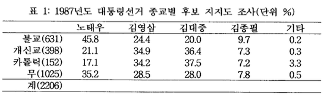

## Data for Practice

한국 갤럽의 1987년 대선 여론조사 자료를 예제로 활용한다.
김용옥 선생이 '나는 불교를 이렇게 본다'에서 인용한 한국갤럽의 발표자료는 

<!--

-->


우선 이 자료를 입력하여 파일로 저장하자. 종교별 표본수를 먼저 벡터로 저장하고, 이름을 정한다.

```{r}
N_Religion <- c(631, 398, 152, 1025)
names(N_Religion) <- c("Buddhism", "Protestant", "Catholic", "None")
```

`table` 구조, 사실상 `matrix`로 읽어들인다.

```{r}
poll87 <- matrix(c(45.8, 21.1, 17.1, 35.2, 24.4, 34.9, 34.2, 28.5, 20.0, 36.4, 37.5, 28.0, 9.7, 7.3, 7.2, 7.8, 0.2, 0.3, 3.3, 0.5), ncol = 5)
poll87
```

필요한 변수명을 넣는다. 

```{r}
dimnames(poll87) <- list(Religion = names(N_Religion), Candidates = c("Roh", "YS", "DJ", "JP", "etc"))
poll87
class(poll87)
str(poll87)
```

과연, 종교별 후보지지도의 합이 100%인지 `addmargins()`를 이용하여 확인. `margin = 2`로 행 단위 합.

```{r}
library(tidyverse)
poll87 %>%
  cbind(Sum = rowSums(.))
addmargins(poll87, margin = 2)
```

카톨릭 표본의 소계가 잘 맞지 않는 것 확인. 종교별 표본수효 함께 출력.

```{r}
options(digits = 3)
poll87 %>%
  cbind(N_Religion)
# cbind(poll87, N_Religion)
```

`N_Religion`의 이름을 표본 크기를 상징하는 `Size`로 교체

```{r}
cbind(poll87, Size = N_Religion)
```

종교별 표본에서 각 후보의 지지자수를 계산한다. 사람의 수를 세는 만큼 소숫점 이하를 나오지 않도록 한다.

```{r}
options(digits = 1)
poll87_counts <- N_Religion * poll87 / 100
poll87_counts
```

종교별 소계, 후보별 지지자 소계를 `addmargins()`를 이용하여 계산한다.

```{r}
poll87_counts %>%
  cbind(Sum = rowSums(.)) %>%
  rbind(Sum = colSums(.)) 
addmargins(poll87_counts)
```

반올림으로 인하여 불교와 카톨릭에서 1명씩의 차이가 나지만 전체 표본의 크기와는 잘 맞는 점을 확인.

후보별 지지율을 계산하기 위하여 `prop.table()`을 적용. 


```{r}
options(digits = 2)
poll87_counts %>%
  prop.table
prop.table(poll87_counts)
```

후보별 지지율 소계를 `addmargins()`를 이용하여 계산

```{r}
poll87_counts %>%
  prop.table %>%
  cbind(Sum = rowSums(.)) %>%
  rbind(Sum = colSums(.))
addmargins(prop.table(poll87_counts))
```

결론은 마지막 행에 있으므로,

```{r}
poll87_counts %>%
  prop.table %>%
  cbind(Sum = rowSums(.)) %>%
  rbind(Sum = colSums(.)) %>%
  `[`(5, 1:6) %>%
  `*`(100)
addmargins(prop.table(poll87_counts))[5, 1:6] * 100
```

### Matrix to Table

`table` 구조로 강제 변환한다.

```{r}
poll87_tbl <- as.table(poll87_counts)
str(poll87_tbl)
```

### Tidy

```{r}
poll87_tbl <- poll87_counts %>%
  as_tibble %>%
  mutate(Religion = rownames(poll87_counts)) %>%
  gather(key = Candidates, value = Counts, -Religion) %>%
  mutate(Religion = factor(Religion, levels = rownames(poll87_counts)),
         Candidates = factor(Candidates, levels = colnames(poll87_counts)))
poll87_tbl
str(poll87_tbl)
```

### Save

```{r}
save.image(file = "poll87_data.RData")
```

