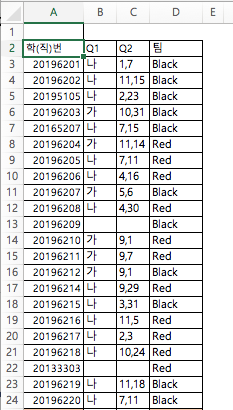

```{r setup, include=FALSE}
knitr::opts_chunk$set(echo = TRUE)
library(readxl)
library(pander)
library(knitr)
library(magrittr)
library(tidyverse)
library(stringr)
panderOptions('table.split.table', Inf)
panderOptions('table.alignment.rownames', 'left')
panderOptions('table.alignment.default', 'right')
options(width = 132)
```

## Data 

```{r, echo = FALSE, out.width = "33%"}

```

```{r, data, echo = FALSE, results = 'hide'}
birthday <- "../data/birthday_problem.xlsx" %>% 
  read_excel(range = "A2:D78")
# birthday <- "../data/birthday_problem.xlsx" %>% 
#   read.xlsx(sheetIndex = 1, 
#             startRow = 2, endRow = 78, 
#             colIndex = c(3:7, 9:12), colClasses = rep("character", 9),
#             encoding = "UTF-8",
#             stringsAsFactors = FALSE)
birthday %>% str
names(birthday) <- c("id", "Q1", "Q2", "group")
birthday$group %<>% factor(levels = c("Red", "Black"))

##> 생일이 같은 사람을 찾아 날짜 순으로 늘어세우기.
##1> 입력된 데이터 살피기
#> strsplit(birthday$Q2, ",") 하면 나오는 리스트의 요소를 month와 date 로 나누었다 다시 합치기
#> Q2의 생김새
birthday$Q2
#> pipe를 이용하여 고쳐쓰면
##> select를 이용할 때
# birthday %>% 
#   select("Q2") %>% 
#   .[[1]] 
##> 바로 윗 식만 고쳐쓰면
# `[[`(1) 
##> 컨테이너 `.`을 이용하여 한 줄로 고쳐쓰면
# .[, "Q2"] #> 두 줄을 한 줄로 

##2> 태어난 월, 일을 날짜 순으로 정리하기
##> 태어난 달 떼어내고 순서대로 정리하기 위하여 "1" => "01"로 변환
#> 태어난 달 뗴어내기. pipe를 이용하여 사용자함수 표현하는 법에 유의.
birthday$month <- birthday$Q2 %>% 
  strsplit(split = ",") %>% 
  sapply(. %>% .[1])
#  sapply(function(.).[1]) 

#> 태어난 달이 1월, 2월 등인 경우 01월, 02월 등으로 표시하여 1월, 10월, 11월 순으로 나오지 않게 함.
birthday$month %<>%
  nchar %>% 
  `==`(1) %>% 
  ifelse(paste0(0, birthday$month), birthday$month)

##> 태어난 날에 대해서도 태어난 달과 같은 방법으로 조치
#> 태어난 날 떼어내기.
birthday$date <- birthday$Q2 %>% 
  strsplit(split = ",") %>% 
  sapply(. %>% .[2])
#   sapply(function(.).[2]) 
#> 1일, 2일 등을 01일, 02일로 표현.
birthday$date %<>%
  nchar %>% 
  `==`(1) %>% 
  ifelse(paste0(0, birthday$date), birthday$date)
#> pipe를 사용하지 않았을 때의 코드
# birthday$month <- sapply(strsplit(birth_month_date, split = ","), function(x) x[1])
# birthday$month <- ifelse(nchar(birthday$month) == 1, paste0(0, birthday$month), birthday$month)
# birthday$date <- sapply(strsplit(birth_month_date, split = ","), function(x) x[2])
# birthday$date <- ifelse(nchar(birthday$date) == 1, paste0(0, birthday$date), birthday$date)

##> "1월1일" 등의 포맷으로 합치기. str_c 용법 알아볼 것.
birthday$Q2_2 <- birthday %$%
  paste0(.$month, "월", .$date, "일")
# birthday$Q2_2 <- birthday$month %>%
#   paste0("월", birthday$date, "일")
# birthday$Q2_2 <- paste0(birthday$month, "월", birthday$date, "일")
# birthday$Q2_2 <- str_c(birthday$month, "월", birthday$date, "일")

##> 합치는 과정에서 NA는 "NA월NA일"로 바뀌게 되므로 NA로 수정. %<>%와 `[<-`의 용법에 유의 
birthday$Q2_2 %<>%
  `[<-`(. == "NA월NA일", NA)
# birthday$Q2_2[birthday$Q2_2 == "NA월NA일"] <- NA

##3> 생일을 날짜 순서대로 정리한 복제본 생성
##> order 함수를 이용하여 태어난 달 먼저, 그 다음 태어난 날짜 순이 되도록 정리
#> pipe를 활용하는 다양한 방법 숙지.
birthday_2 <- birthday %>%
  `[`(order(.$month, .$date), )
#> pipe를 활용하는 또다른 방법
# birthday_2 <- birthday %>%
#   `[`(.$month %>% order(birthday$date), )
#> pipe를 사용하지 않고 한 줄로 표혐.
# birthday_2 <- birthday[order(birthday$month, birthday$date), ]
#> 학번과 태어난 월일을 날짜 순으로 나열 
birthday_2[, c("id", "Q2_2")]
##> 맨 마지막에 나오는 NA는 제거
#> NA 아닌 값만 추출. 추출하는 조건식에 컨테이너 `.` 활용하는 법 유의.
birthdate <- birthday_2$Q2_2 %>%
  `[`(is.na(.) %>% `!`)
# birthdate <- birthday_2$Q2_2[!is.na(birthday_2$Q2_2)]
#> 태어난 월일을 제출한 인원
N1 <- birthdate %>% length
# N1 <- length(birthdate)

##4> 어느 위치에서 앞에 나온 날짜와 같은 날짜가 등장하는 지 파악하고 중복된 생일 나열.
#> duplicated 함수의 용법과 birthdate의 특징에 따라 TRUE가 나오면 바로 그 위치 앞에 중복된 생일 위치.
dup_b <- birthdate %>%
  duplicated
# dup_b <- duplicated(birthdate)
#> 최소한 두번 이상 중복되는 생일들(3번 이상 중복되는 값이 나올 수 있음), 둘째 줄까지만 수행해보면 5월10일이 두번 나오는 데 이는 5월10일이 생일인 사람이 세명 있다는 뜻임.
b_dup_b <- birthdate %>%
  `[`(duplicated(.)) %>%
  unique
# b_dup_b <- unique(birthdate[duplicated(birthdate)])
# b_dup_b <- unique(birthdate[dup_b])
#> 중복되는 생일들을 순서대로 나열하려면 어느 날짜들이 중복된 생일인지 파악하고, 전체 생일 목록과 대조하여 그 리스트에 등장하는 생일들을 뽑아냄. 
birthdate %>%
  `[`(. %in% (birthdate %>% `[`(duplicated(.)) %>% unique))
# birthdate[birthdate %in% unique(birthdate[duplicated(birthdate)])]
# birthdate[birthdate %in% b_dup_b]
#> Q2_2의 어느 위치에 중복된 생일이 등장하는가?
index_dup_b <- birthday_2$Q2_2 %>%
  `%in%`(b_dup_b) %>%
  which
# index_dup_b <- which(birthday$Q2_2 %in% b_dup_b)
#> 중복된 생일, 학번, 그룹 나열
birthday_2 %>%
  `[`(index_dup_b, c("id", "Q2_2", "group"))
# birthday_2[index_dup_b, c("id", "Q2_2", group)]

##5>중복된 생일을 테이블로 나타내고 몇 명인지 합산.
birthday_2$Q2_2 %>%
  `[`(index_dup_b) %>%
  table %>%
  as.matrix %>%
  t %>%
  cbind("계" = rowSums(.)) %>%
  kable(row.names = NA)
# table(birthday_2$Q2_2[index_dup_b])
# tbl_b <- t(as.matrix(table(birthday_2$Q2_2[index.dup.b])))
# cbind(tbl_b, "계" = rowSums(tbl_b))
# kable(t(as.matrix(table(birthday_2$Q2_2[index.dup.b]))))
##> Q1
birthday$Q1 %<>% factor(levels = c("가", "나"),
                        labels = c("있을 것이다", "없을 것이다"))
# str(birthday)
pander(birthday[c("Q2", "Q1", "group")])
```

```{r, randomization, echo = FALSE, results = 'hide'}
summary(birthday)
```

## 생일 문제의 질문

```{r, echo = FALSE, out.width = "75%"}
knitr::include_graphics("../pics/birthday_Qs.png", dpi = NA)
```

### Q2. Birthday Problem

#### 생일이 같은 사람의 수효

```{r, echo = FALSE}
birthday_2 %>%
  `[`(index_dup_b, c("id", "Q2_2", "group")) %>%
  kable(col.names = c("학번", "생일", "그룹"), align = "c", row.names = FALSE)
```

#### 어느 날에 몇 명씩 생일이 같은가?

```{r, echo = FALSE}
birthday_2$Q2_2 %>%
  `[`(index_dup_b) %>%
  table %>%
  as.matrix %>%
  t %>%
  cbind("계" = rowSums(.)) %>%
  kable(row.names = FALSE)
```

#### 생일이 같은 사람은 몇 명 정도 기대되는가?

```{r, echo = FALSE}
E_N <- . %>% {. * (1 - (364 / 365) ^ ( . - 1))}
# E_N <- function(N){N * (1 - (364 / 365) ^ (N - 1))}
V_N <- . %>% {E_N(.) + . * ( . - 1) * (1 - (363 / 365)) ^ ( . - 2)}
# V_N <- function(N){N * (1 - (364 / 365) ^ (N - 1)) + N * (N - 1) * (1 - (363 / 365)) ^ (N - 2)}
```

$N$을 전체 인원이라 할 때, 기대 인원은 $N\times\{1- (\frac{364}{365})^{N-1}\}$, 
분산은 $N\times\{1- (\frac{364}{365})^{N-1}\} + N\times(N-1)\times\{1-(\frac{363}{365})^{N-2}\}$로 계산된다.

무응답이거나 결석한 학생을 제외한 응답 인원 `r N1`명에 대하여 기대인원을 계산하면 `r N1 %>% E_N %>% round(1)`명,
표준오차는 `r N1 %>% V_N %>% sqrt %>% round(1)`명으로 계산되어 관찰된 값이 그 범위 근처에 있음을 알 수 있다.

##### 기대값의 계산

```{r, echo = FALSE}
N1 %>% 
  E_N %>%
  round(digits = 1)
```

##### 표준오차의 계산

```{r, echo = FALSE}
N1 %>%
  V_N %>%
  sqrt %>%
  round(digits = 1)
```

#### 태어난 달의 분포는?

```{r, month of the birthdates, echo = FALSE}
birthday$month <- birthday$month %>%
  factor(levels = unique(birthday$month), labels = paste0(1:12, "월"))
birthday$month %>%
  table(birthday$group, .) %>%
  cbind("계" = rowSums(.)) %>%
  rbind("계" = colSums(.)) %>%
  kable(align = "r")
```

#### 랜덤화 효과 검증

```{r, echo = FALSE}
birthday$month %>%
  table(birthday$group, .) %>%
  chisq.test(simulate.p.value = TRUE) %>%
  pander
```

#### 월별로 고르게 출생하였는가?

```{r, echo = FALSE}
birthday$month %>%
  table %>%
  chisq.test(simulate.p.value = TRUE) %>%
  pander
```

### Q1. 나와 생일 같은 사람이 있을까?


나와 생일이 같은 사람이 있겠느냐는 질문에 3/4은 없을 것이라고 답을 했습니다. 
생일이 같은 사람이 11명이나 되는 데 대해서 어떻게 생각할까요?

```{r, Money illusion, echo = FALSE}
tbl_Q1_a <- birthday$Q1 %>%
  table(birthday$group, ., useNA = "ifany") %>%
  cbind("계" = rowSums(.)) %>%
  rbind("계" = colSums(.))
colnames(tbl_Q1_a)[3] <- "결석"
rownames(tbl_Q1_a) <- c("Red", "Black", "계")
tbl_Q1_a %>% 
  kable
tbl_Q1_a %>%
  `[`(-3, -(3:4)) %>%
  chisq.test(simulate.p.value = FALSE) %>%
  pander
```

#### % 비교.  

```{r, Money illusion in percentage, echo = FALSE}
tbl_Q1_a %>% 
  `[`(-3, -(3:4)) %>%
  prop.table(margin = 1) %>%
  `*`(100) %>%
  cbind("계" = rowSums(.)) %>%
  format(digits = 2, nsmall = 1) %>%
  kable
```

#### % 합계

```{r, percentage, echo = FALSE}
tbl_Q1_a %>% 
  `[`(3, -(3:4), drop = FALSE) %>%
  prop.table(margin = 1) %>%
  `*`(100) %>%
  cbind("계" = rowSums(.)) %>%
  format(digits = 2, nsmall = 1) %>%
  kable
```
```{r, save, echo = FALSE}
#save.image("../R/birthday.rda")
```