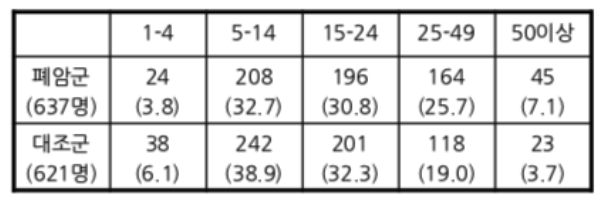

```{r setup, include=FALSE}
library(knitr)
knitr::opts_chunk$set(echo = TRUE)
```

## Doll and Hill

흡연과 건강의 관계에 대한 대표적인 회고 연구(Retrospective Study) 중 하나인 Doll & Hill의 보고서에 등장하는 데이터를 살펴본다. 회고 연구의 경우 먼저 폐암 환자와 대조군을 선정하고 그들의 흡연습관을 묻는 방식으로 진행된다. 데이터로부터 대조군과 비교했을 때, 폐암환자군에서 과다 흡연자의 비율이 높게 나타난다는 것을 알 수 있다.대조군은 폐암환자군보다 소량의 흡연자 비율이 높게 나타난다.그렇다고 해서 이 연구 결과가 바로 흡연이 폐암을 일으킨다고 결론을 내려서는 안 된다. 바로 위에서 살펴본 쌍둥이연구가 등장한 배경이다.

```{r, out.width = "35%", fig.align = "left"}

```

### 막대그래프 : stack

```{r, fig.width = 6, fig.height = 6, fig.align = "center"}
options(digits = 3)
library(magrittr)
library(tidyverse)
#> RColorBrewer 패키지를 이용하여 컬러 생성
library(RColorBrewer)
#> "Accent" palette 채택
cols <- brewer.pal(8, "Accent")
#> 막대의 가운데에 추가 정보를 넣기 위한 좌표 설정 함수. 
# pos <- function(x){
#   cumsum(x) - x / 2
# }
pos <- . %>% {`-`(cumsum(.), . / 2)}
#> Data
DollnHill <- matrix(c(24, 38, 208, 242, 196, 201, 164, 118, 45, 23),
                    nrow = 2)
rownames(DollnHill) <- c("Lung Cancer", "Control")
colnames(DollnHill) <- c("1-4", "5-14", "15-24", "25-49", "50 more")
c4 <- ncol(DollnHill)
b4 <- barplot(t(DollnHill), 
              space = 0.8, 
              col = cols[1:5], 
              yaxt = "n")
axis(side = 2,
     at = c(0, apply(t(DollnHill), 
                     MARGIN = 2, 
                     FUN = cumsum)),
     labels = format(c(0, apply(t(DollnHill), 
                                MARGIN = 2, 
                                FUN = cumsum)), 
                     digits = 2, 
                     nsmall = 0), 
     las = 2)
y4_text <- apply(DollnHill, 
                 MARGIN = 1, 
                 FUN = pos)
text(x = rep(b4, each = 5), 
     y = y4_text, 
     labels = t(DollnHill), 
     col = c(rep("black", 4), "white"))
legend("top", 
       fill = cols[5:1], 
       legend = rev(colnames(DollnHill)))
title(main = "Retrospective Study : Doll & Hill")
```

### 막대그래프 : Fill

```{r, fig.width = 6, fig.height = 6, fig.align = "center"}
DollnHill_p <- prop.table(DollnHill, 
                          margin = 1) * 100
c4 <- ncol(DollnHill)
b4_p <- barplot(t(DollnHill_p), 
                space = 0.8, 
                col = cols[1:5], 
                yaxt = "n")
axis(side = 2,
     at = apply(t(DollnHill_p), 
                MARGIN = 2, 
                FUN = cumsum),
     labels = format(apply(t(DollnHill_p), 
                           MARGIN = 2, 
                           FUN = cumsum), 
                     digits = 2, 
                     nsmall = 1), 
     las = 2)
y4_text_p <- apply(DollnHill_p, 
                   MARGIN = 1, 
                   FUN = pos)
text(x = rep(b4_p, each = 5), 
     y = y4_text_p, 
     labels = paste0(format(t(DollnHill_p), 
                            digits = 3, 
                            nsmall = 1), "%"), 
     col = c(rep("black", 4), "white"))
legend("top", 
       fill = cols[5:1], 
       legend = rev(colnames(DollnHill)))
title(main = "Retrospective Study : Doll & Hill")
```

### Mosaic plot

```{r}
mosaicplot(DollnHill, 
           main = "Retrospective Study : Doll & Hill", 
           xlab = "Group", 
           ylab = "Number of Cigarettes Smoked",
           off = c(0.5, 2.5),
           color = cols[1:5], 
           cex.axis = 1)
chisq.test(DollnHill)
```

## Doll and Hill : Inhaler

```{r, out.width = "35%", fig.align = "left"}
include_graphics("../pics/DollnHill_Inhale.png")
```

### 막대그래프 : frequency, beside = TRUE, par(new = TRUE)

```{r, fig.width = 8, fig.height = 6, fig.align = "left"}
opar <- par(no.readonly = TRUE)
par(mai = c(1.02, 0.82, 0.82, 1.02))
DollnHill2 <- matrix(c(7, 17, 141, 162, 133, 157, 96, 74, 21, 16), 
                     nrow = 2)
rownames(DollnHill2) <- c("Lung Cancer", "Control")
colnames(DollnHill2) <- c("1-4", "5-14", "15-24", "25-49", "50 more")
c5 <- ncol(DollnHill2)
b4_d <- barplot(DollnHill, 
                beside = TRUE,
                col = cols[c(1, 3)],
                ylim = c(0, 250),
                yaxt = "n")
axis(side = 2, 
     at = c(0, DollnHill),
     labels = c(0, DollnHill),
     las = 2)
title(main = "Frequency of Inhalers among All",
      xlab = "Cigarettes Smoked", 
      ylab = "All",
      cex.main = 2)
par(new = "TRUE")
b5 <- barplot(DollnHill2,
              beside = TRUE,
              col = cols[c(8, 7)], 
              ylim = c(0, 250),              
              yaxt = "n")
axis(side = 4, 
     at = c(0, DollnHill2),
     labels = c(0, DollnHill2),
     las = 2)
y5_text_d <- c(DollnHill2 / 2)
y4_text_d <- c((DollnHill2 + DollnHill) / 2)
text(x = c(b5), 
     y = y4_text_d, 
     labels = c(DollnHill))
text(x = c(b5), 
     y = y5_text_d, 
     labels = c(DollnHill2))
mtext("Inhaler", 
      side = 4, 
      line = 3)
legend("topright", 
       inset = 0.01,
       fill = cols[c(1, 3, 8, 7)], 
       legend = c("Lung Cancer : All", 
                  "Control : All",
                  "Lung Cancer : Inhaler",
                  "Control : Inhaler"))
par(opar)
```

### 막대그래프 : Fill, beside = TRUE

```{r, fig.width = 8, fig.height = 6, fig.align = "left"}
DollnHill2_p <- DollnHill2 / DollnHill * 100
c5 <- ncol(DollnHill2)
b5_p <- barplot(DollnHill2_p, 
                beside = TRUE,
                col = cols[c(8, 7)], 
                ylim = c(0, 100),
                yaxt = "n")
y5_text_p <- c(DollnHill2_p / 2)
text(x = c(b5_p), 
     y = c(y5_text_p), 
     labels = paste0(format(c(DollnHill2_p), 
                            digits = 3, 
                            nsmall = 1), "\n%"))
legend("topright", 
       fill = cols[c(8, 7)], 
       legend = c("Lung Cancer", "Control"))
title(main = "Percentage of Inhalers",
      xlab = "Cigarettes Smoked",
      cex.main = 2)
```

<P style = "page-break-before:always">

# ggplot

## tidyverse

깔끔한 데이터 바꾸는 과정에서 유의할 점은 ggplot으로 그릴 때 어떤 변수가 x, y, fill 역할을 할 것인지를 명확히 하여야 어떤 변수를 맨 앞에 위치시키고, 그 다음 변수를 어느 위치에 그리고 Counts를 위치시킨다.
즉, fill 에 해당하는 변수를 맨 앞에, 그리고 x에 해당하는 변수를 그 다음에, 마지막으로 세번째 변수로 Freq 또는 Counts가 위치하도록 tidy를 적용하면 ggplot으로 그릴 때 상당히 체계적인 접근이 가능해진다. 특히, 막대들의 중간에 추가적인 정보를 삽입하기 위하여 좌표를 계산할 필요가 있을 때 크게 도움이 된다.

```{r}
DollnHill_tbl <- DollnHill %>%
  t %>%
  as_tibble %>%
  mutate(Smoking = row.names(t(DollnHill))) %>%
  gather(key = "Group", value = "Counts", -Smoking) %>%
  mutate(Group = factor(Group, 
                        levels = c("Lung Cancer", "Control"), 
                        labels = c("Lung_Cancer", "Control")),
         Smoking = factor(Smoking, 
                          labels = c("1-4", 
                                     "5-14", 
                                     "15-24", 
                                     "25-49", 
                                     "50_more")))
```


