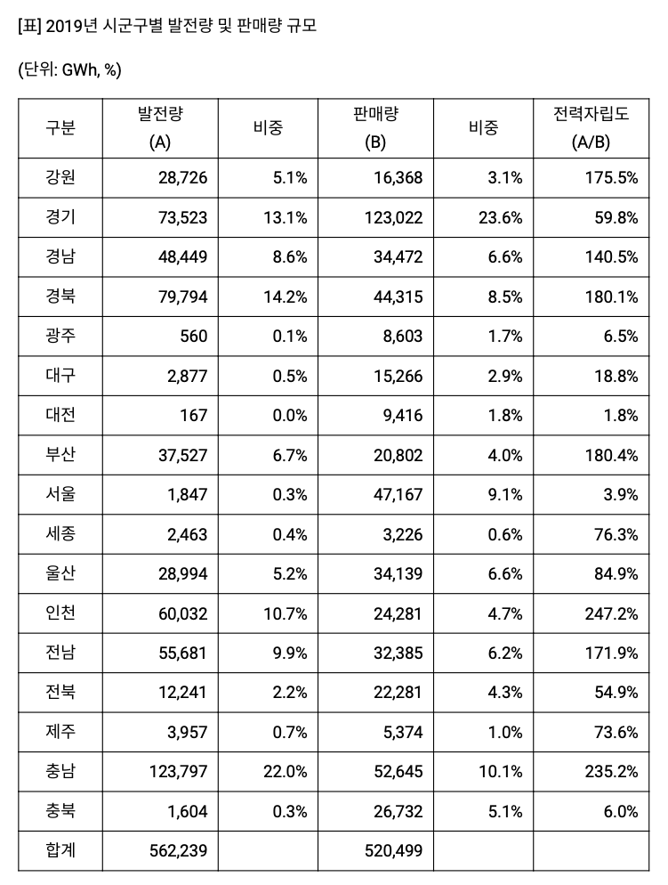

```{r setup, include=FALSE}
knitr::opts_chunk$set(echo = TRUE)
library(magrittr)
library(pander)
```

## 전력자립도

```{r Data, echo = FALSE, out.width = "70%"}

```

```{r, echo = FALSE}
Province <- c("강원", "경기", "경남", "경북", "광주", "대구", "대전", "부산", "서울", "세종", "울산", "인천", "전남", "전북", "제주", "충남", "충북")
A <- c(28276, 73523, 48449, 79794, 560, 2877, 167, 37527, 1847, 2463, 28994, 60032, 55681, 12241, 3957, 123797, 1604)
B <- c(16368, 123022, 34472, 44315, 8603, 15266, 9416, 20802, 47167, 3226, 34139, 24281, 32385, 22281, 5374, 52645, 26732)
R <- c("강원", "수도권", "가야", "신라", "영산강", "신라", "백제", "가야", "수도권", "백제", "가야", "수도권", "영산강", "전북", "제주", "백제", "백제")
R2 <- c("수도권", "수도권", "가야", "신라", "영산강", "신라", "백제", "가야", "수도권", "백제", "가야", "수도권", "영산강", "백제", "영산강", "백제", "백제")
Electricity <- data.frame(Province, R, R2, A, B)
Electricity$Rates <- round(Electricity$A / Electricity$B * 100, digits = 1)
# load("./R/Elec.RData")
# Electricity$Rates
Electricity$R2 <- factor(Electricity$R2, 
                         levels = c("수도권", "가야", "백제", "신라", "영산강"))
Electricity %>%
  pander
# by(Electricity[4:5], factor(Electricity$R2), 
#    function(x) round(sum(x[1]) / sum(x[2]) * 100, digits = 1)) 
```

```{r, echo = FALSE}
library(plyr)
ddply(Electricity, .(R2), 
      function(x) round(sum(x[, 4]) / sum(x[, 5]) * 100, digits = 1)) %>%
  pander
```


