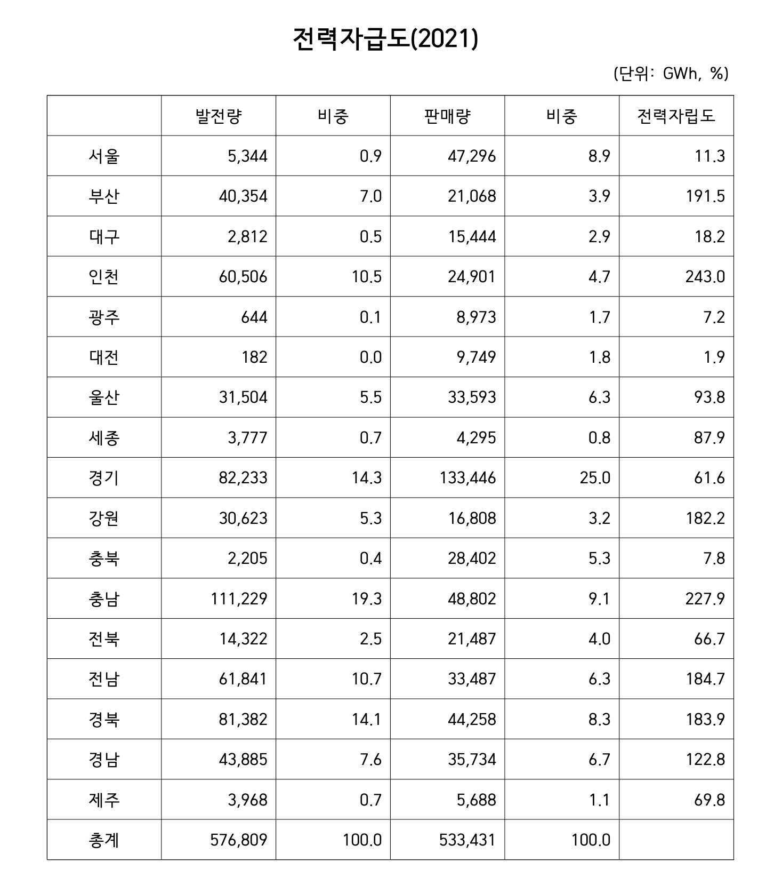

```{r setup, include=FALSE}
knitr::opts_chunk$set(echo = TRUE)
library(knitr)
library(magrittr)
library(readxl)
library(pander)
```

## 전력자립도

```{r Data, echo = FALSE, out.width = "70%"}

```

### 전력 발전량

```{r}
#> pdf 파일을 copy 하여 excel 시트에 옮기고, xlsx 파일로 정리하여 읽어들임. "-"를 NA 로 설정하여 읽어들인 후 0으로 변환.
Electricity <- 
  "../data/Electricity_Produce.xlsx" %>%
  read_excel(range = "B1:I18", 
             col_names = TRUE,
             col_types = "numeric") 
# Electricity[is.na(Electricity)] <- 0
Electricity
Province <- 
  c("서울", "부산", "대구", "인천", "광주", "대전", "울산", "세종", "경기", "강원", "충북", "충남", "전북", "전남", "경북", "경남", "제주")
Electricity %<>%
  data.frame(row.names = Province)
Electricity %<>%
 `/`(1000) %>%
  round 
Electricity %>%
  cbind("계" = rowSums(.)) %>%
  rbind("계" = colSums(.)) %>%
  pander
Source <- names(Electricity)
Electricity_Produce <- 
  data.frame(Source = factor(rep(names(Electricity), times = 17), levels = Source), 
             Province = factor(rep(Province, each = 8), levels = Province), 
             Produce = c(t(Electricity)))
pander(Electricity_Produce,
       col.names = c("에너지원", "시도", "발전량(MWh)"))
```

### Mosaic Plot

```{r, fig.width = 16, fig.height = 8}
library(ggplot2)
source("./mosaic_gg_tidy.R")
m_list <- mosaic_gg(tbl = Electricity_Produce)
m <- m_list$m
df <- m_list$df
p_df <- m_list$p_df
str(p_df)
# y_min <- min(p_df$y_breaks)
# y_max <- sort(unique(p_df$y_breaks[p_df$y_breaks < 0.99]), decreasing = TRUE)[1]
m_list$m +
  geom_text(aes(x = center, y = rep(c(rep(1.05, 4), 1.04, 1.06, rep(1.05, 11)), each = 8)),
            family = "KoPubWorldDotum Medium",
            label = p_df[, 2]) + 
  theme_bw() +
  labs(x = "시도(%)", y = "에너지원별(%)") + 
  ggtitle("시도별 에너지원별 발전량") + 
  scale_fill_brewer(name = "에너지원별", 
                    labels = Source,
                    type = "div", 
                    palette = "Spectral", 
                    direction = 1,
                    guide = guide_legend(reverse = TRUE)) +
  theme(legend.title = element_text(family = "KoPubWorldDotum Medium"),
        axis.title.x = element_text(family = "KoPubWorldDotum Light"),
        axis.title.y = element_text(family = "KoPubWorldDotum Light"),
        legend.text = element_text(family = "KoPubWorldDotum Light"),
        plot.title = element_text(size = 20, hjust = 0.5, family = "KoPubWorldDotum Bold"))
ggsave("../pics/Electrity_Produce_Province.png", dpi = 300, width = 16, height = 8, units = "in")
```


### 전력판매량

```{r}
Usage <- c("가정용", "공공용", "서비스업", "농림어업", "광업", "제조업")
Sales <- c(14656, 3575, 27499, 19, 2, 1544, 
           4975, 1280, 7507, 111, 20, 7175, 
           3461, 866, 5562, 80, 15, 5459, 
           4587, 944, 7572, 167, 88, 11544, 
           2216, 569, 3272, 77, 3, 2836, 
           2103, 1108, 4112, 37, 1, 2388, 
           1639, 505, 3498, 90, 15, 27846, 
           612, 343, 1520, 91, 12, 1718, 
           20775, 5941, 37299, 2712, 272, 66446, 
           2290, 1479, 6399, 784, 452, 5406, 
           2386, 1361, 5365, 920, 129, 18241, 
           3185, 1122, 7231, 2292, 342, 34631, 
           2589, 1082, 5146, 1705, 70, 10895, 
           2579, 1373, 5740, 3461, 83, 20251, 
           3709, 1706, 8789, 2136, 229, 27689, 
           4826, 1437, 9043, 2370, 69, 17990, 
           971, 334, 2627, 1445, 8, 303)
Electricity_Sales <- data.frame(Province = factor(rep(Province, each = 6), levels = Province), 
                                Usage = factor(rep(Usage, times = 17), levels = Usage), 
                                Sales = Sales)
Electricity_Sales <- Electricity_Sales[, c(2, 1, 3)]
```

### Mosaic Plot

```{r, fig.width = 16, fig.height = 8}
library(ggplot2)
source("./mosaic_gg_tidy.R")
m2_list <- mosaic_gg(tbl = Electricity_Sales)
m2 <- m2_list$m
df2 <- m2_list$df
p_df2 <- m2_list$p_df
str(p_df2)
m2_list$m +
  geom_text(aes(x = center, y = 1.05),
            family = "KoPubWorldDotum Medium",
            label = p_df2[, 2]) + 
  theme_bw() +
  labs(x = "시도(%)", y = "용도별(%)") + 
  ggtitle("시도별 용도별 판매전력량") + 
  scale_fill_brewer(name = "용도별", 
                    labels = Usage,
                    type = "qual", 
                    palette = "Set3", 
                    direction = 1,
                    guide = guide_legend(reverse = TRUE)) +
  theme(legend.title = element_text(family = "KoPubWorldDotum Medium"),
        axis.title.x = element_text(family = "KoPubWorldDotum Light"),
        axis.title.y = element_text(family = "KoPubWorldDotum Light"),
        legend.text = element_text(family = "KoPubWorldDotum Light"),
        plot.title = element_text(size = 20, hjust = 0.5, family = "KoPubWorldDotum Bold"))
ggsave("../pics/Electrity_Sales_Province.png", dpi = 300, width = 16, height = 8, units = "in")
```

### 전력 자급도

```{r, echo = FALSE}
Province_old <- c("강원", "경기", "경남", "경북", "광주", "대구", "대전", "부산", "서울", "세종", "울산", "인천", "전남", "전북", "제주", "충남", "충북")
A <- c(30623, 82233, 43885, 81382, 644, 2812, 182, 40354, 5344, 3777, 31504, 60506, 61841, 14322, 3968, 111229, 2205)
names(A) <- Province_old
W_A <- round(A / sum(A) * 100, 1)
# pander(WA, caption = "발전량 비중")
B <- c(16808, 133446, 35734, 44258, 8973, 15444, 9749, 21068, 47296, 4295, 33593, 24901, 33487, 21487, 5688, 48802, 28402)
names(B) <- Province_old
W_B <- round(B / sum(B) *100, 1)
# pander(W_B, caption = "판매량 비중")
A <- A[match(Province, Province_old)]
B <- B[match(Province, Province_old)]
SS <- round(A / B * 100, digits = 1)
kable(data.frame(A, W_A, B, W_B, SS),
       col.names = c("발전량(GWh)", "발전량비중(%)", "판매량(GWh)", "판매량비중(%)", "전력자급도(%)"), align = "r")
```

### 초광역 접근

```{r}
R <- c("강원", "수도권", "가야", "신라", "영산강", "신라", "백제", "가야", "수도권", "백제", "가야", "수도권", "영산강", "전북", "제주", "백제", "백제")
R <- R[match(Province, Province_old)]
R2 <- c("수도권", "수도권", "가야", "신라", "영산강", "신라", "백제", "가야", "수도권", "백제", "가야", "수도권", "영산강", "백제", "영산강", "백제", "백제")
R2 <- R2[match(Province, Province_old)]
Electricity <- 
  data.frame(Province, R, R2, A, W_A, B, W_B, SS)
kable(Electricity, col.names = c("시도", "5극3특", "5대권역", "발전량(GWh)", "발전량비중(%)", "판매량(GWh)", "판매량비중(%)", "전력자급도(%)"))
Electricity$R2 <- factor(Electricity$R2, 
                         levels = c("수도권", "가야", "백제", "신라", "영산강"))
Electricity %>%
  kable(col.names = c("시도", "5극3특", "5대권역", "발전량(GWh)", "발전량비중(%)", "판매량(GWh)", "판매량비중(%)", "전력자급도(%)"), row.names = FALSE)
# by(Electricity[4:5], factor(Electricity$R2), 
#    function(x) round(sum(x[1]) / sum(x[2]) * 100, digits = 1)) 
```

```{r, echo = FALSE}
library(plyr)
ddply(Electricity, .(R2), 
      function(x) round(sum(x[, 4]) / sum(x[, 6]) * 100, digits = 1)) %>%
  format(digits = 2, nsmall = 1) %>%
  pander(col.names = c("5대권역", "전력자급도(%)"), align = "r")
```


