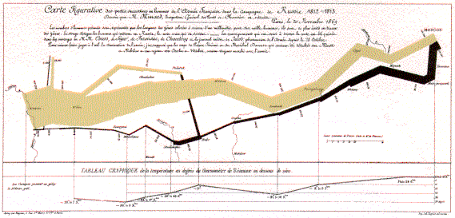

```{r setup, include=FALSE}
knitr::opts_chunk$set(echo = TRUE, message = TRUE, warning = FALSE)
```

```{r, out.width = "75%", fig.align = "left"}
# 
```

# 패키지

```{r, fig.width = 10, fig.height = 5}
# install.packages("gganimate", repos = "https://cloud.r-project.org/")
# install.packages("transformr", repos = "https://cloud.r-project.org/")   # gganimate와 함께 자주 필요
library(HistData)
library(ggplot2)
library(dplyr)
library(gganimate)   # 그래프 결합용 (설치 필요시: install.packages("patchwork"))
library(transformr)
library(gifski)

p <- ggplot(Minard.troops, aes(x = long, y = lat)) +
  geom_path(aes(size = survivors, color = direction, group = group),
            lineend = "round") +
  geom_point(data = Minard.cities, aes(x = long, y = lat),
             inherit.aes = FALSE, size = 2) +
  geom_text(data = Minard.cities, aes(x = long, y = lat, label = city),
            inherit.aes = FALSE, vjust = -1) +
  scale_size(range = c(0.5, 12), guide = "none") +
  scale_color_manual(values = c(A = "#c79a56", R = "#333333"),
                     labels = c(A = "Advance", R = "Retreat")) +
  coord_quickmap() +
  theme_minimal(base_size = 12) +
  labs(title = "Napoleon's March (Animated)",
       subtitle = "Frame: {frame_along}")

# 애니메이션: survivors 값이 줄어드는 과정을 따라가도록
anim <- p + transition_reveal(along = survivors)
```

## Animation

```{r, animate}
animate(anim, nframes = 100, fps = 10, width = 800, height = 600)
```

# Temperature

```{r}
p_temp <- ggplot(Minard.temp, aes(x = long, y = temp)) +
  geom_line() +
  geom_point() +
  geom_text(aes(label = paste0(temp, "°C")), vjust = -0.7) +
  theme_minimal() +
  labs(title = "Temperature during Retreat",
       subtitle = "{frame_time}") +
  transition_time(as.Date(date, "%Y-%m-%d")) +
  ease_aes("linear")
```

## Animation

```{r, temperature}
animate(p_temp, nframes = 80, fps = 8, width = 800, height = 400)
```