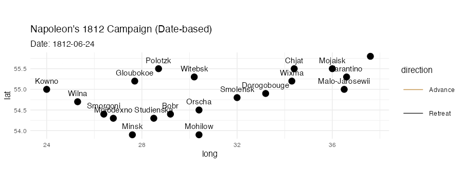
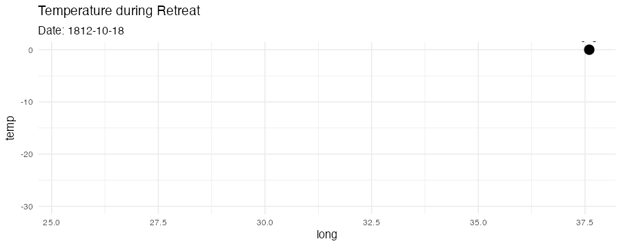

```{r setup, include=FALSE}
knitr::opts_chunk$set(echo = TRUE, message = TRUE, warning = FALSE, dev = "ragg_png")
options(gganimate.dev_args = list(units = "px", res = NA))

# 필수 패키지 확인 (설치는 콘솔에서!)
need <- c("HistData","ggplot2","dplyr","gganimate","gifski","transformr")
miss <- need[!sapply(need, requireNamespace, quietly = TRUE)]
if (length(miss) > 0) {
  stop(sprintf("미설치 패키지: %s\n콘솔에서 install.packages()로 먼저 설치하세요.", paste(miss, collapse=", ")))
}
lapply(c("HistData","ggplot2","dplyr","gganimate"), library, character.only=TRUE)
dir.create("figs", showWarnings = FALSE)
```

```{r anchors, include=FALSE}
library(tibble); library(lubridate); library(dplyr)

# ---- 1) 후퇴(R) 날짜 파싱(강건) ----
temps_raw <- HistData::Minard.temp
mon_candidates <- c("month","Month","mon","Mon")
day_candidates <- c("day","Day","DAY")
mon_col <- mon_candidates[mon_candidates %in% names(temps_raw)][1]
day_col <- day_candidates[day_candidates %in% names(temps_raw)][1]

temps <- temps_raw %>%
  mutate(
    date_chr = if ("date" %in% names(.)) as.character(date) else NA_character_,
    date_iso = suppressWarnings(lubridate::ymd(date_chr, quiet = TRUE)),
    date_1812_from_date = suppressWarnings(
      lubridate::parse_date_time(paste("1812", date_chr),
        orders = c("Y d b","Y d B","Y b d","Y B d"), quiet = TRUE)
    ),
    mon_chr = if (!is.na(mon_col)) as.character(.data[[mon_col]]) else NA_character_,
    day_chr = if (!is.na(day_col)) as.character(.data[[day_col]]) else NA_character_,
    date_1812_from_cols = suppressWarnings(
      lubridate::parse_date_time(paste("1812", mon_chr, day_chr),
        orders = c("Y b d","Y B d","Y d b","Y d B"), quiet = TRUE)
    ),
    date = coalesce(as.Date(date_iso),
                    as.Date(date_1812_from_date),
                    as.Date(date_1812_from_cols))
  ) %>%
  arrange(long) %>%
  filter(!is.na(long)) %>%
  distinct(long, .keep_all = TRUE)

bad <- temps %>% filter(is.na(date))
if (nrow(bad) > 0) {
  warning(sprintf("Minard.temp에서 날짜 파싱 실패 %d건 제외: %s",
                  nrow(bad),
                  paste(unique(na.omit(bad$date_chr)), collapse=", ")))
  temps <- temps %>% filter(!is.na(date))
}
stopifnot(nrow(temps) >= 2)

# 후퇴(R): long → date 보간 함수
ret_fun <- approxfun(temps$long, as.numeric(temps$date), rule = 2)

# ---- 2) 진군(Advance) 앵커(원하는 도시·날짜는 자유롭게 보강하세요) ----
anchors_adv_raw <- tribble(
  ~city,       ~date,
  "Kowno",     "1812-06-24",
  "Wilna",     "1812-06-28",
  "Witebsk",   "1812-07-28",  # Vitebsk
  "Orscha",    "1812-07-26",  # Orsha
  "Smolensk",  "1812-08-17",
  "Mojaisk",   "1812-09-08",  # (Borodino 인근, 데이터셋 표기)
  "Moskva",    "1812-09-14"   # 표기가 다를 수 있어 퍼지 매칭으로 해결
) %>% mutate(date = as.Date(date))

# ---- 3) 퍼지 매칭으로 city 표준화 → 좌표 결합 ----
cities_vec <- sort(unique(HistData::Minard.cities$city))

closest_city <- function(x, pool, max_dist = 3) {
  if (is.na(x) || !nzchar(x)) return(NA_character_)
  d <- adist(x, pool)
  i <- which.min(d)
  if (length(i) == 0) return(NA_character_)
  if (d[i] <= max_dist) pool[i] else NA_character_
}

anchors_adv <- anchors_adv_raw %>%
  rowwise() %>%
  mutate(city_std = closest_city(city, cities_vec, max_dist = 3)) %>%
  ungroup() %>%
  mutate(city_std = coalesce(city_std, city)) %>%  # 매칭 실패 시 원문 유지(경고 후 제외)
  left_join(HistData::Minard.cities, by = c("city_std" = "city")) %>%
  arrange(long) %>%
  distinct(long, .keep_all = TRUE)

missing_long <- anchors_adv %>% filter(is.na(long))
if (nrow(missing_long) > 0) {
  warning(sprintf(
    "앵커 좌표를 찾지 못해 제외된 도시: %s\n(가능한 표기: %s)",
    paste(missing_long$city, collapse=", "),
    paste(head(cities_vec, 20), collapse=", ")
  ))
  anchors_adv <- anchors_adv %>% filter(!is.na(long))
}
stopifnot(nrow(anchors_adv) >= 2)

# 진군(A): long → date 보간 함수
adv_fun <- approxfun(anchors_adv$long, as.numeric(anchors_adv$date), rule = 2)
```

```{r}
troops <- HistData::Minard.troops %>%
  mutate(
    date_num = if_else(direction == "R",
                       ret_fun(long),   # 후퇴: temp 기반
                       adv_fun(long)    # 진군: 앵커 기반
    ),
    date = as.Date(date_num, origin = "1970-01-01")
  ) %>%
  group_by(group) %>%
  arrange(date, .by_group = TRUE) %>%
  ungroup()
```

```{r}
p <- ggplot(troops, aes(long, lat, group = group)) +
  geom_path(aes(size = survivors, color = direction), lineend = "round") +
  geom_point(data = HistData::Minard.cities, aes(long, lat),
             inherit.aes = FALSE, size = 2) +
  geom_text(data = HistData::Minard.cities, aes(long, lat, label = city),
            inherit.aes = FALSE, vjust = -1) +
  scale_size(range = c(0.5, 12), guide = "none") +
  scale_color_manual(values = c(A = "#c79a56", R = "#333333"),
                     labels = c(A = "Advance", R = "Retreat")) +
  coord_quickmap() +
  theme_minimal(base_size = 12) +
  labs(title = "Napoleon's 1812 Campaign (Date-based)",
       subtitle = "Date: {frame_along}")

anim <- p + gganimate::transition_reveal(date)

gif <- animate(anim,
               nframes = 120, fps = 12,
               width = 900, height = 620,
               units = "px", 
               bg = "white",
               renderer = gifski_renderer())
anim_save("figs/minard_date.gif", gif)
```


```{r}

```

```{r}
p_temp <- ggplot(temps, aes(long, temp)) +
  geom_line() + geom_point() +
  geom_text(aes(label = paste0(temp, "°C")), vjust = -0.7) +
  theme_minimal() +
  labs(title = "Temperature during Retreat", subtitle = "{frame_time}")

anim_temp <- p_temp + gganimate::transition_time(date) + gganimate::ease_aes("linear")

gif_temp <- animate(anim_temp,
                    nframes = 60, fps = 8,
                    width = 900, height = 360,
                    units = "px", 
                    bg = "white",
                    renderer = gifski_renderer())
anim_save("figs/minard_temp.gif", gif_temp)
```

```{r}

```
