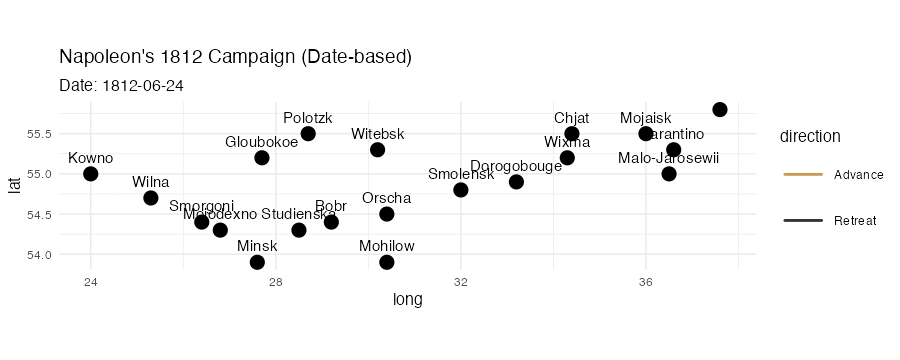
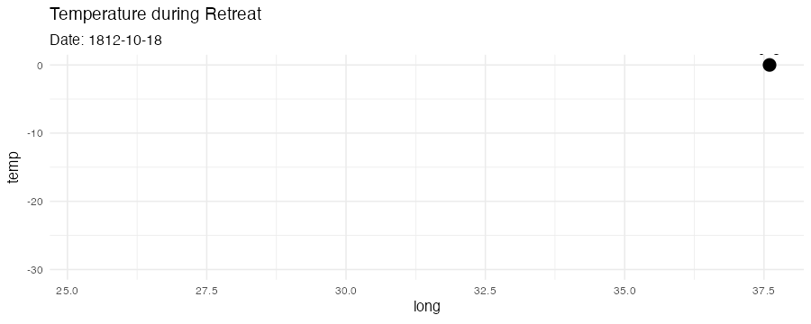

```{r setup, message = FALSE, include = TRUE, results = 'hide'}
knitr::opts_chunk$set(echo = TRUE, message = TRUE, warning = FALSE, dev = "ragg_png")
# gganimate가 장치를 인치 단위로 해석하지 않도록 픽셀 단위를 기본으로 강제
options(gganimate.dev_args = list(units = "px", res = NA))

# 설치는 콘솔에서 미리: HistData, ggplot2, dplyr, gganimate, gifski, transformr, lubridate
need <- c("HistData","ggplot2","dplyr","gganimate","gifski","transformr","lubridate","tibble")
miss <- need[!sapply(need, requireNamespace, quietly = TRUE)]
if (length(miss) > 0) {
  stop(sprintf("미설치 패키지: %s\n콘솔에서 install.packages()로 먼저 설치하세요.", paste(miss, collapse=", ")))
}
lapply(c("HistData","ggplot2","dplyr","gganimate","lubridate","tibble"),
       library, character.only = TRUE)
dir.create("figs", showWarnings = FALSE)
```

# 1) 날짜 앵커 정의 + 날짜 파싱(안전판)

```{r anchors, include = TRUE}
# ---- 후퇴(R): Minard.temp의 long–date 사용 ----
temps_raw <- HistData::Minard.temp

# date가 문자/팩터 섞임, 연도 없는 경우가 있어 강건 파싱
mon_candidates <- c("month","Month","mon","Mon")
day_candidates <- c("day","Day","DAY")
mon_col <- mon_candidates[mon_candidates %in% names(temps_raw)][1]
day_col <- day_candidates[day_candidates %in% names(temps_raw)][1]

temps <- temps_raw %>%
  mutate(
    date_chr = if ("date" %in% names(.)) as.character(date) else NA_character_,
    # 1) ISO(YYYY-MM-DD 등)
    date_iso = suppressWarnings(lubridate::ymd(date_chr, quiet = TRUE)),
    # 2) "Nov 24" 등 연도 없는 표기에는 1812 붙여 파싱
    date_1812_from_date = suppressWarnings(
      lubridate::parse_date_time(paste("1812", date_chr),
                                 orders = c("Y d b","Y d B","Y b d","Y B d"),
                                 quiet = TRUE)
    ),
    # 3) month/day 컬럼이 따로 있으면 그것으로 1812년 파싱
    mon_chr = if (!is.na(mon_col)) as.character(.data[[mon_col]]) else NA_character_, 
    day_chr = if (!is.na(day_col)) as.character(.data[[day_col]]) else NA_character_,
    date_1812_from_cols = suppressWarnings(
      lubridate::parse_date_time(paste("1812", mon_chr, day_chr),
                                 orders = c("Y b d","Y B d","Y d b","Y d B"),
                                 quiet = TRUE)
    ),
    date = dplyr::coalesce(as.Date(date_iso),
                           as.Date(date_1812_from_date),
                           as.Date(date_1812_from_cols))
  ) %>%
  arrange(long) %>%
  filter(!is.na(long)) %>%
  distinct(long, .keep_all = TRUE)

# 파싱 실패한 행은 경고만 띄우고 제외
bad <- temps %>% filter(is.na(date))
if (nrow(bad) > 0) {
  warning(sprintf("Minard.temp에서 날짜 파싱 실패 %d건 제외: %s",
                  nrow(bad),
                  paste(unique(na.omit(bad$date_chr)), collapse=", ")))
  temps <- temps %>% filter(!is.na(date))
}
stopifnot(nrow(temps) >= 2)

# 라벨 타입 고정(gganimate labelcolumn 타입 충돌 방지)
temps <- temps %>% mutate(lbl = as.character(paste0(temp, "°C"))) %>% mutate(gid = 1L)

# 후퇴(R): long → date 보간 함수
ret_fun <- approxfun(temps$long, as.numeric(temps$date), rule = 2)

# ---- 진군(A) 앵커: 데이터셋 표기에 맞춰 퍼지 매칭 사용 ----
anchors_adv_raw <- tibble::tribble(
  ~city,       ~date,
  "Kowno",     "1812-06-24",
  "Wilna",     "1812-06-28",
  "Witebsk",   "1812-07-28",  # Vitebsk
  "Orscha",    "1812-07-26",  # Orsha
  "Smolensk",  "1812-08-17",
  "Mojaisk",   "1812-09-08",  # (Borodino 인근, 데이터셋 표기)
  "Moskva",    "1812-09-14"   # Moscow/Moscou 등과 표기 차이를 퍼지 매칭으로 해결
) %>%
  mutate(date = as.Date(date))

# 데이터셋의 실제 표기 목록
cities_vec <- sort(unique(HistData::Minard.cities$city))

# 간단한 퍼지 매칭 함수(adist)
closest_city <- function(x, pool, max_dist = 3) {
  if (is.na(x) || !nzchar(x)) return(NA_character_)
  d <- adist(x, pool)
  i <- which.min(d)
  if (length(i) == 0) return(NA_character_)
  if (d[i] <= max_dist) pool[i] else NA_character_
}

anchors_adv <- anchors_adv_raw %>%
  rowwise() %>%
  mutate(city_std = closest_city(city, cities_vec, max_dist = 3)) %>%
  ungroup() %>%
  mutate(city_std = dplyr::coalesce(city_std, city)) %>%
  left_join(HistData::Minard.cities, by = c("city_std" = "city")) %>%
  arrange(long) %>%
  distinct(long, .keep_all = TRUE)

missing_long <- anchors_adv %>% filter(is.na(long))
if (nrow(missing_long) > 0) {
  warning(sprintf(
    "앵커 좌표를 찾지 못해 제외된 도시: %s",
    paste(missing_long$city, collapse=", ")
  ))
  anchors_adv <- anchors_adv %>% filter(!is.na(long))
}
stopifnot(nrow(anchors_adv) >= 2)

# 진군(A): long → date 보간 함수
adv_fun <- approxfun(anchors_adv$long, as.numeric(anchors_adv$date), rule = 2)

# 도시 라벨은 character로 고정 (labelcolumn 타입 불일치 방지)
cities_df <- HistData::Minard.cities %>% dplyr::mutate(city = as.character(city))
```

# 2) 부대 경로에 날짜 부여

```{r attach-dates, include=TRUE}
troops <- HistData::Minard.troops %>%
  mutate(
    date_num = if_else(direction == "R",
                       ret_fun(long),   # 후퇴: temp 기반
                       adv_fun(long)    # 진군: 앵커 기반
    ),
    date = as.Date(date_num, origin = "1970-01-01")
  ) %>%
  group_by(group) %>%
  arrange(date, .by_group = TRUE) %>%
  ungroup()
```

# 3) 날짜(date) 기반 경로 애니메이션 → GIF 저장 & 포함

```{r animate-path, message = FALSE, include = TRUE}
p <- ggplot(troops, aes(long, lat, group = group)) +
  geom_path(aes(size = survivors, color = direction), lineend = "round") +
  geom_point(data = cities_df, aes(long, lat), inherit.aes = FALSE, size = 2) +
  geom_text(data = cities_df, aes(long, lat, label = city),
            inherit.aes = FALSE, vjust = -1, size = 2) +
  scale_size(range = c(0.5, 4.5), guide = "none") +
  scale_color_manual(values = c(A = "#c79a56", R = "#333333"),
                     labels = c(A = "Advance", R = "Retreat")) +
  coord_quickmap() +
  theme_minimal(base_size = 6) +
  labs(title = "Napoleon's 1812 Campaign (Date-based)",
       subtitle = "Date: {frame_along}")

anim <- p + gganimate::transition_reveal(date)

gif <- animate(anim,
               nframes = 120, fps = 12,
               width = 900, height = 360,
               units = "px",
               bg = "white",
               renderer = gifski_renderer())
anim_save("figs/minard_date.gif", gif)
```

```{r, echo = TRUE, out.width="100%"}

```

# 4) 온도(후퇴) 애니메이션 (옵션)

```{r animate-temp, message = FALSE, include = TRUE}
# Create the base plot
p_temp <- ggplot(temps, aes(long, temp)) +
  # Add the full line as a static background
  geom_line(aes(group = 1), na.rm = TRUE) +
  # Animate the points along the line
  geom_point(aes(group = seq_along(long)), na.rm = TRUE, size = 2) +
  # Animate the labels for the points
  geom_text(aes(label = lbl, group = seq_along(long)), vjust = -1, na.rm = TRUE, size = 2) +
  theme_minimal(base_size = 6) +
  labs(title = "Temperature during Retreat", subtitle = "Date: {frame_along}")

# Apply the animation
anim_temp <- p_temp + gganimate::transition_reveal(date)

# Save the animation
gif_temp <- animate(anim_temp,
                    nframes = 60, fps = 8,
                    width = 900, height = 360,
                    units = "px",
                    bg = "white",
                    renderer = gifski_renderer())
anim_save("figs/minard_temp.gif", gif_temp)
```


```{r, echo=FALSE, out.width="100%"}

```
