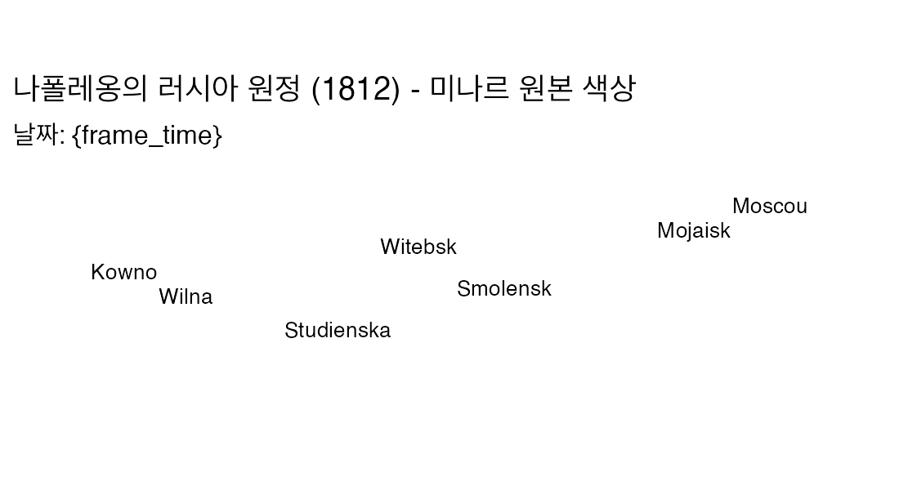
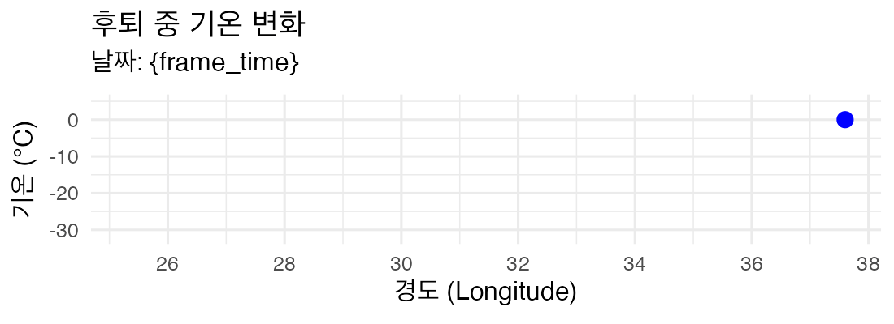

```{r setup, message = FALSE, include = TRUE, results = 'hide'}
knitr::opts_chunk$set(echo = TRUE, message = TRUE, warning = FALSE, dev = "ragg_png")
# gganimate가 장치를 인치 단위로 해석하지 않도록 픽셀 단위를 기본으로 강제
options(gganimate.dev_args = list(units = "px", res = NA))

# 필요한 패키지 로드
need <- c("HistData","ggplot2","dplyr","gganimate","gifski","lubridate","tibble","scales")
miss <- need[!sapply(need, requireNamespace, quietly = TRUE)]
if (length(miss) > 0) {
  stop(sprintf("미설치 패키지: %s\n콘솔에서 install.packages()로 먼저 설치하세요.", paste(miss, collapse=", ")))
}
lapply(c("HistData","ggplot2","dplyr","gganimate","lubridate","tibble", "scales"),
       library, character.only = TRUE)
dir.create("figs", showWarnings = FALSE) # GIF 저장 폴더 생성
```

# 1) 데이터 정리 및 날짜/온도 정보 통합

```{r data-prep, include = TRUE}
# ----------------------------------------------------
# 1. 온도 데이터 처리 (후퇴 경로의 색상 및 라벨에 사용)
# ----------------------------------------------------
temps_raw <- HistData::Minard.temp

# 날짜 파싱 (기존 코드 유지: 다양한 형식의 날짜를 안전하게 Date 타입으로 변환)
mon_candidates <- c("month","Month","mon","Mon")
day_candidates <- c("day","Day","DAY")
mon_col <- mon_candidates[mon_candidates %in% names(temps_raw)][1]
day_col <- day_candidates[day_candidates %in% names(temps_raw)][1]

temps <- temps_raw %>%
  mutate(
    date_chr = if ("date" %in% names(.)) as.character(date) else NA_character_,
    date_iso = suppressWarnings(lubridate::ymd(date_chr, quiet = TRUE)),
    date_1812_from_date = suppressWarnings(
      lubridate::parse_date_time(paste("1812", date_chr), orders = c("Y d b","Y d B","Y b d","Y B d"), quiet = TRUE)),
    mon_chr = if (!is.na(mon_col)) as.character(.data[[mon_col]]) else NA_character_, 
    day_chr = if (!is.na(day_col)) as.character(.data[[day_col]]) else NA_character_,
    date_1812_from_cols = suppressWarnings(
      lubridate::parse_date_time(paste("1812", mon_chr, day_chr), orders = c("Y b d","Y B d","Y d b","Y d B"), quiet = TRUE)),
    date = dplyr::coalesce(as.Date(date_iso),
                           as.Date(date_1812_from_date),
                           as.Date(date_1812_from_cols))
  ) %>%
  filter(!is.na(long)) %>%
  distinct(long, .keep_all = TRUE) %>%
  # FIX: 날짜가 NA인 행을 명시적으로 제거하여 gganimate 오류 방지 
  filter(!is.na(date)) %>%
  # 온도 라벨 및 gganimate 그룹 ID 추가
  mutate(temp_lbl = as.character(paste0(temp, "°C")),
         temp_id = row_number()) %>%
  # gganimate의 안정성을 위해 date를 numeric으로 변환한 열을 명시적으로 추가
  mutate(date_num = as.numeric(date)) 
  
# 후퇴(R) 경로의 long → date 보간 함수
ret_fun <- approxfun(temps$long, as.numeric(temps$date), rule = 2)


# ----------------------------------------------------
# 2. 부대 경로 데이터 처리 (Minard.troops)
# ----------------------------------------------------
troops <- HistData::Minard.troops %>%
  # --- FIX: 진군 경로의 애니메이션이 보이도록 순서를 명확히 부여 ---
  # 그룹/방향별로 경도 순서에 따라 정렬하고, 순번(row_number)을 부여하여 움직임 생성
  group_by(group, direction) %>% 
  arrange(long, .by_group = TRUE) %>% 
  
  mutate(
    date_num_base = if_else(direction == "R",
                       ret_fun(long),   # 후퇴: temp 기반 날짜 보간 (정확한 날짜)
                       # 진군: 경로의 순번(row_number)을 이용하여 시간 간격(5일) 부여
                       as.numeric(as.Date("1812-06-24")) + (row_number() * 5) 
    )
  ) %>%
  ungroup() %>%
  
  # 최종 date_num과 date 생성
  mutate(
    date_num = date_num_base,
    date = as.Date(date_num, origin = "1970-01-01")
  ) %>%
  # 최종 애니메이션 순서를 위해 date_num 기준으로 정렬
  arrange(date_num) 

# 온도 데이터를 tropas 데이터에 합치기 (후퇴 경로의 색상 적용을 위함)
troops_merged <- troops %>%
  # 조인 시 temp를 temp_value로 이름 변경
  left_join(temps %>% 
              select(long, date, temp_value = temp), 
            by = c("long", "date")) %>%
  
  # 진군 경로에는 NA 온도, 후퇴 경로에는 조인된 temp_value 사용
  mutate(temp = if_else(direction == "R", temp_value, NA_real_)) %>%
  select(-temp_value) %>% # 임시 열 제거
  
  # color_value를 temp 기준으로 설정 (진군 경로는 10도 고정)
  mutate(color_value = if_else(direction == "A", 10, temp)) %>%
  # gganimate가 동일한 time step을 인식하도록 날짜를 숫자로 다시 변환
  mutate(date_num = as.numeric(date))
  
# 도시 라벨 (Minard.cities)
cities_df <- HistData::Minard.cities %>% 
  dplyr::mutate(city = as.character(city))

# --- FIX: 중요한 도시 필터링 목록 최종 수정 ---
# Minard.cities 데이터셋의 정확한 이름 사용: Moscou, Studienska (베레지나 도하)
key_cities <- c("Kowno", "Wilna", "Witebsk", "Smolensk", "Moscou", "Studienska", "Mojaisk")

cities_df_filtered <- cities_df %>%
    filter(city %in% key_cities)
```

# 2) 날짜 기반 경로 애니메이션 (색상 및 라벨 크기 조정)

```{r animate-path-with-temp, message = FALSE, include = TRUE, out.width="100%"}
# Minard 지도의 색상 설정 (진군: 황갈색, 후퇴: 검은색)
# 온도에 따른 색상 변화는 두 번째 그래프에서 시각화하며, 여기서는 원본 지도 색상을 따름.

# --- FIX: 데이터 경계 계산을 ggplot 구문 외부로 이동 ---
x_min <- min(troops_merged$long, na.rm = TRUE) - 1.5
x_max <- max(troops_merged$long, na.rm = TRUE) + 1.5
y_min <- min(troops_merged$lat, na.rm = TRUE) - 0.5
y_max <- max(troops_merged$lat, na.rm = TRUE) + 0.5


p_path_temp <- ggplot(troops_merged, aes(long, lat, group = group)) +
  # 경로 그리기: 사이즈는 생존자(survivors), 색상은 방향(direction)
  geom_path(aes(size = survivors, color = direction, group = group), 
            lineend = "round") +
  
  # --- FIX: 색상 변경 (원본 미나르 지도 색상) ---
  scale_color_manual(
    values = c("A" = "#E1B08C", # 진군: 황갈색
               "R" = "#333333"), # 후퇴: 검은색 (원작 반영)
    guide = "none"
  ) +
  
  scale_size(range = c(0.5, 5), guide = "none") +
  
  # --- FIX: 좌표계 범위 확장 적용 ---
  coord_quickmap(xlim = c(x_min, x_max), ylim = c(y_min, y_max)) +
  
  # --- FIX: 도시 라벨 크기 축소 및 배경 제거 (geom_text 사용) ---
  geom_text(data = cities_df_filtered, aes(long, lat, label = city),
             inherit.aes = FALSE, vjust = -0.5, size = 3.5, # 크기 3.5로 축소
             color = "black") + # 박스 제거 및 크기 조정
  
  # 전체 배경 지도 스타일 설정
  theme_minimal(base_size = 12) +
  theme(panel.grid = element_blank(),
        axis.title = element_blank(),
        axis.text = element_blank()) +
        
  labs(title = "나폴레옹의 러시아 원정 (1812) - 미나르 원본 색상",
       subtitle = "날짜: {frame_time}")

# 애니메이션 적용: 날짜(date) 기준으로 경로가 드러나게 함
anim_path_temp <- p_path_temp + 
  gganimate::transition_reveal(date_num)

# GIF 저장
gif_path_temp <- animate(anim_path_temp,
                         nframes = 150, fps = 10, 
                         width = 1100, height = 600,
                         units = "px",
                         bg = "white",
                         renderer = gifski_renderer())

anim_save("figs/minard_path_temp.gif", gif_path_temp)
```

```{r, echo = TRUE, out.width="100%"}

```

# 3) 온도 변화 애니메이션

```{r animate-temp-final, message = FALSE, include = TRUE, out.width="100%"}
# 온도 데이터만 사용
p_temp_final <- ggplot(temps, aes(long, temp)) +
  # --- FIX: Y축 범위 강제 확장 ---
  ylim(min(temps$temp, na.rm = TRUE) - 2, 
       max(temps$temp, na.rm = TRUE) + 5) + 
  
  # 전체 온도 선
  geom_line(aes(group = 1), na.rm = TRUE, color = "#444444") +
  # 애니메이션 점과 라벨
  geom_point(aes(group = temp_id), na.rm = TRUE, size = 3, color = "#0000FF") +
  geom_text(aes(label = temp_lbl, group = temp_id), vjust = -1.5, na_rm = TRUE, size = 4) +
  
  theme_minimal(base_size = 12) +
  labs(title = "후퇴 중 기온 변화", 
       subtitle = "날짜: {frame_time}",
       x = "경도 (Longitude)",
       y = "기온 (°C)") +
  
  # x축을 경로와 맞추기
  scale_x_continuous(breaks = scales::breaks_pretty(n = 6))

anim_temp_final <- p_temp_final + gganimate::transition_reveal(date_num)

gif_temp_final <- animate(anim_temp_final,
                          nframes = 80, fps = 10,
                          width = 1100, height = 400, 
                          units = "px",
                          bg = "white",
                          renderer = gifski_renderer())

anim_save("figs/minard_temp_final.gif", gif_temp_final)
```

```{r, echo=TRUE, out.width="100%"}

```