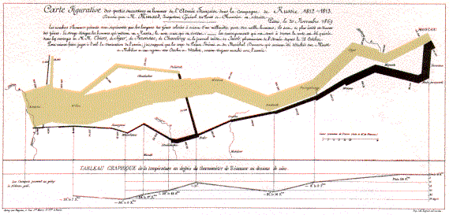

```{r setup, include=FALSE}
knitr::opts_chunk$set(echo = TRUE, warning = FALSE, message = FALSE)
# warning = FALSE 및 message = FALSE 설정을 추가하여 렌더링 시 메시지 최소화
```

```{r, out.width = "100%"}

```

```{r, out.width = "100%"}
# 필요한 패키지 로드
library(HistData)
library(ggplot2)
library(scales)
library(gridExtra)
library(dplyr) # 데이터 클리닝을 위해 dplyr 추가

# 데이터 로드
data(Minard.troops)
data(Minard.cities)
data(Minard.temp)

# Minard.temp에서 date가 NA인 행을 명시적으로 제거하여 경고 제거
Minard.temp.clean <- Minard.temp %>% 
  filter(!is.na(.data$date))

# plot_minard에서 사용할 breaks 정의
breaks <- c(1, 2, 3) * 10^5

# 병력 이동 경로
plot_troops <- ggplot(Minard.troops, aes(long, lat)) +
  geom_path(aes(linewidth = survivors, colour = direction, group = group),
            lineend = "round", linejoin = "round")

# 도시 위치 레이블
plot_cities <- geom_text(aes(label = city), size = 4, data = Minard.cities)

# 병력 이동 플롯 (Minard Map) 최종 구성
plot_minard <- plot_troops + plot_cities +
  scale_size("Survivors", range = c(1, 10), 
             breaks = breaks, labels = scales::comma(breaks)) +
  scale_color_manual("Direction", 
                     values = c("#E1B08C", "#333333"), 
                     labels=c("Advance", "Retreat")) +
  # Kowno(23.85)와 Taroutino(39.5)를 모두 포함하도록 범위 확장
  coord_cartesian(xlim = c(23.5, 40)) + 
  xlab(NULL) + 
  ylab("Latitude") + 
  ggtitle("Napoleon's March on Moscow") +
  theme_bw() +
  theme(legend.position = "inside", 
        legend.position.inside=c(.8, .2), 
        legend.box="horizontal")

# 온도 변화 플롯 구성 (클리닝된 데이터 사용)
plot_temp <- ggplot(Minard.temp.clean, aes(long, temp)) +
  geom_path(color="grey", size=1.5) +
  geom_point(size=2) +
  geom_text(aes(label=date)) +
  xlab("Longitude") + ylab("Temperature") +
  # 병력 플롯과 동일한 xlim 적용
  coord_cartesian(xlim = c(23.5, 40)) + 
  theme_bw()

grid.arrange(plot_minard, plot_temp, nrow=2, heights=c(3,1))
```