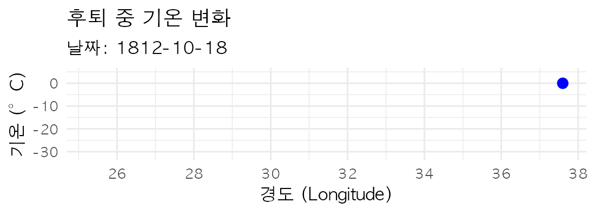

<!--
[정리 내역]  Minard_Gemini.Rmd 를 바탕으로 아래 다섯 가지를 고쳤습니다.
  1. transition_reveal() 은 {frame_time} 이 아니라 {frame_along} 을 줍니다.
     자막에 {frame_time} 이 글자 그대로 찍히던 원인입니다.
  2. transition_reveal(date_num) → transition_reveal(date).
     Date 를 그대로 넘겨야 자막에 날짜로 찍힙니다. 숫자로 넘기면 15550 같은 값이 나옵니다.
  3. 한글 폰트를 운영체제에 맞춰 지정하고 animate() 에 device = "ragg_png" 를 줍니다.
     프레임의 한글이 두부(□□□)로 깨지던 원인입니다.
  4. geom_path 의 size → linewidth (ggplot2 3.4 이후 권장).
  5. geom_text 의 na_rm → na.rm (오타).
     그리고 쓰이지 않던 color_value / 온도 조인을 걷어냈습니다.

원본 Minard_Gemini.Rmd 는 비교용으로 그대로 두었습니다.
-->

```{r setup, message = FALSE, results = 'hide'}
knitr::opts_chunk$set(echo = TRUE, message = TRUE, warning = FALSE, dev = "ragg_png")

need <- c("HistData", "ggplot2", "dplyr", "gganimate", "gifski",
          "ragg", "lubridate", "tibble", "scales")
miss <- need[!sapply(need, requireNamespace, quietly = TRUE)]
if (length(miss) > 0) {
  stop(sprintf("미설치 패키지: %s\n콘솔에서 install.packages(c(\"%s\")) 로 먼저 설치하세요.",
               paste(miss, collapse = ", "), paste(miss, collapse = "\", \"")))
}
invisible(lapply(c("HistData", "ggplot2", "dplyr", "gganimate",
                   "lubridate", "tibble", "scales"),
                 library, character.only = TRUE))

#> [수정 3] 한글 폰트. 프레임을 그리는 장치는 knitr 의 dev 설정을 쓰지 않으므로
#>          테마에 직접 지정해야 합니다. 이걸 빼면 한글이 두부(□□□)로 나옵니다.
kfont <- if (.Platform$OS.type == "windows") "Malgun Gothic" else "AppleGothic"
theme_set(theme_minimal(base_size = 12, base_family = kfont))

dir.create("figs", showWarnings = FALSE)
```

## 이 자료에 대하여

샤를 조제프 미나르가 1869년에 그린 나폴레옹의 1812년 러시아 원정 지도다. 두 개의
차원 위에 여섯 가지를 한꺼번에 얹었다 — 부대의 규모, 위도, 경도, 진행 방향,
날짜, 그리고 후퇴 중의 기온.

우리가 쓰는 것은 그 그림을 디지털로 옮긴 `HistData` 패키지의 세 표다.

```{r about-data}
str(HistData::Minard.troops)
str(HistData::Minard.cities)
str(HistData::Minard.temp)
```

`survivors` 열이 이 그림의 핵심이다. 이 숫자가 어디서 왔는지, 미나르가 무엇을
근거로 삼았는지는 별도의 컨텍스트 절에서 다룬다.

# 1) 자료 정리

```{r data-prep}
## ── 기온 자료 : 후퇴 경로의 날짜를 얻는 데 쓴다 ────────────────────
temps_raw <- HistData::Minard.temp

mon_col <- c("month", "Month", "mon", "Mon")[c("month", "Month", "mon", "Mon") %in% names(temps_raw)][1]
day_col <- c("day", "Day", "DAY")[c("day", "Day", "DAY") %in% names(temps_raw)][1]

temps <- temps_raw %>%
  mutate(
    date_chr = if ("date" %in% names(.)) as.character(date) else NA_character_,
    date_iso = suppressWarnings(lubridate::ymd(date_chr, quiet = TRUE)),
    date_a = suppressWarnings(lubridate::parse_date_time(
      paste("1812", date_chr), orders = c("Y d b", "Y d B", "Y b d", "Y B d"), quiet = TRUE)),
    mon_chr = if (!is.na(mon_col)) as.character(.data[[mon_col]]) else NA_character_,
    day_chr = if (!is.na(day_col)) as.character(.data[[day_col]]) else NA_character_,
    date_b = suppressWarnings(lubridate::parse_date_time(
      paste("1812", mon_chr, day_chr), orders = c("Y b d", "Y B d", "Y d b", "Y d B"), quiet = TRUE)),
    date = dplyr::coalesce(as.Date(date_iso), as.Date(date_a), as.Date(date_b))
  ) %>%
  filter(!is.na(long), !is.na(date)) %>%
  distinct(long, .keep_all = TRUE) %>%
  mutate(temp_lbl = paste0(temp, "°C"),
         temp_id  = row_number())

## 후퇴 경로의 경도 → 날짜 보간
ret_fun <- approxfun(temps$long, as.numeric(temps$date), rule = 2)

## ── 부대 경로 ──────────────────────────────────────────────────────
troops <- HistData::Minard.troops %>%
  group_by(group, direction) %>%
  arrange(long, .by_group = TRUE) %>%
  mutate(date_num = if_else(
    direction == "R",
    ret_fun(long),                                             # 후퇴 : 기온표의 날짜
    as.numeric(as.Date("1812-06-24")) + row_number() * 5)) %>% # 진군 : 5일 간격 가정
  ungroup() %>%
  mutate(date = as.Date(date_num, origin = "1970-01-01")) %>%
  arrange(date_num)

## ── 도시 라벨 ──────────────────────────────────────────────────────
key_cities <- c("Kowno", "Wilna", "Witebsk", "Smolensk",
                "Moscou", "Studienska", "Mojaisk")
cities_df <- HistData::Minard.cities %>%
  mutate(city = as.character(city)) %>%
  filter(city %in% key_cities)

c(부대_행수 = nrow(troops), 기온_행수 = nrow(temps), 도시 = nrow(cities_df))
```

> **진군 경로의 날짜는 가정입니다.** 기온표는 후퇴 구간만 담고 있어서, 진군
> 구간에는 6월 24일부터 5일 간격이라는 임의의 간격을 넣었습니다. 애니메이션이
> 고르게 흐르게 하려는 장치일 뿐, 실제 행군 속도가 아닙니다. 이 그림에서
> **진군의 속도를 읽어서는 안 됩니다.**

# 2) 경로 애니메이션

```{r animate-path, message = FALSE, out.width = "100%"}
x_rng <- range(troops$long, na.rm = TRUE) + c(-1.5, 1.5)
y_rng <- range(troops$lat,  na.rm = TRUE) + c(-0.5, 0.5)

p_path <- ggplot(troops, aes(long, lat, group = group)) +
  #> [수정 4] size → linewidth
  geom_path(aes(linewidth = survivors, colour = direction), lineend = "round") +
  scale_linewidth(range = c(0.5, 5), guide = "none") +
  scale_colour_manual(values = c("A" = "#E1B08C",   # 진군 : 황갈색
                                 "R" = "#333333"),  # 후퇴 : 검정
                      guide = "none") +
  coord_quickmap(xlim = x_rng, ylim = y_rng) +
  geom_text(data = cities_df, aes(long, lat, label = city),
            inherit.aes = FALSE, vjust = -0.5, size = 3.5, colour = "black") +
  theme(panel.grid = element_blank(),
        axis.title = element_blank(),
        axis.text  = element_blank()) +
  #> [수정 1·2] transition_reveal 은 {frame_along} 을 줍니다. {frame_time} 이 아닙니다.
  labs(title = "나폴레옹의 러시아 원정 (1812)",
       subtitle = "날짜: {frame_along}")

anim_path <- p_path + gganimate::transition_reveal(date)

gif_path <- animate(anim_path,
                    nframes = 150, fps = 10,
                    width = 1100, height = 600, units = "px",
                    bg = "white",
                    device = "ragg_png",              #> [수정 3] 한글 렌더링
                    renderer = gifski_renderer())

anim_save("figs/minard_path.gif", gif_path)
```

```{r show-path, echo = TRUE, out.width = "100%"}
knitr::include_graphics("figs/minard_path.gif")
```

# 3) 기온 애니메이션

```{r animate-temp, message = FALSE, out.width = "100%"}
p_temp <- ggplot(temps, aes(long, temp)) +
  ylim(min(temps$temp, na.rm = TRUE) - 2, max(temps$temp, na.rm = TRUE) + 5) +
  geom_line(aes(group = 1), na.rm = TRUE, colour = "#444444") +
  geom_point(aes(group = temp_id), na.rm = TRUE, size = 3, colour = "#0000FF") +
  #> [수정 5] na_rm 은 오타입니다. na.rm 이 맞습니다.
  geom_text(aes(label = temp_lbl, group = temp_id),
            vjust = -1.5, na.rm = TRUE, size = 4) +
  scale_x_continuous(breaks = scales::breaks_pretty(n = 6)) +
  labs(title = "후퇴 중 기온 변화",
       subtitle = "날짜: {frame_along}",
       x = "경도 (Longitude)", y = "기온 (°C)")

anim_temp <- p_temp + gganimate::transition_reveal(date)

gif_temp <- animate(anim_temp,
                    nframes = 80, fps = 10,
                    width = 1100, height = 400, units = "px",
                    bg = "white",
                    device = "ragg_png",
                    renderer = gifski_renderer())

anim_save("figs/minard_temp.gif", gif_temp)
```

```{r show-temp, echo = TRUE, out.width = "100%"}

```

<!--
[렌더가 중간에 끊길 때]
gganimate 가 프레임을 만들다 멈추면 작업 폴더에 gganim_plot0001.png … 이 남습니다.
.gitignore 의 R/gganim_plot*.png 가 잡아 주므로 커밋에는 들어가지 않지만,
눈에 거슬리면 지우셔도 됩니다. 완성된 결과물은 figs/ 폴더의 gif 두 개입니다.
-->
