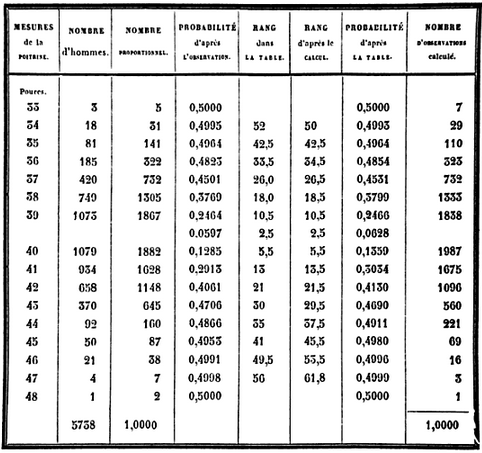

# Data

## From Stigler's

```{r, packages, echo = FALSE}
library(knitr)
library(magrittr)
```

<!--



-->

```{r, out.width = "50%", fig.align = "left"}

```


## Frequency Table

* 케틀레가 작성한 스코틀랜드 군인 5738명의 가슴둘레(인치) 분포표를 옮기면 

```{r, data setup}
chest <- 33:48
freq <- c(3, 18, 81, 185, 420, 749, 1073, 1079, 934, 658, 370, 92, 50, 21, 4, 1)
data.frame(chest, freq)
data.frame(Chest = chest, Freq = freq)
chest_df <- data.frame(Chest = chest, Freq = freq)
chest_df
str(chest_df)
```

### Extract Parts of an Object

```{r, extract parts }
chest_df$Freq
chest_df %>%
  .$Freq
str(chest_df$Freq)
chest_df[, 2]
chest_df %>%
  `[`(, 2)
str(chest_df[, 2])
chest_df[, "Freq"]
chest_df %>%
  `[`(, "Freq")
str(chest_df[, "Freq"])
chest_df["Freq"]
chest_df %>%
  `[`("Freq")
str(chest_df["Freq"])
chest_df["Freq"]$Freq
chest_df %>%
  `[`("Freq") %>%
  .$Freq
str(chest_df["Freq"]$Freq)
chest_df["Freq"][[1]]
chest_df %>%
  `[`("Freq") %>%
  `[[`(1) 
#  `[`(, 1) 
#   `[`(1)
str(chest_df["Freq"][[1]])
chest_df[2]
chest_df %>%
  `[`(2)
str(chest_df[2])
chest_df[2]$Freq
chest_df %>%
  `[`(2) %>%
  .$Freq
str(chest_df[2]$Freq)
chest_df[2][[1]]
chest_df %>%
  `[`(2) %>%
  `[[`(1)
str(chest_df[2][[1]])
chest_df[[2]]
chest_df %>%
  `[[`(2)
str(chest_df[[2]])
```


* 33인치인 사람이 3명, 34인치인 사람이 18명 등으로 기록되어 있으나 이는 구간의 가운데로 이해하여야 함.


## Probability Histogram

* `barplot(height, ...)` 은 기본적으로 `height`만 주어지면 그릴 수 있음. 확률 히스토그램의 기둥 면적의 합은 1이므로, 각 기둥의 높이는 각 계급의 돗수를 전체 돗수, `r sum(chest_df$Freq)`명으로 나눠준 값임.

```{r, barplot first, fig.width = 8, fig.height = 4.5}
total <- sum(chest_df$Freq)
barplot(chest_df$Freq / total)
chest_df$Freq %>%
  `/`(., sum(.)) %>%
  barplot
chest_df$Freq %>% 
  prop.table %>%
#> R 4.0.0 부터는 proportions 사용 가능
#  proportions %>%
  barplot
#> 조심! 다음 두 표현은 원하는 그림이 나오지 않음.
chest_df$Freq %>%
  barplot(. / sum(.))
chest_df$Freq %>%
  barplot(`/`(., sum(.)))
```

* 각 막대의 이름은 계급을 나타내는 가슴둘레 값으로 표현할 수 있고, 막대 간의 사이를 띄우지 않으며, 디폴트 값으로 주어진 회색 보다는 차라리 백색이 나으므로 이를 설정해 주면,

```{r, barplot white, fig.width = 8, fig.height = 4.5}
barplot(chest_df$Freq/total, 
        names.arg = 33:48, 
        space = 0, 
        col = "white")
chest_df$Freq %>%
  `/`(., sum(.)) %>%
  barplot(names.arg = 33:48, 
          space = 0, 
          col = "white")
``` 

* 확률 히스토그램의 정의에 따라 이 막대들의 면적을 합하면 1이 됨에 유의.

## Summary statistics and SD

* 33인치가 3명, 34인치가 18명 등을 한 줄의 긴 벡터로 나타내어야 평균과 표준편차를 쉽게 계산할 수 있으므로 long format으로 바꾸면,

```{r, long format data frame}
chest_vec <- rep(chest_df$Chest, chest_df$Freq)
chest_vec <- chest_df %$%
  rep(.$Chest, .$Freq)
str(chest_vec)
```

### `rep()`

```{r, rep()}
rep(1:3, times = 3)
rep(1:3, each = 3)
rep(1:3, 1:3)
```


* `chest_vec` 을 이용하여 기초통계와 표준편차를 계산하면,

```{r, basic statistics}
summary(chest_vec)
sd(chest_vec)
```

## Histogram

* 히스토그램을 직관적으로 그려보면 $y$축은 돗수가 기본값임을 알 수 있음.

```{r, frequency histogram, fig.width = 8, fig.height = 4.5}
hist(chest_vec)
chest_vec %>%
  hist
```

* 정규분포와 비교하기 위해서 $y$축을 확률로 나타내려면

```{r, probability histogram, fig.width = 8, fig.height = 4.5}
hist(chest_vec, 
     probability = TRUE)
chest_vec %>%
  hist(probability = TRUE)
```

### Inside the histogram

* 실제로 이 히스토그램을 그리는 데 계산된 값들은?

```{r, histogram objects}
(h_chest <- hist(chest_vec, plot = FALSE))
list(breaks = h_chest$breaks, 
     counts = h_chest$counts, 
     density = h_chest$density, 
     mids = h_chest$mids)
chest_vec %>%
  hist(plot = FALSE) %>%
  list(breaks = .$breaks, 
       counts = .$counts, 
       density = .$density, 
       mids = .$mids)
```

* 평균값과 표준편차로부터 히스토그램의 위치가 0.5만큼 왼쪽으로 치우쳐 있다는 것을 알 수 있음. 제자리에 옮겨 놓기 위해서 `breaks` 매개변수를 32.5부터 48.5까지 1간격으로 설정

```{r, move 0.5 inches, fig.width = 8, fig.height = 4.5}
hist(chest_vec, 
     probability = TRUE, 
     breaks = 32.5:48.5)
```

* 위의 히스토그램을 그리느라고 계산된 값들은?

```{r, histogram2 objects}
h_chest_2 <- hist(chest_vec, 
                  breaks = 32.5:48.5, 
                  plot = FALSE)
list(breaks = h_chest_2$breaks, 
     counts = h_chest_2$counts, 
     density = h_chest_2$density, 
     mids = h_chest_2$mids)
chest_vec %>%
  hist(breaks = 32.5:48.5,
       plot = FALSE) %>%
  list(breaks = .$breaks, 
       counts = .$counts, 
       density = .$density, 
       mids = .$mids)
```

* 히스토그램을 보기 쉽게 하기 위해서 메인 타이틀과 서브 타이틀, x축 라벨, y축 라벨 설정

```{r, annotations, fig.width = 8, fig.height = 4.5}
main_title <- "Fitting Normal Distribution"
# sub_title <- "Chest Circumferences of Scottish Soldiers"
sub_title <- ""
x_lab <- "Chest Circumferences (inches)"
y_lab <- "Proportion"
hist(chest_vec, 
     breaks = 32.5:48.5, 
     probability = TRUE, 
     main = main_title, 
     sub = sub_title, 
     xlab = x_lab, 
     ylab = y_lab)
```

## Mean $\pm$ SD contains 2/3 of total number of counts 

* 평균을 중심으로 $\pm$표준편차 만큼 떨어진 자료를 붉은 색 수직점선으로 표시.

```{r, mean and sd, fig.width = 8, fig.height = 4.5}
mean_chest <- mean(chest_vec)
sd_chest <- sd(chest_vec)
x_lower <- mean_chest - sd_chest
x_upper <- mean_chest + sd_chest
sd_chest <- chest_vec %>%
  sd
x_lower <- chest_vec %>%
  mean %>%
  `-`(sd_chest)
x_upper <- chest_vec %>%
  mean %>%
  `+`(sd_chest)
hist(chest_vec, 
     breaks = 32.5:48.5, 
     probability = TRUE, 
     main = main_title, 
     sub = sub_title, 
     xlab = x_lab, 
     ylab = y_lab)
abline(v = c(x_lower, x_upper), 
       lty = 2, 
       col = "red")
```

* 그 사이의 영역을 빗금으로 표시하기 위하여 다각형의 좌표를 계산

```{r, coordinates of polygon}
h_chest_2$density[6:10]
y <- h_chest_2$density[6:10]
```

* 5개의 직사각형으로 파악하고 향후 면적 계산을 쉽게 하기 위하여 다음과 같이 좌표 설정

```{r, 5 rectangles, fig.width = 8, fig.height = 4.5}
x_coord <- rep(c(x_lower, 38.5:41.5, x_upper), each = 2)
y_coord <- c(0, rep(y, each = 2), 0)
poly_df <- data.frame(x = x_coord, y = y_coord)
hist(chest_vec, 
     breaks = 32.5:48.5, 
     probability = TRUE, 
     main = main_title, 
     sub = sub_title, 
     xlab = x_lab, 
     ylab = y_lab)
abline(v = c(x_lower, x_upper), 
       lty = 2, 
       col = "red")
# polygon(x_coord, y_coord, density = 20)
polygon(poly_df, 
#        col = "grey",
#        border = NA)
        density = 20)
```

* 이론적으로 빗금친 부분의 면적은 `pnorm(1) - pnorm(-1) = ``r pnorm(1) - pnorm(-1)`에 가까울 것으로 예상. 5개 직사각형의 면적을 구하여 합하는 과정은 다음과 같음.

```{r, area of shaded area}
options(digits = 3)
x_area <- c(x_lower, 38.5:41.5, x_upper)
y
diff(x_area)
diff(x_area) * y
sum(diff(x_area) * y)
source("./area.R")
area_R
area_R(x_coord, y_coord)
```

## Comparison with normal curve

*  이론적인 정규분포 밀도함수 곡선을 히스토그램에 덧붙여 그림.

```{r, normal curve added, fig.width = 8, fig.height = 4.5}
x_chest <- seq(32.5, 48.5, 
               length = 1000)
y_norm <- dnorm(x_chest, 
                mean = mean_chest, 
                sd = sd_chest)
hist(chest_vec, 
     breaks = 32.5:48.5, 
     probability = TRUE, 
     main = main_title, 
     sub = sub_title, 
     xlab = x_lab, 
     ylab = y_lab)
abline(v = c(x_lower, x_upper), 
       lty = 2, 
       col = "red")
# abline(v = c(38, 42), lty = 2, col = "red")
polygon(poly_df, 
        density = 20)
# polygon(x_coord, y_coord, density = 20)
lines(x_chest, y_norm, col = "red")
```

## Changing tick marks of x axis

* default로 주어지는 $x$축의 눈금을 제대로 볼 수 있게 고치려면,

```{r, x axis, fig.width = 8, fig.height = 4.5}
hist(chest_vec, 
     breaks = 32.5:48.5, 
     probability = TRUE, 
     main = main_title, 
     sub = sub_title, 
     xlab = x_lab, 
     ylab = y_lab, 
     axes = FALSE)
abline(v = c(x_lower, x_upper), 
       lty = 2, 
       col = "red")
polygon(poly_df, 
        density = 20)
# polygon(x_coord, y_coord, density = 20)
lines(x_chest, y_norm, col = "red")
axis(side = 1, 
     at = seq(32, 48, by = 2), 
     labels = seq(32, 48, by = 2))
axis(side = 2)
```

## ggplot

* data frame으로 작업. 

### Basic histogram

```{r, ggplots, fig.width = 8, fig.height = 4.5}
library(ggplot2)
# theme_update(plot.title = element_text(hjust = 0.5)) 
g0 <- ggplot(data = data.frame(chest_vec), 
             mapping = aes(x = chest_vec)) 
(g1 <- g0 +
    stat_bin(aes(y = after_stat(density)),
#   stat_bin(aes(y = ..density..), 
             binwidth = 1, 
             fill = "white", 
             colour = "black"))
# (g1 <- g0 + 
#   stat_count(fill = "white", 
#              colour = "black"))
# (g1 <- g0 + 
#    geom_histogram(aes(y = ..density..), 
#                   binwidth = 1, 
#                   fill = "white", 
#                   colour = "black"))
# (g1 <- g0 + 
#  geom_histogram(aes(y = ..density..), 
#                binwidth = 1, 
#                breaks = 32.5:48.5, 
#                fill = "white", 
#                colour = "black"))
```

###  Mean $\pm$ SD 

```{r, mean plus minus sd, fig.width = 8, fig.height = 4.5}
(g2 <- g1 + 
   geom_vline(xintercept = c(x_lower, x_upper), 
              linetype = "dotted", 
              colour = "red")) 
```

### x-axis label and main title

```{r, xlab and ggtitle, fig.width = 8, fig.height = 4.5}
(g3 <- g2 + 
   theme_bw() + 
#   xlab(x_lab) + 
#   ylab(y_lab) +
#   ggtitle(main_title) +
   labs(title = main_title,
        x = x_lab, 
        y = y_lab) + 
   theme(plot.title = element_text(hjust = 0.5,
                                   size = 20)))
```

### Shading the area

```{r, polygon, fig.width = 8, fig.height = 4.5}
(g4 <- g3 + 
   geom_polygon(data = poly_df, 
                mapping = aes(x = x, y = y), 
                alpha = 0.5, 
                fill = "grey"))
```

### Normal curve added

```{r, normal curve, fig.width = 8, fig.height = 4.5}
# x_curve <- seq(32.5, 48.5, length = 100)
# y_curve <- dnorm(x_curve, mean = mean_chest, sd = sd_chest)
curve_df <- data.frame(x = x_chest, y = y_norm)
(g5 <- g4 + 
  geom_line(data = curve_df, 
            mapping = aes(x = x, y = y), 
            colour = "blue"))
```

### x-axis tick marks 

```{r, tick marks, fig.width = 8, fig.height = 4.5}
(g6 <- g5 + 
   scale_x_continuous(breaks = seq(32, 48, by = 2), 
                      labels = seq(32, 48, by = 2)))
```

## Save

```{r, save}
getwd()
save.image(file = "./Quetelet_chest.RData")
```