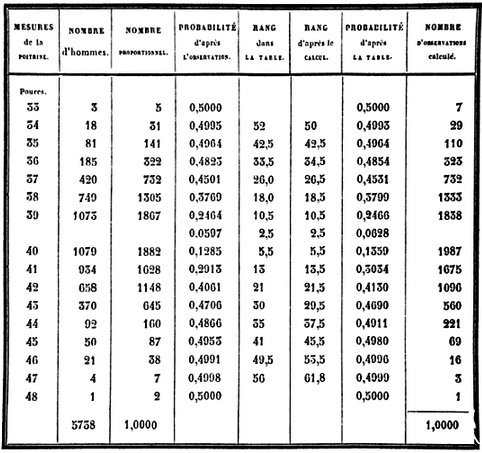

<!--
이 파일은 Quetelet_chest_200927.Rmd 의 2026-2학기 개정판입니다.
원본은 그대로 두었으므로 지난 학기 자료와 나란히 비교할 수 있습니다.
바뀐 것 : (1) 맨 앞에 컨텍스트 절  (2) 맨 끝에 필수 계산·Comments 양식·자가점검
-->

```{r setup-context, include = FALSE}
knitr::opts_chunk$set(echo = TRUE, message = FALSE, warning = FALSE)
```

## 이 데이터에 대하여

### 이 숫자는 원래 통계 자료가 아니었다

우리가 이번 주에 정규분포를 맞춰 볼 표는 **군복을 짓기 위해 만들어진 치수표**다.

출처는 1817년 *Edinburgh Medical and Surgical Journal* 제13권 260–264쪽에 실린
익명의 기사 **"Statement of the Sizes of Men in Different Counties of Scotland,
Taken from the Local Militia"** 다. 스코틀랜드 지역 민병대에 군복을 납품하던
군납업자가 **11개 연대**의 병사 치수를 연대별로 정리해 발표한 것으로,
가슴둘레와 키를 따로 교차 집계해 두었다. 단위는 인치다.

즉 이 표를 만든 사람의 질문은 **"어느 치수의 군복을 몇 벌 만들어야 하는가"** 였다.
사람의 본성에 관한 질문이 아니었다.

### 케틀레가 이 표에 던진 질문

30년 뒤 벨기에의 **아돌프 케틀레**(Adolphe Quetelet)가 이 표를 가져다 전혀 다른
질문에 썼다. 그는 *Lettres … sur la Théorie des Probabilités* (1846) 400쪽에
가슴둘레 분포표(합계 **5,738**)를 싣고, 이 분포가 **오차의 법칙**, 즉 정규분포를
따른다고 주장했다.

그의 논증은 유명한 **검투사 상(Gladiator) 비유**로 요약된다
(*Sur l'homme et le développement de ses facultés*, 1835, pp. 135–136).
천 명의 조각가에게 검투사 상을 하나씩 베끼게 하면, 천 개의 모사품 치수는
오차의 법칙에 따라 규칙적으로 흩어진다. 케틀레는 스코틀랜드 병사들의 가슴둘레도
같은 모양으로 흩어진다는 것을 보이고, 그렇다면 이들 역시 **하나의 원본을 베낀
모사품**이라고 말한다. 그 원본이 **'평균인'(l'homme moyen)** 이다.

이것이 이번 주의 핵심 질문이다.

> **분포가 정규 모양이라는 사실로부터, 원본이 되는 '평균인'이 실재한다는 결론을
> 끌어낼 수 있는가?**

끌어낼 수 없다. 많은 수의 작고 독립적인 원인이 더해지면 밑에 '이상적 원형'이
있든 없든 종 모양이 나온다. 케틀레는 **곡선의 모양을 원형의 존재에 대한 증거로
읽었고, 이것이 추론의 방향을 거꾸로 뒤집은 것**이다.

### 그런데 케틀레의 표는 틀렸다

스티븐 스티글러(Stephen Stigler)가 *The History of Statistics* (1986) 208쪽에서
케틀레의 표를 1817년 원문과 대조했더니 **전사 오류**가 있었다. 1817년 기사는
키에 대해서는 합계를 실었지만 **가슴둘레에 대해서는 연대별 합계를 싣지 않았기**
때문에, 케틀레는 11개 연대의 숫자를 직접 더해야 했고 그 과정에서 여러 칸이 틀렸다.
합계는 5,738이 아니라 **5,732**다.

R 패키지 `HistData` 는 두 판본을 모두 담고 있다 — `ChestSizes` (케틀레, 5,738)와
`ChestStigler` (스티글러 정정, 5,732). 직접 비교해 보자.

```{r two-versions-context}
chest    <- 33:48
quetelet <- c(3, 18, 81, 185, 420, 749, 1073, 1079, 934, 658, 370,  92, 50, 21, 4, 1)
stigler  <- c(3, 19, 81, 189, 409, 753, 1062, 1082, 935, 646, 313, 168, 50, 18, 3, 1)

cmp <- data.frame(chest, quetelet, stigler, diff = stigler - quetelet)
cmp[cmp$diff != 0, ]
c(quetelet = sum(quetelet), stigler = sum(stigler))
```

가장 큰 차이는 **43인치(370 → 313)와 44인치(92 → 168)** 다. 케틀레의 표에서는
44인치 칸이 너무 얕게 파여 있었다. 오른쪽 꼬리 모양이 달라지는 자리다.

### 정정하면 정규분포에 더 잘 맞는다

두 판본에 각각 정규분포를 적합시켜 카이제곱 적합도를 비교하면, **케틀레의
원표는 유의수준 5%에서 정규성이 기각되고, 스티글러가 정정한 표는 기각되지
않는다.** 즉 케틀레는 자료를 잘못 옮겼지만, 그 실수가 그의 결론을 만들어 낸
것은 아니었다. 오히려 정확한 자료가 그의 주장에 더 유리하다.

> **직접 확인해 보세요.** 이 문서 맨 끝의 *필수 계산* 에서 두 판본을 각각
> 적합시켜 p-값이 실제로 갈리는지 보게 됩니다. 결론을 먼저 듣고 넘어가는 것과
> 자기 손으로 두 숫자를 나란히 놓고 보는 것은 다릅니다.

> 참고 — 이 결론은 Gallagher, K. "Was Quetelet's Average Man Normal?"
> *The American Statistician* **74**(3), 301–306 (2020)의 분석과 방향이 같다.
> 구간을 어떻게 묶느냐에 따라 통계값은 달라진다. 맨 끝의 필수 계산에서
> 구간을 바꿔 가며 결과가 얼마나 흔들리는지 직접 확인해 보라.

### 반올림이 하는 일

한 가지 더. 이 표의 값은 **정수 인치**다. 실제 가슴둘레가 39.4인치인 사람과
39.5인치인 사람이 모두 같은 칸에 들어가 있다. 이 반올림만으로도 정규성 검정은
무너진다.

```{r rounding-context}
set.seed(2026)
v <- rep(chest, stigler)                       #> 반올림된 원자료
j <- v + runif(length(v), -0.5, 0.5)           #> 구간 안에서 균등하게 흩어 준다

c(rounded_mean = mean(v), jittered_mean = mean(j))
c(rounded_sd   = sd(v),   jittered_sd   = sd(j))

#> shapiro.test 는 표본 5000개까지만 받으므로 무작위로 뽑아서 비교
c(rounded  = shapiro.test(sample(v, 5000))$p.value,
  jittered = shapiro.test(sample(j, 5000))$p.value)
```

평균과 표준편차는 거의 그대로인데, 정규성 검정의 p-값은 사실상 0에서 크게
살아난다. **검정이 기각한 것은 '정규분포가 아님'이 아니라 '값이 정수로 뭉쳐
있음'이었다.** 검정 결과를 읽을 때 그 검정이 무엇에 반응하고 있는지 물어야 한다.

### 이 이야기의 뒷부분

케틀레의 '사회물리학'은 두 갈래로 이어졌다.

하나는 **골턴(Francis Galton)** 이다. 케틀레는 평균에서 벗어난 것을 **오차**로
보았지만, 골턴은 그 **변이 자체를 연구 대상**으로 삼았다. 이 전환이 상관과 회귀를
낳았고, 동시에 사람을 우열로 줄 세우는 **우생학**의 도구가 되었다. 피어슨의
카이제곱과 피셔의 유의성 검정도 같은 연구 프로그램 안에서 자랐다.
다음 주(4주차) crimtab 자료가 정확히 이 계보에 속한다.

다른 하나는 우리 주변에 남아 있다. 케틀레가 "몸무게는 키의 제곱에 비례한다"며
만든 지수가 **케틀레 지수**였고, 1972년 앤설 키스(Ancel Keys)가 이를
**체질량지수(BMI)** 로 이름을 바꿨다. BMI 는 집단 수준에서는 체지방과 잘
대응하지만 **개인에게 적용하면 정확하지도 신뢰할 만하지도 않다** — 근육이 많은
사람은 과대평가되고 근감소가 있는 사람은 과소평가된다.

집단의 통계를 개인에게 그대로 갖다 붙이는 것. 케틀레가 '평균인'에서 저지른 실수와
정확히 같은 실수다. 200년이 지나도 같은 자리에서 넘어진다.

### 이번 주 코드가 실제로 하는 일

우리는 확률 히스토그램을 그리고, 평균 ± 표준편차 구간의 면적이 약 2/3임을
직접 계산하고, 이론적 정규곡선을 겹쳐 그린다. 그리면서 생각해 볼 것 —

- 히스토그램의 **막대 위치를 0.5만큼 옮기는 `breaks` 설정**은 미관 문제가 아니다.
  값이 구간의 **가운데**를 뜻한다는 해석을 코드로 적는 일이다.
- 곡선이 잘 맞는다는 것은 **"이 자료가 정규분포와 모순되지 않는다"** 는 뜻이지,
  **"평균인이 있다"** 는 뜻이 아니다.

<P style = "page-break-before:always">

# Data

## From Stigler's

```{r, packages, echo = FALSE}
library(knitr)
library(magrittr)
```

<!--



-->

```{r, out.width = "50%", fig.align = "left"}

```


## Frequency Table

* 케틀레가 작성한 스코틀랜드 군인 5738명의 가슴둘레(인치) 분포표를 옮기면 

```{r, data setup}
chest <- 33:48
freq <- c(3, 18, 81, 185, 420, 749, 1073, 1079, 934, 658, 370, 92, 50, 21, 4, 1)
data.frame(chest, freq)
data.frame(Chest = chest, Freq = freq)
chest_df <- data.frame(Chest = chest, Freq = freq)
chest_df
str(chest_df)
```

### Extract Parts of an Object

```{r, extract parts}
chest_df$Freq
chest_df %>%
  .$Freq
str(chest_df$Freq)
chest_df[, 2]
chest_df %>%
  `[`(, 2)
str(chest_df[, 2])
chest_df[, "Freq"]
chest_df %>%
  `[`(, "Freq")
str(chest_df[, "Freq"])
chest_df["Freq"]
chest_df %>%
  `[`("Freq")
str(chest_df["Freq"])
chest_df["Freq"]$Freq
chest_df %>%
  `[`("Freq") %>%
  .$Freq
str(chest_df["Freq"]$Freq)
chest_df["Freq"][[1]]
chest_df %>%
  `[`("Freq") %>%
  `[[`(1) 
#  `[`(, 1) 
#   `[`(1)
str(chest_df["Freq"][[1]])
chest_df[2]
chest_df %>%
  `[`(2)
str(chest_df[2])
chest_df[2]$Freq
chest_df %>%
  `[`(2) %>%
  .$Freq
str(chest_df[2]$Freq)
chest_df[2][[1]]
chest_df %>%
  `[`(2) %>%
  `[[`(1)
str(chest_df[2][[1]])
chest_df[[2]]
chest_df %>%
  `[[`(2)
str(chest_df[[2]])
```


* 33인치인 사람이 3명, 34인치인 사람이 18명 등으로 기록되어 있으나 이는 구간의 가운데로 이해하여야 함.


## Probability Histogram

* `barplot(height, ...)` 은 기본적으로 `height`만 주어지면 그릴 수 있음. 확률 히스토그램의 기둥 면적의 합은 1이므로, 각 기둥의 높이는 각 계급의 돗수를 전체 돗수, `r sum(chest_df$Freq)`명으로 나눠준 값임.

```{r, barplot first, fig.width = 8, fig.height = 4.5}
total <- sum(chest_df$Freq)
barplot(chest_df$Freq / total)
#> 위의 두 줄을 %>% 로 흘려보내면 `total`을 만들지 않아도 되는 데 ...
chest_df$Freq %>%
  `/`(., sum(.)) %>%
  barplot
chest_df$Freq %>% 
  prop.table %>%
#> R 4.0.0 부터는 proportions 사용 가능
#  proportions %>%
  barplot
#> 조심! 다음 두 표현은 원하는 그림이 나오지 않음.
chest_df$Freq %>%
  barplot(. / sum(.))
chest_df$Freq %>%
  barplot(`/`(., sum(.)))
```

* 각 막대의 이름은 계급을 나타내는 가슴둘레 값으로 표현할 수 있고, 막대 간의 사이를 띄우지 않으며, 디폴트 값으로 주어진 회색 보다는 차라리 백색이 나으므로 이를 설정해 주면,

```{r, barplot white, fig.width = 8, fig.height = 4.5}
barplot(chest_df$Freq/total, 
        names.arg = 33:48, 
        space = 0, 
        col = "white")
chest_df$Freq %>%
  `/`(., sum(.)) %>%
  barplot(names.arg = 33:48, 
          space = 0, 
          col = "white")
``` 

* 확률 히스토그램의 정의에 따라 이 막대들의 면적을 합하면 1이 됨에 유의.

## Summary statistics and SD

* 33인치가 3명, 34인치가 18명 등을 한 줄의 긴 벡터로 나타내어야 평균과 표준편차를 쉽게 계산할 수 있으므로 long format으로 바꾸면,

```{r, long format data frame}
chest_vec <- rep(chest_df$Chest, chest_df$Freq)
chest_vec <- chest_df %$%
  rep(.$Chest, .$Freq)
str(chest_vec)
```

### `rep()`

```{r, rep()}
rep(1:3, times = 3)
rep(1:3, each = 3)
rep(1:3, 1:3)
```


* `chest_vec` 을 이용하여 기초통계와 표준편차를 계산하면,

```{r, basic statistics}
summary(chest_vec)
sd(chest_vec)
```

## Histogram

* 히스토그램을 직관적으로 그려보면 $y$축은 돗수가 기본값임을 알 수 있음.

```{r, frequency histogram, fig.width = 8, fig.height = 4.5}
hist(chest_vec)
chest_vec %>%
  hist
```

* 정규분포와 비교하기 위해서 $y$축을 확률로 나타내려면

```{r, probability histogram, fig.width = 8, fig.height = 4.5}
hist(chest_vec, 
     probability = TRUE)
chest_vec %>%
  hist(probability = TRUE)
```

### Inside the histogram

* 실제로 이 히스토그램을 그리는 데 계산된 값들은?

```{r, histogram objects}
(h_chest <- hist(chest_vec, plot = FALSE))
list(breaks = h_chest$breaks, 
     counts = h_chest$counts, 
     density = h_chest$density, 
     mids = h_chest$mids)
chest_vec %>%
  hist(plot = FALSE) %>%
  list(breaks = .$breaks, 
       counts = .$counts, 
       density = .$density, 
       mids = .$mids)
```

* 평균값과 표준편차로부터 히스토그램의 위치가 0.5만큼 왼쪽으로 치우쳐 있다는 것을 알 수 있음. 제자리에 옮겨 놓기 위해서 `breaks` 매개변수를 32.5부터 48.5까지 1간격으로 설정

```{r, move 0.5 inches, fig.width = 8, fig.height = 4.5}
hist(chest_vec, 
     probability = TRUE, 
     breaks = 32.5:48.5)
```

* 위의 히스토그램을 그리느라고 계산된 값들은?

```{r, histogram2 objects}
h_chest_2 <- hist(chest_vec, 
                  breaks = 32.5:48.5, 
                  plot = FALSE)
list(breaks = h_chest_2$breaks, 
     counts = h_chest_2$counts, 
     density = h_chest_2$density, 
     mids = h_chest_2$mids)
chest_vec %>%
  hist(breaks = 32.5:48.5,
       plot = FALSE) %>%
  list(breaks = .$breaks, 
       counts = .$counts, 
       density = .$density, 
       mids = .$mids)
```

* 히스토그램을 보기 쉽게 하기 위해서 메인 타이틀과 서브 타이틀, x축 라벨, y축 라벨 설정

```{r, annotations, fig.width = 8, fig.height = 4.5}
main_title <- "Fitting Normal Distribution"
# sub_title <- "Chest Circumferences of Scottish Soldiers"
sub_title <- ""
x_lab <- "Chest Circumferences (inches)"
y_lab <- "Proportion"
hist(chest_vec, 
     breaks = 32.5:48.5, 
     probability = TRUE, 
     main = main_title, 
     sub = sub_title, 
     xlab = x_lab, 
     ylab = y_lab)
```

## Mean $\pm$ SD contains 2/3 of total number of counts 

* 평균을 중심으로 $\pm$표준편차 만큼 떨어진 자료를 붉은 색 수직점선으로 표시.

```{r, mean and sd, fig.width = 8, fig.height = 4.5}
mean_chest <- mean(chest_vec)
sd_chest <- sd(chest_vec)
x_lower <- mean_chest - sd_chest
x_upper <- mean_chest + sd_chest
sd_chest <- chest_vec %>%
  sd
x_lower <- chest_vec %>%
  mean %>%
  `-`(sd_chest)
x_upper <- chest_vec %>%
  mean %>%
  `+`(sd_chest)
hist(chest_vec, 
     breaks = 32.5:48.5, 
     probability = TRUE, 
     main = main_title, 
     sub = sub_title, 
     xlab = x_lab, 
     ylab = y_lab)
abline(v = c(x_lower, x_upper), 
       lty = 2, 
       col = "red")
```

* 그 사이의 영역을 빗금으로 표시하기 위하여 다각형의 좌표를 계산

```{r, coordinates of polygon}
h_chest_2$density[6:10]
y <- h_chest_2$density[6:10]
```

* 5개의 직사각형으로 파악하고 향후 면적 계산을 쉽게 하기 위하여 다음과 같이 좌표 설정

```{r, 5 rectangles, fig.width = 8, fig.height = 4.5}
x_coord <- rep(c(x_lower, 38.5:41.5, x_upper), each = 2)
y_coord <- c(0, rep(y, each = 2), 0)
poly_df <- data.frame(x = x_coord, y = y_coord)
hist(chest_vec, 
     breaks = 32.5:48.5, 
     probability = TRUE, 
     main = main_title, 
     sub = sub_title, 
     xlab = x_lab, 
     ylab = y_lab)
abline(v = c(x_lower, x_upper), 
       lty = 2, 
       col = "red")
# polygon(x_coord, y_coord, density = 20)
polygon(poly_df, 
#        col = "grey",
#        border = NA)
        density = 20)
```

* 이론적으로 빗금친 부분의 면적은 `pnorm(1) - pnorm(-1) = ``r pnorm(1) - pnorm(-1)`에 가까울 것으로 예상. 5개 직사각형의 면적을 구하여 합하는 과정은 다음과 같음.

```{r, area of shaded area}
options(digits = 3)
x_area <- c(x_lower, 38.5:41.5, x_upper)
y
diff(x_area)
diff(x_area) * y
sum(diff(x_area) * y)
source("./area.R")
area_R
area_R(x_coord, y_coord)
```

## Comparison with normal curve

*  이론적인 정규분포 밀도함수 곡선을 히스토그램에 덧붙여 그림.

```{r, normal curve added, fig.width = 8, fig.height = 4.5}
x_chest <- seq(32.5, 48.5, 
               length = 1000)
y_norm <- dnorm(x_chest, 
                mean = mean_chest, 
                sd = sd_chest)
hist(chest_vec, 
     breaks = 32.5:48.5, 
     probability = TRUE, 
     main = main_title, 
     sub = sub_title, 
     xlab = x_lab, 
     ylab = y_lab)
abline(v = c(x_lower, x_upper), 
       lty = 2, 
       col = "red")
# abline(v = c(38, 42), lty = 2, col = "red")
polygon(poly_df, 
        density = 20)
# polygon(x_coord, y_coord, density = 20)
lines(x_chest, y_norm, col = "red")
```

## Changing tick marks of x axis

* default로 주어지는 $x$축의 눈금을 제대로 볼 수 있게 고치려면,

```{r, x axis, fig.width = 8, fig.height = 4.5}
hist(chest_vec, 
     breaks = 32.5:48.5, 
     probability = TRUE, 
     main = main_title, 
     sub = sub_title, 
     xlab = x_lab, 
     ylab = y_lab, 
     axes = FALSE)
abline(v = c(x_lower, x_upper), 
       lty = 2, 
       col = "red")
polygon(poly_df, 
        density = 20)
# polygon(x_coord, y_coord, density = 20)
lines(x_chest, y_norm, col = "red")
axis(side = 1, 
     at = seq(32, 48, by = 2), 
     labels = seq(32, 48, by = 2))
axis(side = 2)
```

## ggplot

* data frame으로 작업. 

### Basic histogram

```{r, ggplots, fig.width = 8, fig.height = 4.5}
library(ggplot2)
# theme_update(plot.title = element_text(hjust = 0.5)) 
g0 <- ggplot(data = data.frame(chest_vec), 
             mapping = aes(x = chest_vec)) 
(g1 <- g0 +
    stat_bin(aes(y = after_stat(density)),
#   stat_bin(aes(y = ..density..), #> ggplot 새 버전에서 퇴출된 코드
             binwidth = 1, 
             fill = "white", 
             colour = "black"))
#> 다음 방법들도 동일한 결과 
# (g1 <- g0 + 
#   stat_count(fill = "white", 
#              colour = "black"))
# (g1 <- g0 + 
#    geom_histogram(aes(y = ..density..), 
#                   binwidth = 1, 
#                   fill = "white", 
#                   colour = "black"))
# (g1 <- g0 + 
#  geom_histogram(aes(y = ..density..), 
#                binwidth = 1, 
#                breaks = 32.5:48.5, 
#                fill = "white", 
#                colour = "black"))
```

###  Mean $\pm$ SD 

```{r, mean plus minus sd, fig.width = 8, fig.height = 4.5}
(g2 <- g1 + 
   geom_vline(xintercept = c(x_lower, x_upper), 
              linetype = "dotted", 
              colour = "red")) 
```

### x-axis label and main title

```{r, xlab and ggtitle, fig.width = 8, fig.height = 4.5}
(g3 <- g2 + 
   theme_bw() + 
#   xlab(x_lab) + 
#   ylab(y_lab) +
#   ggtitle(main_title) +
#> 위의 세 코드를 한 번에 
   labs(title = main_title,
        x = x_lab, 
        y = y_lab) + 
   theme(plot.title = element_text(hjust = 0.5,
                                   size = 20)))
```

### Shading the area

```{r, polygon, fig.width = 8, fig.height = 4.5}
(g4 <- g3 + 
   geom_polygon(data = poly_df, 
                mapping = aes(x = x, y = y), 
                alpha = 0.5, 
                fill = "grey"))
```

### Normal curve added

```{r, normal curve, fig.width = 8, fig.height = 4.5}
# x_curve <- seq(32.5, 48.5, length = 100)
# y_curve <- dnorm(x_curve, mean = mean_chest, sd = sd_chest)
curve_df <- data.frame(x = x_chest, y = y_norm)
(g5 <- g4 + 
  geom_line(data = curve_df, 
            mapping = aes(x = x, y = y), 
            colour = "blue"))
```

### x-axis tick marks 

```{r, tick marks, fig.width = 8, fig.height = 4.5}
(g6 <- g5 + 
   scale_x_continuous(breaks = seq(32, 48, by = 2), 
                      labels = seq(32, 48, by = 2)))
```

<P style = "page-break-before:always">

## 두 판본을 각각 적합시킨다

케틀레가 1846년에 실은 표(합계 **5,738**)와 스티글러가 1817년 원문과 대조해
정정한 표(합계 **5,732**)는 43인치와 44인치 칸에서 크게 다르다. 오른쪽 꼬리
모양이 달라지는 자리다.

**전사 오류가 결론을 바꾸는가.** 이것은 의견이 아니라 계산으로 답할 수 있는
질문이다.

```{r two-versions}
chest    <- 33:48
quetelet <- c(3, 18, 81, 185, 420, 749, 1073, 1079, 934, 658, 370,  92, 50, 21, 4, 1)
stigler  <- c(3, 19, 81, 189, 409, 753, 1062, 1082, 935, 646, 313, 168, 50, 18, 3, 1)

c(quetelet = sum(quetelet), stigler = sum(stigler))
```

적합도 검정 함수는 아래에 준비해 두었다. 코드를 한 줄씩 읽고, 각 줄이 무엇을
하는지 확인한 다음 쓰라. 특히 `cuts` 와 `df` 두 줄이 결과를 좌우한다.

```{r normal-gof}
normal_gof <- function(count, mid = 33:48, lo = 36, hi = 44){
  n    <- sum(count)
  m    <- sum(mid * count) / n
  sd   <- sqrt(sum(count * (mid - m)^2) / (n - 1))
  cuts <- c(-Inf, (lo:hi) - 0.5, Inf)          #> 양쪽 꼬리는 하나로 묶는다
  obs  <- tapply(count, cut(mid, breaks = cuts), sum)
  p    <- diff(pnorm(cuts, mean = m, sd = sd))
  X2   <- sum((obs - n * p)^2 / (n * p))
  df   <- length(obs) - 1 - 2                   #> 평균과 표준편차를 추정했으므로 -2
  c(mean = m, sd = sd, X2 = X2, df = df,
    p_value = pchisq(X2, df, lower.tail = FALSE))
}
```

### 필수 계산 (두 가지)

1. `normal_gof()` 를 두 판본에 각각 적용하고, 결과를 **2행짜리**로 묶어
   **`gof_two`** 라는 이름에 담으세요.
   - **1행이 케틀레(5,738), 2행이 스티글러(5,732)** 순서여야 합니다.
   - **`p_value` 라는 이름의 열**이 반드시 있어야 합니다.
2. 두 p-값을 보고 **결론이 갈리는지** 확인하세요.
   케틀레 원표는 5%에서 기각(p < 0.05), 스티글러 정정본은 기각되지 않아야
   (p > 0.05) 합니다. 그렇게 나오지 않으면 `lo`, `hi` 를 확인하세요.

```{r gof-two}
#> 1. 여기에 gof_two 를 만드세요


#> 2. 여기에서 두 p-값을 확인하세요


```

여유가 있으면 `lo`, `hi` 를 바꿔 가며 결과가 얼마나 흔들리는지도 보세요.
구간을 어떻게 묶느냐에 따라 p-값이 달라진다는 사실 자체가 관찰거리입니다.

계산이 끝나면 한 걸음 물러서서 보세요. 케틀레는 자료를 잘못 옮겼는데, 정확한
자료가 오히려 그의 주장에 **더 유리**하게 나옵니다. 그런데도 "평균인이 실재한다"는
결론은 여전히 따라 나오지 않습니다. 왜 그런지가 Comments 4번입니다.

<P style = "page-break-before:always">

## Comments

> 아래 네 항목을 모두 채워 주세요. 분량보다 항목의 충실함으로 평가합니다.
> 각 항목은 **두세 문장** 이면 충분합니다.

**1. 맥락** — 1817년의 표는 무엇을 위해 만들어졌고, 케틀레는 그것으로 어떤 질문에
답하려 했는가. 목적이 바뀌면서 무엇이 무리한 요구가 되었는가.

(여기에 작성)

**2. 주장** — 여러분이 그린 히스토그램과 정규곡선에서 읽어낼 수 있는 것을
한 문장으로.

(여기에 작성)

**3. 근거** — 위 주장을 뒷받침하는 그림이나 수치, 그리고 그것을 만들어 낸
코드의 핵심 한 줄과 그 줄이 하는 일.

(여기에 작성)

**4. 한계** — 위에서 구한 두 p-값을 근거로, 전사 오류의 정정이 결론을 바꾸는지
답하세요. 그리고 "분포가 정규 모양이다"에서 "평균인이 실재한다"로 넘어가는
추론이 왜 성립하지 않는지 자기 말로 쓰세요.

(여기에 작성)

<P style = "page-break-before:always">

## 제출 전 자가점검

아래 청크를 그대로 두고 Knit 하면 형식 점검 결과가 나옵니다.
**모두 '통과' 가 뜬 것을 확인한 뒤에 제출하세요.**
이 점검은 형식만 봅니다. 내용은 교수자가 읽고 평가합니다.

```{r submit-check, echo = FALSE, results = "asis"}
if (file.exists("submit_check.R")) {
  source("submit_check.R", encoding = "UTF-8")
  submit_check(week = 3)
} else {
  cat("submit_check.R 을 이 Rmd 파일과 같은 폴더에 두세요.")
}
```
