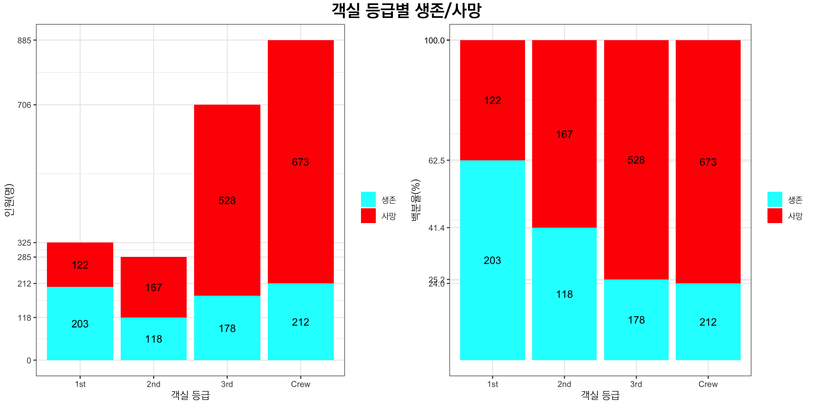
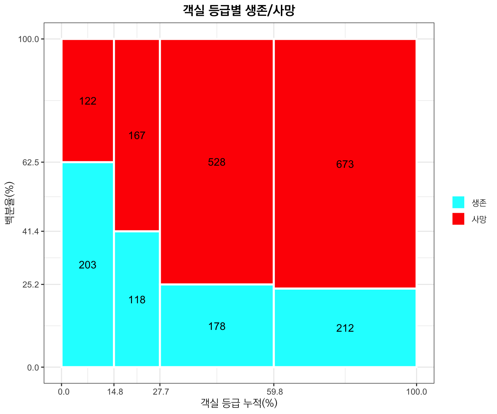
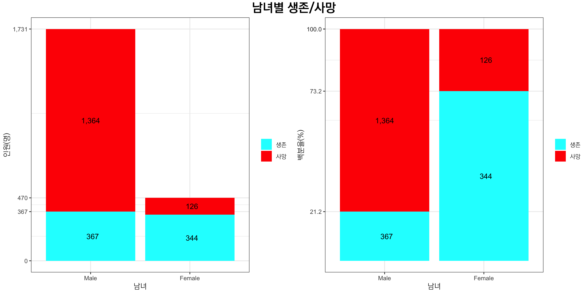
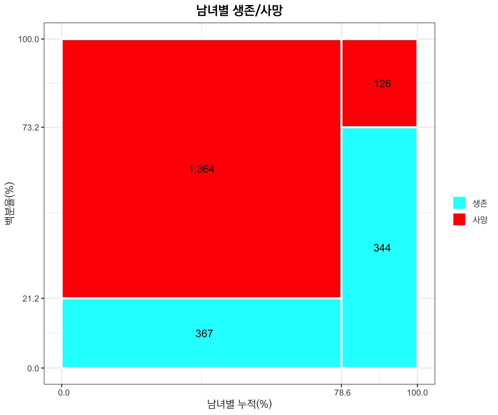
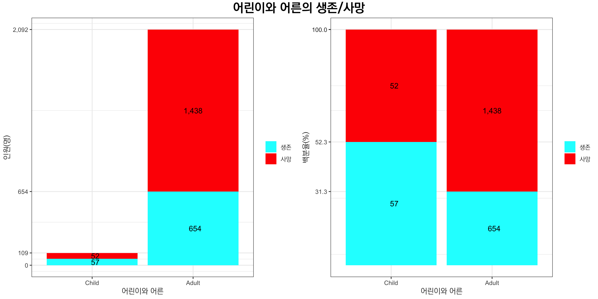
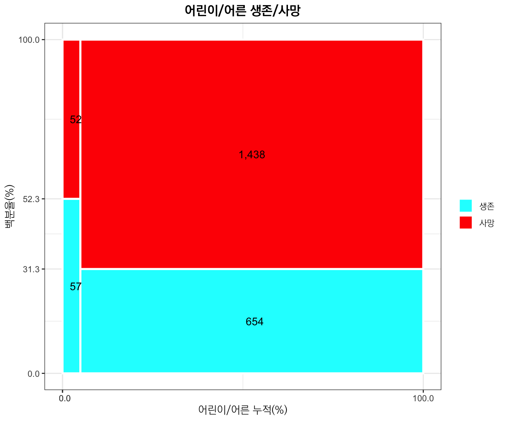
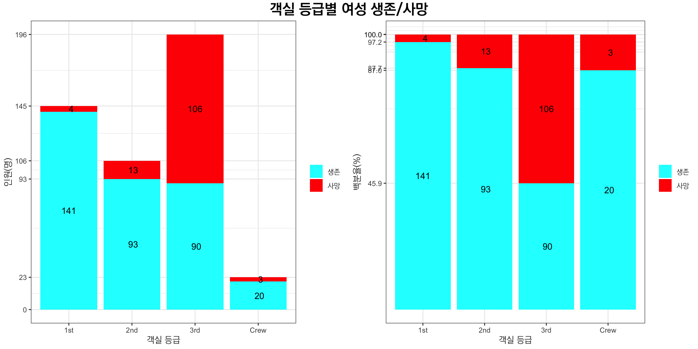
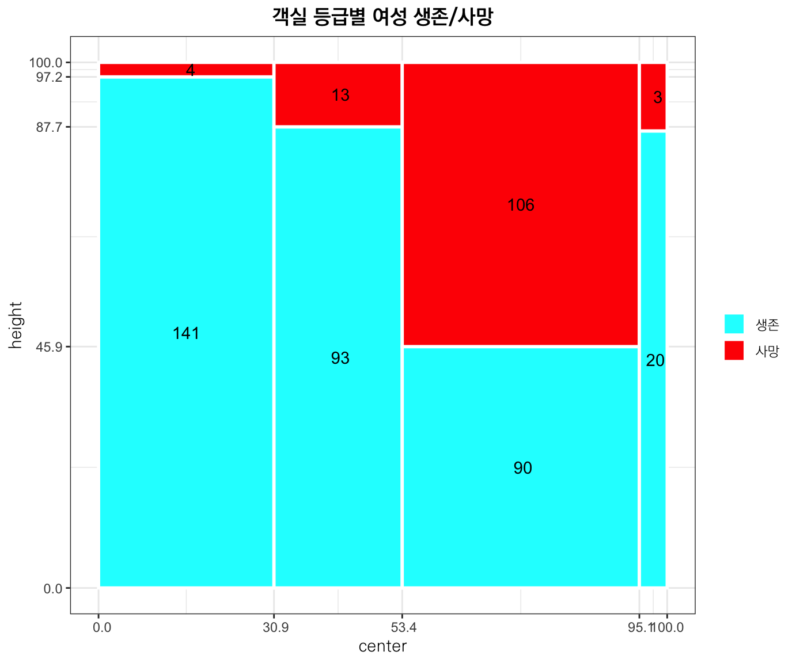
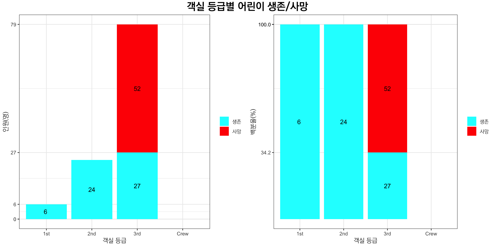
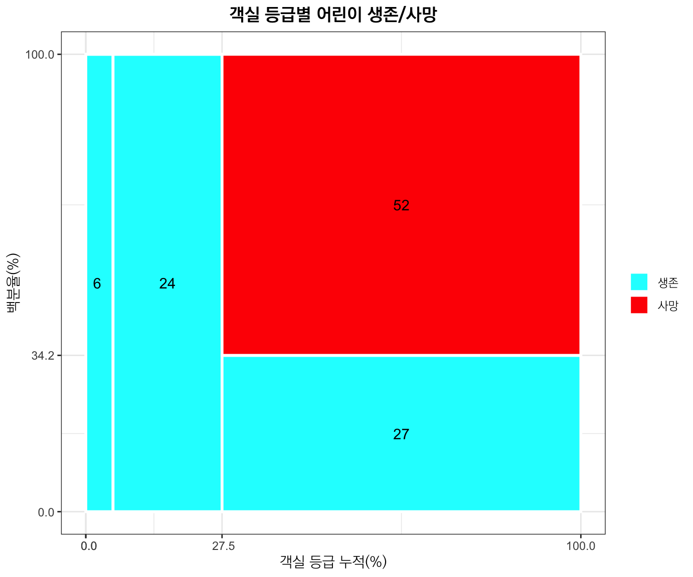

타이타닉호의 침몰 과정에서 **여성과 어린이를 먼저 구한다**는 원칙은 지켜졌는가?

## Data


```r
library(magrittr)
library(knitr)
```

```
## Warning: package 'knitr' was built under R version 4.2.2
```

```r
library(pander)
library(ggplot2)
library(grid)
library(gridExtra)
library(extrafont)
```

```
## Registering fonts with R
```

```r
load("Titanic_Base.RData")
# load("Titanic_1801.RData")
ls()
```

```
##  [1] "Adult_df"     "b1"           "b1_p"         "b2"           "b2_p"        
##  [6] "b3"           "b3_p"         "b4"           "b4_p"         "b5"          
## [11] "b5_p"         "Child_Class"  "Child_df"     "Female_Class" "Female_df"   
## [16] "Male_df"      "p1"           "p1_text"      "p2"           "p2_text"     
## [21] "p3"           "p3_text"      "p4"           "p4_text"      "p5"          
## [26] "p5_text"      "pos"          "Surv_Age"     "Surv_Class"   "Surv_Sex"    
## [31] "Titanic"      "y1_text"      "y2_text"      "y3_text"      "y4_text"     
## [36] "y5_text"
```

## Source User Defined Functions


```r
source("barplot_gg.R")
source("mosaic_gg.R")
```

## Data Manipulation


```r
Surv_Class %>% 
  str
```

```
##  num [1:2, 1:4] 122 203 167 118 528 178 673 212
##  - attr(*, "dimnames")=List of 2
##   ..$ Survived: chr [1:2] "No" "Yes"
##   ..$ Class   : chr [1:4] "1st" "2nd" "3rd" "Crew"
```

```r
Surv_Class %>% 
  as.table %>% 
  str
```

```
##  'table' num [1:2, 1:4] 122 203 167 118 528 178 673 212
##  - attr(*, "dimnames")=List of 2
##   ..$ Survived: chr [1:2] "No" "Yes"
##   ..$ Class   : chr [1:4] "1st" "2nd" "3rd" "Crew"
```

```r
Surv_Sex %>% 
  str
```

```
##  num [1:2, 1:2] 1364 367 126 344
##  - attr(*, "dimnames")=List of 2
##   ..$ Survived: chr [1:2] "No" "Yes"
##   ..$ Sex     : chr [1:2] "Male" "Female"
```

```r
Surv_Sex %>% 
  as.table %>% 
  str
```

```
##  'table' num [1:2, 1:2] 1364 367 126 344
##  - attr(*, "dimnames")=List of 2
##   ..$ Survived: chr [1:2] "No" "Yes"
##   ..$ Sex     : chr [1:2] "Male" "Female"
```

```r
Surv_Age %>% 
  str
```

```
##  num [1:2, 1:2] 52 57 1438 654
##  - attr(*, "dimnames")=List of 2
##   ..$ Survived: chr [1:2] "No" "Yes"
##   ..$ Age     : chr [1:2] "Child" "Adult"
```

```r
Surv_Age %>% 
  as.table %>% 
  str
```

```
##  'table' num [1:2, 1:2] 52 57 1438 654
##  - attr(*, "dimnames")=List of 2
##   ..$ Survived: chr [1:2] "No" "Yes"
##   ..$ Age     : chr [1:2] "Child" "Adult"
```

```r
Female_Class %>% 
  str
```

```
##  'xtabs' num [1:2, 1:4] 4 141 13 93 106 90 3 20
##  - attr(*, "dimnames")=List of 2
##   ..$ Survived: chr [1:2] "No" "Yes"
##   ..$ Class   : chr [1:4] "1st" "2nd" "3rd" "Crew"
##  - attr(*, "call")= language xtabs(formula = Freq ~ Survived + Class, data = ., drop.unused.levels = TRUE)
```

```r
Child_Class %>% 
  str
```

```
##  'xtabs' num [1:2, 1:4] 0 6 0 24 52 27 0 0
##  - attr(*, "dimnames")=List of 2
##   ..$ Survived: chr [1:2] "No" "Yes"
##   ..$ Class   : chr [1:4] "1st" "2nd" "3rd" "Crew"
##  - attr(*, "call")= language xtabs(formula = Freq ~ Survived + Class, data = ., drop.unused.levels = TRUE)
```

## Plots 

### By Class

#### Barplots


```r
b1_stack <- barplot_gg_stack(as.data.frame(as.table(Surv_Class)[2:1, ])) + 
  theme_bw() +
  labs(x = "객실 등급", y = "인원(명)") +
  scale_fill_manual(name = "", 
                    labels = c("생존", "사망"), 
                    values = rainbow(2)[2:1]) +
  theme(axis.title.x = element_text(family = "KoPubWorldDotum Light"),
        axis.title.y = element_text(family = "KoPubWorldDotum Light"),
        legend.text = element_text(family = "KoPubWorldDotum Light"))
b1_fill <- barplot_gg_fill(as.data.frame(as.table(Surv_Class)[2:1, ])) + 
  theme_bw() +
  labs(x = "객실 등급", y = "백분율(%)") + 
  scale_fill_manual(name = "", 
                    labels = c("생존", "사망"), 
                    values = rainbow(2)[2:1]) +
  theme(axis.title.x = element_text(family = "KoPubWorldDotum Light"),
        axis.title.y = element_text(family = "KoPubWorldDotum Light"),
        legend.text = element_text(family = "KoPubWorldDotum Light"))
top1 <- textGrob("객실 등급별 생존/사망", 
                 gp = gpar(cex = 1.5, fontfamily = "KoPubWorldDotum Bold"))
grid.arrange(b1_stack, b1_fill, ncol = 2, top = top1)
```



#### Mosaic Plots


```r
mosaic_gg(as.table(Surv_Class)[2:1, ])$m +
  theme_bw() +
  labs(x = "객실 등급 누적(%)", y = "백분율(%)") + 
  ggtitle("객실 등급별 생존/사망") + 
  scale_fill_manual(name = "", 
                    labels = c("생존", "사망"), 
                    values = rainbow(2)[2:1]) +
  theme(axis.title.x = element_text(family = "KoPubWorldDotum Light"),
        axis.title.y = element_text(family = "KoPubWorldDotum Light"),
        legend.text = element_text(family = "KoPubWorldDotum Light"),
        plot.title = element_text(hjust = 0.5, family = "KoPubWorldDotum Bold"))
```



```r
ggsave("../pics/Titanic_mosaic_ggplot01.png", width = 8, height = 6, dpi = 72)
```

### By Sex

#### Barplots


```r
b2_stack <- barplot_gg_stack(as.data.frame(as.table(Surv_Sex)[2:1, ])) + 
  theme_bw() +
  labs(x = "남녀", y = "인원(명)") +
  scale_fill_manual(name = "", 
                    labels = c("생존", "사망"), 
                    values = rainbow(2)[2:1]) +
  theme(axis.title.x = element_text(family = "KoPubWorldDotum Light"),
        axis.title.y = element_text(family = "KoPubWorldDotum Light"),
        legend.text = element_text(family = "KoPubWorldDotum Light"))
b2_fill <- barplot_gg_fill(as.data.frame(as.table(Surv_Sex)[2:1, ])) + 
  theme_bw() +
  labs(x = "남녀", y = "백분율(%)") + 
  scale_fill_manual(name = "", 
                    labels = c("생존", "사망"), 
                    values = rainbow(2)[2:1]) +
  theme(axis.title.x = element_text(family = "KoPubWorldDotum Light"),
        axis.title.y = element_text(family = "KoPubWorldDotum Light"),
        legend.text = element_text(family = "KoPubWorldDotum Light"))
top2 <- textGrob("남녀별 생존/사망", 
                 gp = gpar(cex = 1.5, fontfamily = "KoPubWorldDotum Bold"))
grid.arrange(b2_stack, b2_fill, ncol = 2, top = top2)
```



#### Mosaic Plots


```r
mosaic_gg(as.table(Surv_Sex)[2:1, ])$m +
  theme_bw() +
  labs(x = "남녀별 누적(%)", y = "백분율(%)") + 
  ggtitle("남녀별 생존/사망") + 
  scale_fill_manual(name = "", 
                    labels = c("생존", "사망"), 
                    values = rainbow(2)[2:1]) +
  theme(axis.title.x = element_text(family = "KoPubWorldDotum Light"),
        axis.title.y = element_text(family = "KoPubWorldDotum Light"),
        legend.text = element_text(family = "KoPubWorldDotum Light"),
        plot.title = element_text(hjust = 0.5, family = "KoPubWorldDotum Bold"))
```



```r
ggsave("../pics/Titanic_mosaic_ggplot02.png", width = 8, height = 6, dpi = 72)
```

### By Age

#### Barplots


```r
b3_stack <- barplot_gg_stack(as.data.frame(as.table(Surv_Age)[2:1, ])) + 
  theme_bw() +
  labs(x = "어린이와 어른", y = "인원(명)") +
  scale_fill_manual(name = "", 
                    labels = c("생존", "사망"), 
                    values = rainbow(2)[2:1]) +
  theme(axis.title.x = element_text(family = "KoPubWorldDotum Light"),
        axis.title.y = element_text(family = "KoPubWorldDotum Light"),
        legend.text = element_text(family = "KoPubWorldDotum Light"))
b3_fill <- barplot_gg_fill(as.data.frame(as.table(Surv_Age)[2:1, ])) + 
  theme_bw() +
  labs(x = "어린이와 어른", y = "백분율(%)") + 
  scale_fill_manual(name = "", 
                    labels = c("생존", "사망"), 
                    values = rainbow(2)[2:1]) +
  theme(axis.title.x = element_text(family = "KoPubWorldDotum Light"),
        axis.title.y = element_text(family = "KoPubWorldDotum Light"),
        legend.text = element_text(family = "KoPubWorldDotum Light"))
top3 <- textGrob("어린이와 어른의 생존/사망", 
                 gp = gpar(cex = 1.5, fontfamily = "KoPubWorldDotum Bold"))
grid.arrange(b3_stack, b3_fill, ncol = 2, top = top3)
```



#### Mosaic Plots


```r
mosaic_gg(as.table(Surv_Age)[2:1, ])$m +
  theme_bw() +
  labs(x = "어린이/어른 누적(%)", y = "백분율(%)") + 
  ggtitle("어린이/어른 생존/사망") + 
  scale_fill_manual(name = "", 
                    labels = c("생존", "사망"), 
                    values = rainbow(2)[2:1]) +
  theme(axis.title.x = element_text(family = "KoPubWorldDotum Light"),
        axis.title.y = element_text(family = "KoPubWorldDotum Light"),
        legend.text = element_text(family = "KoPubWorldDotum Light"),
        plot.title = element_text(hjust = 0.5, family = "KoPubWorldDotum Bold"))
```



```r
ggsave("../pics/Titanic_mosaic_ggplot03.png", width = 8, height = 6, dpi = 72)
```

### Female by Class

#### Barplots


```r
b4_stack <- barplot_gg_stack(as.data.frame(as.table(Female_Class)[2:1, ])) + 
  theme_bw() +
  labs(x = "객실 등급", y = "인원(명)") +
  scale_fill_manual(name = "", 
                    labels = c("생존", "사망"), 
                    values = rainbow(2)[2:1]) +
  theme(axis.title.x = element_text(family = "KoPubWorldDotum Light"),
        axis.title.y = element_text(family = "KoPubWorldDotum Light"),
        legend.text = element_text(family = "KoPubWorldDotum Light"))
b4_fill <- barplot_gg_fill(as.data.frame(as.table(Female_Class)[2:1, ])) + 
  theme_bw() +
  labs(x = "객실 등급", y = "백분율(%)") + 
  scale_fill_manual(name = "", 
                    labels = c("생존", "사망"), 
                    values = rainbow(2)[2:1]) +
  theme(axis.title.x = element_text(family = "KoPubWorldDotum Light"),
        axis.title.y = element_text(family = "KoPubWorldDotum Light"),
        legend.text = element_text(family = "KoPubWorldDotum Light"))
top4 <- textGrob("객실 등급별 여성 생존/사망", 
                 gp = gpar(cex = 1.5, fontfamily = "KoPubWorldDotum Bold"))
grid.arrange(b4_stack, b4_fill, ncol = 2, top = top4)
```



#### Mosaic Plots


```r
mosaic_gg(as.table(Female_Class)[2:1, ])$m +
  theme_bw() +
  labs(x = "객실 등급 누적(%)", y = "백분율(%)")$m + 
  ggtitle("객실 등급별 여성 생존/사망") + 
  scale_fill_manual(name = "", 
                    labels = c("생존", "사망"), 
                    values = rainbow(2)[2:1]) +
  theme(axis.title.x = element_text(family = "KoPubWorldDotum Light"),
        axis.title.y = element_text(family = "KoPubWorldDotum Light"),
        legend.text = element_text(family = "KoPubWorldDotum Light"),
        plot.title = element_text(hjust = 0.5, family = "KoPubWorldDotum Bold"))
```



```r
ggsave("../pics/Titanic_mosaic_ggplot04.png", width = 8, height = 6, dpi = 72)
```

### Children by Class

#### Barplots


```r
b5_stack <- barplot_gg_stack(as.data.frame(as.table(Child_Class)[2:1, ])) + 
  theme_bw() +
  labs(x = "객실 등급", y = "인원(명)") +
  scale_fill_manual(name = "", 
                    labels = c("생존", "사망"), 
                    values = rainbow(2)[2:1]) +
  theme(axis.title.x = element_text(family = "KoPubWorldDotum Light"),
        axis.title.y = element_text(family = "KoPubWorldDotum Light"),
        legend.text = element_text(family = "KoPubWorldDotum Light"))
b5_fill <- barplot_gg_fill(as.data.frame(as.table(Child_Class)[2:1, ])) + 
  theme_bw() +
  labs(x = "객실 등급", y = "백분율(%)") + 
  scale_fill_manual(name = "", 
                    labels = c("생존", "사망"), 
                    values = rainbow(2)[2:1]) +
  theme(axis.title.x = element_text(family = "KoPubWorldDotum Light"),
        axis.title.y = element_text(family = "KoPubWorldDotum Light"),
        legend.text = element_text(family = "KoPubWorldDotum Light"))
top5 <- textGrob("객실 등급별 어린이 생존/사망", 
                 gp = gpar(cex = 1.5, fontfamily = "KoPubWorldDotum Bold"))
grid.arrange(b5_stack, b5_fill, ncol = 2, top = top5)
```



#### Mosaic Plots


```r
mosaic_gg(as.table(Child_Class)[2:1, -4])$m +
  theme_bw() +
  labs(x = "객실 등급 누적(%)", y = "백분율(%)") + 
  ggtitle("객실 등급별 어린이 생존/사망") + 
  scale_fill_manual(name = "", 
                    labels = c("생존", "사망"), 
                    values = rainbow(2)[2:1]) +
  theme(axis.title.x = element_text(family = "KoPubWorldDotum Light"),
        axis.title.y = element_text(family = "KoPubWorldDotum Light"),
        legend.text = element_text(family = "KoPubWorldDotum Light"),
        plot.title = element_text(hjust = 0.5, family = "KoPubWorldDotum Bold"))
```



```r
ggsave("../pics/Titanic_mosaic_ggplot05.png", width = 8, height = 6, dpi = 72)
```


