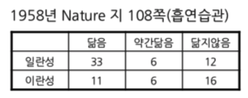
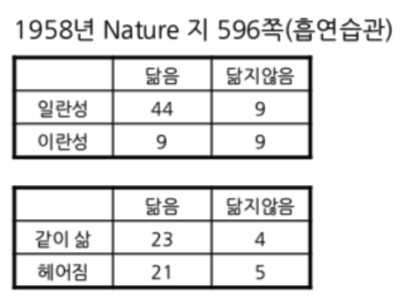

```{r setup, include=FALSE}
library(knitr)
knitr::opts_chunk$set(echo = TRUE)
```

흡연과 건강의 논쟁 가운데 관찰로 수행된 연구 결과가 인과 관계를 이끌어내기 어렵다는 피셔 선생님과 버어크슨 선생님의 반론에서 흡연과 건강의 양쪽에 영향을 미치는 요인으로 유전이 거론되었다. 그에 따라 여러 가지의 쌍둥이연구가 수행되었는데 그 중 1958년 Nature 지에 실린 자료들을 소개한다.

## Nature 1958 version 1

```{r, out.width = "35%", fig.align = "left"}

```

첫번째 자료는 R.A. Fisher 선생님이 Nature 지에 기고한 논문에 인용된 것으로 일란성쌍둥이 51쌍과 이란성쌍둥이 33쌍에게 흡연습관을 묻고 얼마나 닮았는지를 집계하였다. 일란성 쌍둥이 51쌍 중에 39쌍의 흡연 습관이 닮거나 약간 닮았던 데 비하여 이란성 쌍둥이 33쌍 중에는 17쌍의 흡연습관이 많이 닮거나 약간 닮은 것으로 조사되었다. 이로부터 유전적 요인을 흡연과 폐암 연구에서 중요한 요소로 간주해야 한다고 결론을 내리고 있다.   

### 막대그래프

막대그래프로 표현하는 데 있어서 현재의 테이블 구조가 어떻게 나오는지 `barplot()` 의 도움말을 반드시 읽어볼 필요가 있다. 매트릭스를 막대그래프로 그릴 때 매트릭스 모양 그대로 표현하려 함에 유의하여야 한다. 즉, 각 열을 각 막대에 대응시키면서 행으로 주어지는 각각의 값들을 각 막대에 나누어 배분하는 디폴트로 한다(`beside = FALSE`). 따라서 흡연 습관에 대한 쌍둥이 연구의 집계 표를 우리가 원하는 막대 그래프로 표현하려면, 즉 쌍둥이의 유형에 따라 닮은 정도를 표현하려면, 현재 나와 있는 표 구조를 전치(transpose)시켜야 한다. 

```{r, message = FALSE}
library(magrittr)
library(tidyverse)
# par(mfrow = c(1, 2))
#> 제시된 표와 닮은 행열 생성
Nature1 <- matrix(c(33, 11, 6, 6, 12, 16), 
                  nrow = 2)
rownames(Nature1) <- c("Identical", "Fraternal")
colnames(Nature1) <- c("Alike", "Little_Alike", "Not_Alike")
Nature1
```

<P style = "page-break-before:always">

#### 행렬 구조와 barplot

```{r, fig.height = 4, out.width = "50%"}
Nature1 %>%
  barplot
Nature1 %>% 
  t %>%
  barplot
# par(mfrow = c(1, 1))
```

`Nature1`의 구조를 전치(transpose)해 주어야 원하는 모양의 막대그래프가 나올 것임을 알 수 있다. 나머지 이러한 점을 염두에 두고 작성한다.

### Stack

```{r}
options(digits = 3)
#> RColorBrewer 패키지를 이용하여 컬러 생성
library(RColorBrewer)
#> "Accent" palette 채택
cols <- brewer.pal(8, "Accent")
#> 막대의 가운데에 추가 정보를 넣기 위한 좌표 설정 함수. 
# pos <- function(x){
#   cumsum(x) - x / 2
# }
pos <- . %>% {`-`(cumsum(.), . / 2)}
# pos <- . %>% {cumsum(.) - . / 2}
#> 아래와 같이 작성하면 오류 발생
# pos <- . %>% cumsum(.) - . / 2
#> 텍스트 정보 넣을 좌표를 계산한다. 
y1_text <- apply(Nature1, 
                 MARGIN = 1, 
                 FUN = pos)
```

### #`pos()` 의 이해

벡터 $\overrightarrow{x} = (x_1, x_2, x_3)$ 에 대하여 $pos(\overrightarrow{x}) = cumsum(\overrightarrow{x}) - \overrightarrow{x} / 2$. $pos$ 함수는 다음 각 막대 중점(x로 표시)의 $y$ 좌표를 찾아주는 역할을 한다는 것을 쉽게 파악할 수 있다.

```{r, pos, echo = FALSE}
b1 <- barplot(as.matrix(1:3, ncol = 1), 
              axes = FALSE,
              width = 1, 
              xlim = c(-0.5, 3.5), 
              ylim = c(0, 6.5), 
              beside = FALSE, 
              col = "white")
text(x = b1 + 0.55, 
     y = cumsum(1:3), 
     labels = c("x1", "x1 + x2", "x1 + x2 + x3"), 
     adj = 0)
text(x = b1, 
     y = cumsum(1:3) - (1:3)/2, 
     labels = "x")
text(x = b1 + 0.7, 
     y = cumsum(1:3) - (1:3)/2, 
     labels = c("x1 - x1/2", "x1 + x2 - x2/2", "x1 + x2 + x3 - x3/2"), 
     adj = 0)
```

```{r, out.width = "75%", fig.align = "center"}
b1 <- Nature1 %>% 
  t %>%
  barplot(width = 1, 
          xlim = c(0, 4), 
          space = 0.3, 
          col = cols[1:3], 
          yaxt = "n")
#> 쌍둥이유형 별로 한 막대에 흡연습관의 닮음 정도를 나타낼 것이므로 `cumsum`함수를 이용하여 막대들이 위치할 좌표를 계산한다. 일란성과 이란성 각각의 수효부터 비교할 수 있도록  막대 높이로 나타내고, 막대 중심에는 해당 속성의 돗수를 표시한다. 원점을 나타내기 위하여 0을 `c`함수 안에 추가하였다. 이를 추가하지 않으면 축이 어떻게 표시되는지 비교한다.
#> `format`함수의 용법에 익숙해지고, `las = 2`가 왜 필요한지 여러 경우를 비교하라.
axis(side = 2,
     at = c(0, apply(t(Nature1),
                     MARGIN = 2, 
                     FUN = cumsum)),
     labels = format(c(0, apply(t(Nature1), 
                                MARGIN = 2, 
                                FUN = cumsum)), 
                     digits = 3, 
                     nsmall = 0), 
     las = 2)

#> 막대그래프 작성 과정에서 나온 막대의 좌표와 `pos`함수로 계산한 y좌표를 이용하여 실제 관찰된 쌍둥이 페어의 수효를 표시한다.`y_text`의 구조에 맞추어 `rep()`에서 `each = 3`으로 설정하였다. `bty = ` `"o" 또는 "n"으로 정할 수 있다. 
text(x = rep(b1, each = 3), 
     y = y1_text, 
     labels = t(Nature1))
#> 범례 표시
legend("topright", 
       inset = 0.01, 
       fill = cols[3:1], 
       legend = rev(colnames(Nature1)), 
       bty = "o")
#> 메인 타이틀 
title(main = "Smoking Habits of Twins", 
      cex.main = 1.5)
```

### Fill

```{r, out.width = "75%", fig.align = "center"}
#> 쌍둥이유형(일란성/이란성) 별로 흡연습관을 구분하여 각 습관의 백분율을 계산한다. 일란성 쌍둥이와 이란성 쌍둥이의 숫자가 다르기 때문에 공평하게 비교하려면 백분율을 비교하는 것이 타당하다.
Nature1_p <- Nature1 %>%
  prop.table(margin = 1) %>%
  `*`(100)
# Nature1_p <- prop.table(Natrue1, margin = 1) * 100
#> 차곡차곡 쌓아놓은 막대그래프를 그리고(`beside = FALSE`가 디폴트) 추가 정보를 표시할 부분 막대의 가운데 좌표를 저장한다.
#> `width`를 설정하려면 `xlim`도 함께 설정하여야 함에 유의한다.
#> 아래 예시의 경우 막대그래프의 범위를 0에서 4까지로 하면서 첫번째 막대의 중심은 1.5,
#> 두번째 막대의 중심은 3.5에 위치한다.(b1 값으로 파악) 막대의 폭(width)을 1, 
#> 두 막대 간의 간격(space) 또한 1로 하여 width, xlim, space 간의 관계를 쉽게 알 수 있도록 하였다.
#> 쌍둥이유형별로 비교하여야 하므로 행렬을 전치시켜서 막대그래프를 그려야 한다.
#>  `yaxt = "n" `을 설정하여 y축에 추가 정보를 넣을 수 있도록 하였다.
#> 텍스트 정보 넣을 좌표를 계산한다. 
y1_text_p <- Nature1_p %>% 
  apply(MARGIN = 1, 
        FUN = pos)
```

```{r, out.width = "75%", fig.align = "center"}
b1_p <- Nature1_p %>% 
  t %>%
  barplot(width = 1, 
          xlim = c(0, 4), 
          space = 0.3, 
          col = cols[1:3], 
          yaxt = "n")
#> 쌍둥이유형 별로 한 막대에 흡연습관의 닮음 정도를 나타낼 것이므로 `cumsum`함수를 이용하여 막대들이 위치할 좌표를 계산한다. 일란성과 이란성을 각각 100%로 하고 닮음 정도의 백분율을 막대 높이로 비교할 수 있도록 하되, 막대 중심에는 해당 속성의 돗수를 표시한다. 원점을 나타내기 위하여 0을 `c`함수 안에 추가하였다. 이를 추가하지 않으면 축이 어떻게 표시되는지 비교한다.
#> `format`함수의 용법에 익숙해지고, `las = 2`가 왜 필요한지 여러 경우를 비교하라.
axis(side = 2,
     at = c(0, apply(t(Nature1_p),
                     MARGIN = 2, 
                     FUN = cumsum)),
     labels = format(c(0, apply(t(Nature1_p), 
                                MARGIN = 2, 
                                FUN = cumsum)), 
                     digits = 3, 
                     nsmall = 1), 
     las = 2)
#> 막대그래프 작성 과정에서 나온 막대의 좌표와 `pos`함수로 계산한 y좌표를 이용하여 실제 관찰된 쌍둥이 페어의 수효를 표시한다.`y1_text_p`의 구조에 맞추어 `rep()`에서 `each = 3`으로 설정하였다. `bty = ` `"o" 또는 "n"으로 정할 수 있다. 
text(x = rep(b1_p, each = 3), 
     y = y1_text_p, 
     labels = t(Nature1))
#> 범례 표시
legend("topright", 
       inset = 0.01, 
       fill = cols[3:1], 
       legend = rev(colnames(Nature1)), 
       bty = "o")
#> 메인 타이틀 
title(main = "Smoking Habits of Twins", 
      cex.main = 1.5)
```

### Mosaic Plot

```{r, fig.width = 4.5, fig.height = 4.5}
mosaicplot(Nature1, 
           main = "Smoking Habits of Twins", 
           xlab = "Twins", 
           ylab = "Resemblance",
           off = c(0.5, 1),
           color = cols[1:3], 
           cex.axis = 1,
           las = 0)
```

<P style = "page-break-before:always">

## Nature 1958 version 2

피셔의 논문이 실려 있는 Nature 지의 596쪽에서는 그와 비슷한 연구 결과가 실려 있었다. 피셔가 인용한 보고서가 흡연습관을 세 단계로 구분한 것과는 달리 닮았거나 그렇지 않거나의 이분법으로 나누었다.
이 보고서가 흥미로운 것은 단순히 일란성 쌍둥이와 이란성 쌍둥이의 흡연습관을 비교한 것이 아니라 일란성 쌍둥이들을 다시 어려서 헤어진 경우와 함께 산 경우로 나눠 본 것이다. 일란성 쌍둥이들은 함께 살았든, 헤어져 살았든 흡연습관에 있어서도 놀라울 정도로 닮은 점을 보여 준다. 

```{r, out.width = "35%", fig.align = "left"}

```

### 막대그래프 : Stack

```{r, out.width = "75%", fig.align = "center"}
Nature2 <- matrix(c(44, 9, 9, 9), 
                  nrow = 2)
rownames(Nature2) <- c("Identical", "Fraternal")
colnames(Nature2) <- c("Alike", "Not_Alike")
Nature2
y2_text <- apply(Nature2, 
                 MARGIN = 1, 
                 FUN = pos)
b2 <- barplot(t(Nature2),
              width = 1,
              xlim = c(0, 4),
              space = 0.5, 
              col = cols[1:2], 
              yaxt = "n")
axis(side = 2,
     at = c(0, apply(t(Nature2),
                     MARGIN = 2, 
                     FUN = cumsum)),
     labels = format(c(0, apply(t(Nature2), 
                                MARGIN = 2, 
                                FUN = cumsum)), 
                     digits = 3, 
                     nsmall = 1), 
     las = 2)
text(x = rep(b2, each = 2), 
     y = y2_text, 
     labels = t(Nature2))
legend("topright", 
       inset = 0.01, 
       fill = cols[2:1], 
       legend = rev(colnames(Nature2)))
title(main = "Smoking Habits of Twins 2")
```

<P style = "page-break-before:always">

### 막대그래프 : Fill

```{r, out.width = "75%", fig.align = "center"}
Nature2_p <- prop.table(Nature2, 
                        margin = 1) * 100
y2_text_p <- apply(Nature2_p, 
                   MARGIN = 1, 
                   FUN = pos)
b2_p <- barplot(t(Nature2_p),
                width = 1,
                xlim = c(0, 4),
                space = 0.5, 
                col = cols[1:2], 
                yaxt = "n")
axis(side = 2,
     at = c(0, apply(t(Nature2_p),
                     MARGIN = 2, 
                     FUN = cumsum)),
     labels = format(c(0, apply(t(Nature2_p), 
                                MARGIN = 2, 
                                FUN = cumsum)), 
                     digits = 3, 
                     nsmall = 1), 
     las = 2)
text(x = rep(b2_p, each = 2), 
     y = y2_text_p, 
     labels = t(Nature2))
legend("topright", 
       inset = 0.01, 
       fill = cols[2:1], 
       legend = rev(colnames(Nature2)))
title(main = "Smoking Habits of Twins 2")
```

<P style = "page-break-before:always">

### Mosaic Plot

```{r, fig.width = 4.5, fig.height = 4.5}
mosaicplot(Nature2,
           main = "Smoking Habits of Twins 2", 
           xlab = "Twins", 
           ylab = "Resemblance",
           off = 1,
           color = cols[1:2],
           cex.axis = 1)
```

<P style = "page-break-before:always">

## Nature 1958 version 2 : Identical Twins

일란성 쌍둥이들만을 대상으로 어렸을 때 헤어졌는지, 함께 살았는지 여부와 흡연습관을 비교한 결과는 놀라울 정도 닮았다는 것을 보여준다.

### 막대그래프 : stack

```{r, out.width = "75%", fig.align = "center"}
Nature3 <- matrix(c(23, 21, 4, 5), 
                  nrow = 2)
rownames(Nature3) <- c("Lived Together", "Separated")
colnames(Nature3) <- c("Alike", "Not_Alike")
Nature3
c3 <- ncol(Nature3)
b3 <- barplot(t(Nature3),
              width = 1,
              xlim = c(0, 4),
              space = 0.5, 
              col = cols[1:2], 
              yaxt = "n")
axis(side = 2,
     at = c(0, apply(t(Nature3), 
                     MARGIN = 2, 
                     FUN = cumsum)),
     labels = format(c(0, apply(t(Nature3), 
                                MARGIN = 2, 
                                FUN = cumsum)), 
                     digits = 3, 
                     nsmall = 0), 
     las = 2)
y3_text <- apply(Nature3, 
                 MARGIN = 1, 
                 FUN = pos)
text(x = rep(b3, each = 2), 
     y = y3_text, 
     labels = t(Nature3))
legend("topright", 
       inset = 0.01, 
       fill = cols[2:1], 
       legend = rev(colnames(Nature2)))
title(main = "Smoking Habits of Identical Twins")
```

### 막대그래프 : Fill

```{r, out.width = "75%", fig.align = "center"}
Nature3_p <- prop.table(Nature3, 
                        margin = 1) * 100
b3_p <- barplot(t(Nature3_p),
                width = 1,
                xlim = c(0, 4),
                space = 0.5, 
                col = cols[1:2], 
                yaxt = "n")
axis(side = 2,
     at = c(0, apply(t(Nature3_p), 
                     MARGIN = 2, 
                     FUN = cumsum)),
     labels = format(c(0, apply(t(Nature3_p), 
                                MARGIN = 2, 
                                FUN = cumsum)), 
                     digits = 3, 
                     nsmall = 1), 
     las = 2)
y3_text_p <- apply(Nature3_p, 
                   MARGIN = 1, 
                   FUN = pos)
text(x = rep(b3, each = 2), 
     y = y3_text_p, 
     labels = t(Nature3))
legend("topright", 
       inset = 0.01, 
       fill = cols[2:1], 
       legend = rev(colnames(Nature2)))
title(main = "Smoking Habits of Identical Twins")
```

### Mosaic Plot

```{r, out.width = "50%", fig.align = "left"}
mosaicplot(Nature3, 
           main = "Smoking Habits of Identical Twins", 
           xlab = "Lived Together?", 
           ylab = "Resemblance",
           off = 1,
           color = cols[2:1],
           cex.axis = 1)
```


<P style = "page-break-before:always">

## ggplot

### tidyverse

깔끔한 데이터 바꾸는 과정에서 유의할 점은 ggplot으로 그릴 때 어떤 변수가 x, y, fill 역할을 할 것인지를 명확히 하여야한다. 어떤 변수를 맨 앞에 위치시키고, 어떤 변수를 그 다음 자리에 위치시키고, 그 다음에 Counts를 위치시킨다.
즉, fill 에 해당하는 변수를 맨 앞에, 그리고 x에 해당하는 변수를 그 다음에, 마지막으로 세번째 변수로 Freq 또는 Counts가 위치하도록 tidy를 적용하면 ggplot으로 그릴 때 상당히 체계적인 접근이 가능해진다. 특히, 막대들의 중간에 추가적인 정보를 삽입하기 위하여 좌표를 계산할 필요가 있을 때 크게 도움이 된다.

```{r}
Nature1_tbl <- Nature1 %>% 
  t %>%
  as_tibble %>%
  mutate(Resemblance = row.names(t(Nature1))) %>%
  pivot_longer(
    cols = -Resemblance, 
    names_to = "Twins", 
    values_to = "Counts"
  ) %>%
#   gather(key = "Twins", 
#          value = "Counts", -Resemblance) %>%
  mutate(Resemblance = factor(Resemblance, 
                              levels = c("Alike", 
                                         "Little_Alike",
                                         "Not_Alike")),
         Twins = factor(Twins, 
                        levels = c("Identical", "Fraternal")))
Nature1_tbl
Nature2_tbl <- Nature2 %>%
  t %>%
  as_tibble %>%
  mutate(Resemblance = row.names(t(Nature2))) %>%
  pivot_longer(
    cols = -Resemblance, 
    names_to = "Twins", 
    values_to = "Counts"
  ) %>%
#   gather(key = "Twins", 
#          value = "Counts", -Resemblance) %>%
  mutate(Twins = factor(Twins, 
                        levels = c("Identical", "Fraternal")),
         Resemblance = factor(Resemblance)) %>%
  print
Nature3_tbl <- Nature3 %>%
  t %>%
  as_tibble %>%
  mutate(Resemblance = row.names(t(Nature3))) %>%
  pivot_longer(
    cols = -Resemblance, 
    names_to = "Separation", 
    values_to = "Counts"
  ) %>%
#   gather(key = "Separation", 
#          value = "Counts", -Resemblance) %>%
  mutate(Separation = factor(Separation),
         Resemblance = factor(Resemblance)) %>%
  print
```

### Good old `as.data.frame`

```{r}
Nature1_tbl <- Nature1 %>% 
  t %>%
  as.data.frame.table %>%
  `colnames<-`(c("Resemblance", "Twins", "Counts"))
Nature2_tbl <- Nature2 %>% 
  t %>%
  as.data.frame.table %>%
  `colnames<-`(c("Resemblance", "Twins", "Counts"))
Nature3_tbl <- Nature3 %>% 
  t %>%
  as.data.frame.table %>%
  `colnames<-`(c("Resemblance", "Separation", "Counts"))
```

<P style = "page-break-before:always">

## Nature 1958 Version 1

### stack

```{r, out.width = "75%", fig.align = "center"}
y1_breaks <- Nature1_tbl %$%
  tapply(Counts,
         INDEX = Twins,
         FUN = cumsum) %>%
  unlist
y1_text <- Nature1_tbl %$%
  tapply(Counts,
         INDEX = Twins,
         FUN = pos) %>%
  unlist
Nature1_tbl %>%
  ggplot(data = ., 
         mapping = aes(x = Twins, 
                       y = Counts, 
                       fill = Resemblance)) +
  geom_bar(stat = "identity", 
           width = 0.5, 
           position = position_stack(reverse = TRUE)) +
  geom_text(aes(y = y1_text), 
            label = Nature1_tbl$Counts, 
            position = "identity") +
  scale_fill_brewer(type = "qual", 
                    palette = "Accent", 
                    direction = -1) +
  scale_y_continuous(breaks = y1_breaks, 
                     labels = y1_breaks)
```

<P style = "page-break-before:always">

### fill

```{r, out.width = "75%", fig.align = "center"}
y1_fill <- y1_text / (Nature1 %>% 
                        apply(MARGIN = 1, 
                              FUN = sum) %>%
                        rep(each = 3))
Nature1_tbl %>%
  ggplot(data = ., 
         mapping = aes(x = Twins, 
                       y = Counts, 
                       fill = Resemblance)) +
  geom_bar(stat = "identity", 
           width = 0.5, 
           position = position_fill(reverse = TRUE)) +
  geom_text(aes(y = y1_fill), 
            label = Nature1_tbl$Counts, 
            position = "identity") +
  scale_fill_brewer(type = "qual", 
                    palette = "Accent", 
                    direction = -1) +
  scale_y_continuous(name = "Cumulative Percentage", 
                     breaks = c(0, 
                                apply(t(Nature1_p), 
                                      MARGIN = 2, 
                                      FUN = cumsum) / 100), 
                     labels = format(c(0, 
                                       apply(t(Nature1_p), 
                                             MARGIN = 2, 
                                             FUN = cumsum)), 
                                     digits = 3, 
                                     nsmall = 1)) +
  labs(title = "Smoking Habits of Twins") +
  theme(plot.title = element_text(hjust = 0.5))
```

<P style = "page-break-before:always">

## Nature 1958 version 2 : Twin Study

### stack

```{r, out.width = "75%", fig.align = "center"}
y2_breaks <- Nature2_tbl %$%
  tapply(Counts,
         INDEX = Twins,
         FUN = cumsum) %>%
  unlist
y2_text <- Nature2_tbl %$%
  tapply(Counts,
         INDEX = Twins,
         FUN = pos) %>%
  unlist
Nature2_tbl %>%
  ggplot(data = ., 
         mapping = aes(x = Twins, 
                       y = Counts, 
                       fill = Resemblance)) +
  geom_bar(stat = "identity", 
           width = 0.5, 
           position = position_stack(reverse = TRUE)) +
  geom_text(aes(y = y2_text), 
            label = Nature2_tbl$Counts, 
            position = "identity") +
  scale_fill_brewer(type = "qual", 
                    palette = "Accent", 
                    direction = -1) +
  scale_y_continuous(breaks = y2_breaks, 
                     labels = y2_breaks)
```

<P style = "page-break-before:always">

### fill

```{r, out.width = "75%", fig.align = "center"}
y2_fill <- y2_text / (Nature2 %>% 
                        apply(MARGIN = 1, 
                              FUN = sum) %>%
                        rep(each = 2))
Nature2_tbl %>%
  ggplot(data = ., 
         mapping = aes(x = Twins, 
                       y = Counts, 
                       fill = Resemblance)) +
  geom_bar(stat = "identity", 
           width = 0.5, 
           position = position_fill(reverse = TRUE)) +
  geom_text(aes(y = y2_fill), 
            label = Nature2_tbl$Counts, 
            position = "identity") +
  scale_fill_brewer(type = "qual", 
                    palette = "Accent", 
                    direction = -1) +
  scale_y_continuous(name = "Cumulative Percentage", 
                     breaks = c(0, 
                                apply(t(Nature2_p), 
                                      MARGIN = 2, 
                                      FUN = cumsum) / 100), 
                     labels = format(c(0, 
                                       apply(t(Nature2_p), 
                                             MARGIN = 2, 
                                             FUN = cumsum)), 
                                     digits = 3, 
                                     nsmall = 1)) +
  labs(title = "Smoking Habits of Twins") +
  theme(plot.title = element_text(hjust = 0.5))
```

<P style = "page-break-before:always">

## Nature 1958 version 2 : Identical Twins

### stack

```{r, out.width = "75%", fig.align = "center"}
y3_breaks <- Nature3_tbl %$%
  tapply(Counts,
         INDEX = Separation,
         FUN = cumsum) %>%
  unlist
y3_text <- Nature3_tbl %$%
  tapply(Counts,
         INDEX = Separation,
         FUN = pos) %>%
  unlist
Nature3_tbl %>%
  ggplot(data = ., 
         mapping = aes(x = Separation, 
                       y = Counts, 
                       fill = Resemblance)) +
  geom_bar(stat = "identity", 
           width = 0.5, 
           position = position_stack(reverse = TRUE)) +
  geom_text(aes(y = y3_text), 
            label = Nature3_tbl$Counts, 
            position = "identity") +
  scale_fill_brewer(type = "qual", 
                    palette = "Accent", 
                    direction = -1) +
  scale_y_continuous(breaks = y3_breaks, 
                     labels = y3_breaks)
```

<P style = "page-break-before:always">

### fill

```{r, out.width = "75%", fig.align = "center"}
y3_fill <- y3_text / (Nature3 %>% 
                        apply(MARGIN = 1, 
                              FUN = sum) %>%
                        rep(each = 2))
Nature3_tbl %>%
  ggplot(data = ., 
         mapping = aes(x = Separation, 
                       y = Counts, 
                       fill = Resemblance)) +
  geom_bar(stat = "identity", 
           width = 0.5, 
           position = position_fill(reverse = TRUE)) +
  geom_text(aes(y = y3_fill), 
            label = Nature3_tbl$Counts, 
            position = "identity") +
  scale_fill_brewer(type = "qual", 
                    palette = "Accent", 
                    direction = -1) +
  scale_y_continuous(name = "Cumulative Percentage", 
                     breaks = c(0, 
                                apply(t(Nature3_p), 
                                      MARGIN = 2, 
                                      FUN = cumsum) / 100), 
                     labels = format(c(0, 
                                       apply(t(Nature3_p), 
                                             MARGIN = 2, 
                                             FUN = cumsum)), 
                                     digits = 3, 
                                     nsmall = 1)) +
  labs(title = "Smoking Habits of Identical Twins") +
  theme(plot.title = element_text(hjust = 0.5))
```

