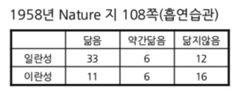
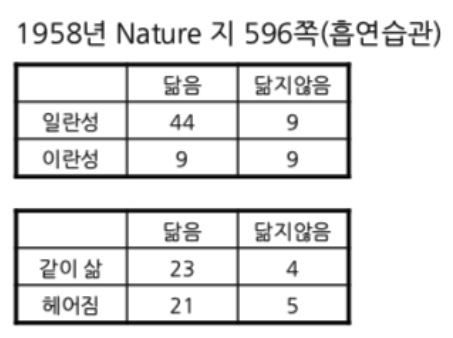

<!--
이 파일은 Twin_Studies.Rmd 의 2026-2학기 개정판입니다.
원본은 그대로 두었으므로 지난 학기 자료와 나란히 비교할 수 있습니다.
바뀐 것 : (1) 맨 앞에 컨텍스트 절  (2) 맨 끝에 필수 계산·Comments 양식·자가점검
-->

```{r setup, include=FALSE}
library(knitr)
knitr::opts_chunk$set(echo = TRUE)
```

흡연과 건강의 논쟁 가운데 관찰로 수행된 연구 결과가 인과 관계를 이끌어내기 어렵다는 피셔 선생님과 버어크슨 선생님의 반론에서 흡연과 건강의 양쪽에 영향을 미치는 요인으로 유전이 거론되었다. 그에 따라 여러 가지의 쌍둥이연구가 수행되었는데 그 중 1958년 Nature 지에 실린 자료들을 소개한다.

```{r setup-context, include = FALSE}
knitr::opts_chunk$set(echo = TRUE, message = FALSE, warning = FALSE)
```

## 이 논쟁에 대하여

1950년대 영국과 미국에서 흡연과 폐암의 관계를 놓고 큰 논쟁이 있었다. 한쪽에는
관찰 연구로 강한 상관을 확인한 역학자들이 있었고, 반대쪽에는 20세기 통계학을
만든 사람 중 하나인 **R. A. 피셔**가 있었다.

우리가 이번 주에 그릴 그래프는 피셔가 자신의 반론을 뒷받침하려고 제시한 자료다.
그래프를 그리기 전에, 그가 무슨 말을 하려 했는지부터 이해해야 한다.

### 피셔의 주장 — 세 갈래

피셔는 "흡연과 폐암은 무관하다"고 말하지 않았다. 그가 말한 것은
**"상관이 있다고 해서 인과를 안 것은 아니다"** 였고, 세 가지 대안을 제시했다.

1. **공통 원인(교란)** — 흡연 습관과 폐암 감수성 **양쪽**에 영향을 주는
   제3의 요인, 구체적으로는 **유전적 체질**이 있을 수 있다.
   이것이 피셔의 이른바 *constitutional hypothesis* 다.
2. **역인과** — 아직 진단되지 않은 초기 폐 병변이 불편감을 일으키고,
   그 불편을 달래려고 담배를 피우게 되는 것일 수도 있다.
3. **선택 편의** — 조지프 버크슨(Joseph Berkson, 메이요 클리닉)이 제기한 것으로,
   병원 입원 환자를 표본으로 삼으면 실제로 없는 연관이 만들어질 수 있다
   (Berkson's fallacy, 1946).

**유전이 공통 원인이라면, 그것을 어떻게 확인할 수 있는가?** 유전자를 공유하는
일란성 쌍둥이와 절반만 공유하는 이란성 쌍둥이의 흡연 습관을 비교해 보면 된다.
피셔가 1958년 *Nature* 에 두 차례 기고하면서 인용한 자료가 바로 이것이다.

- Fisher, R. A. "Lung Cancer and Cigarettes?" *Nature* **182**, 108 (1958. 7. 12.)
- Fisher, R. A. "Cancer and Smoking" *Nature* **182**, 596 (1958. 8. 30.)

첫 번째 자료는 독일 뮌스터 대학 인류유전학연구소의 **오트마 폰 페어슈어**
(Otmar von Verschuer)가 제공한 남성 쌍둥이 자료이고, 두 번째는 런던 모즐리 병원의
**엘리엇 슬레이터**(Eliot Slater)가 제공한 주로 여성 쌍둥이 자료다.

> **미리 알아둘 것** — 폰 페어슈어는 나치 시기 독일의 인종위생학
> (racial hygiene) 연구자였다. 쌍둥이 자료가 어떤 연구 전통에서 축적되었는지는
> 자료의 신뢰성과 별개로 반드시 함께 언급되어야 하는 맥락이다.

### 원문의 숫자를 직접 확인한다

역사적 자료를 다룰 때는 **인용된 표가 원문과 맞는지 검산**하는 습관이 필요하다.
피셔의 1958년 7월 12일 편지 원문은 다음과 같이 적고 있다.

> "Of the first, **33 pairs are wholly alike** qualitatively … **Six pairs**, though
> closely alike, show some differences … **Twelve pairs**, less than one-quarter of
> the whole, show distinct differences."
>
> "Of the dizygotic pairs only **11** can be classed as wholly alike, while
> **16 out of the 31** are distinctly different, this being **51 per cent.** as
> against **24 per cent.** among the monozygotic."

여기서 이란성 쌍둥이의 합계는 **31쌍**이고, 따라서 가운데 칸(약간 닮음)은
31 − 11 − 16 = **4쌍**이다. 지금까지 강의자료에 쓰던 표는 이 칸이 6, 합계가 33으로
되어 있었다. 어느 쪽이 맞는지는 피셔 자신이 적어 둔 백분율로 검산할 수 있다.

33쌍짜리 표에서는 '닮지 않음'이 16/33 = 48.5% 이고, 31쌍짜리 표에서는
16/31 = 51.6% 다. 피셔가 본문에 적은 **51%** 와 맞는 것은 뒤쪽뿐이다.
앞으로는 **31쌍짜리 표**를 쓴다.

> **직접 검산해 보세요.** 이 문서 맨 끝의 *필수 계산* 에서 표를 입력하고
> 백분율을 계산해 51.6% 와 23.5% 가 나오는지 확인하게 됩니다.
> 사소해 보이는 두 칸의 차이지만, 이런 검산을 하지 않으면 우리는 남이 잘못
> 옮겨 적은 숫자 위에서 몇 시간짜리 분석을 하게 된다.

일란성과 이란성의 흡연 습관 닮음 정도에 차이가 있다는 것은 카이제곱 검정으로도
확인된다. 피셔는 여기서 멈추지 않고, "그렇다면 그 닮음이 **함께 자란 환경** 때문은 아닌가"
라는 반론을 미리 차단하려 했다.

### 두 번째 자료 — 헤어져 자란 일란성 쌍둥이

1958년 8월 30일 편지(596쪽)에 실린 슬레이터의 자료다. **첫 번째 편지와 다른
연구가 아니라, 피셔가 같은 논지를 보강하려고 자기 편지 안에 실은 두 번째 표**다.

```{r slater-context}
#> 일란성 vs 이란성 (슬레이터, 주로 여성)
N2 <- matrix(c(44, 9, 9, 9), nrow = 2,
             dimnames = list(c("Identical", "Fraternal"),
                             c("Alike", "Not_Alike")))
N2
addmargins(N2)

#> 일란성 53쌍을 '태어나자마자 헤어짐 / 함께 자람' 으로 다시 나눈 표
#> 원문: "only 4 occur among the 27 separated at birth"
N3 <- matrix(c(23, 21, 4, 5), nrow = 2,
             dimnames = list(c("Separated", "Together"),
                             c("Alike", "Not_Alike")))
N3
round(100 * prop.table(N3, margin = 1), 1)
```

헤어져 자란 27쌍 중 닮지 않은 경우가 4쌍(14.8%), 함께 자란 26쌍 중에서는
5쌍(19.2%)이다. 피셔의 결론: 일란성 쌍둥이의 흡연 습관이 닮은 것은
**서로 영향을 주고받아서가 아니다.**

> **정정** — 기존 강의자료의 `Nature3` 은 `"Lived Together"` 에 23/4,
> `"Separated"` 에 21/5 를 넣어 두 행의 이름이 서로 바뀌어 있었다.
> 원문은 **헤어진 쪽이 27쌍(23 alike, 4 unlike)** 이다.

### 그래서 피셔가 옳았는가

여기가 이번 주의 핵심이다. 위 표들은 **흡연 습관이 유전의 영향을 받는다**는 것을
꽤 설득력 있게 보여준다. 그런데 그것이 곧 **"담배가 폐암을 일으키지 않는다"** 는
뜻인가? 아니다. 그 사이에 큰 논리적 간격이 있다.

이 간격을 가장 먼저 지적한 사람이 갈턴 연구소의 **라이오넬 펜로즈**
(L. S. Penrose, *Nature* **182**, 1178, 1958. 10. 25.)다. 요지는 간단하다.
**담배를 피우는 성향이 유전된다는 사실은, 담배가 몸에 무슨 짓을 하는지에 대해
아무것도 말해 주지 않는다.**

그리고 피셔의 가설을 수치로 무너뜨린 것은 **코른필드의 부등식**이다
(Cornfield et al., *J Natl Cancer Inst* **22**, 173–203, 1959).

```{r cornfield-context}
#> 흡연자의 폐암 상대위험도 RR 이 약 9 일 때,
#> "숨은 유전적 체질" 이 이 연관을 전부 설명하려면
#> 그 체질이 흡연자에게 최소 몇 배 더 흔해야 하는가?
RR <- 9
cat("숨은 요인의 유병률 비가 최소", RR, "배는 되어야 한다\n")
```

즉 흡연자 집단에 그 유전적 체질을 가진 사람이 비흡연자 집단보다 **최소 9배는 더
많아야** 피셔의 설명이 성립한다. 그런 유전자는 발견되지 않았다.

현대의 답은 이렇게 정리할 수 있다. **피셔의 논리는 타당했고, 실증은 그를 배반했다.**
실제로 흡연량과 폐암 위험 양쪽에 관련된 유전자 자리(15q25.1의 *CHRNA5–A3–B4*)가
나중에 발견되기는 했다. 그러나 그 효과의 극히 일부만이 흡연 행동을 통해 매개된다.
피셔가 가리킨 구멍은 실재했지만, 코른필드의 문턱을 넘기에는 턱없이 작았다.

논쟁을 실제로 끝낸 것은 다음의 축적이다.

- **돌 & 힐의 영국 의사 연구** (1951년 10월 설문 발송, *BMJ* 1954 · 1956 · 1964,
  그리고 50년 추적 결과 *BMJ* 2004;328:1519)
- **1964년 1월 11일 미국 공중보건국장 보고서**
- **오스틴 브래드퍼드 힐의 1965년 인과 판단 기준 9가지**
  (*Proc R Soc Med* **58**, 295–300)

그리고 마지막으로 기억할 사실 하나. 피셔는 1956년부터 **영국 담배제조사협회
(Tobacco Manufacturers' Standing Committee)의 유급 자문**이었고, 본인도 골초였다.
이해관계가 곧 오류를 뜻하지는 않지만, 주장을 읽을 때 함께 놓고 보아야 할 정보다
(Stolley, P. D. "When Genius Errs: R. A. Fisher and the Lung Cancer Controversy."
*Am J Epidemiol* **133**(5), 416–425, 1991).

### 이번 주 코드가 실제로 하는 일

우리는 위의 세 표를 막대그래프(빈도 / 백분율)와 모자이크 플롯으로 그린다.
그리는 동안 다음을 의식하자.

- **빈도 막대와 백분율 막대는 다른 주장을 한다.** 일란성 51쌍과 이란성 31쌍은
  크기가 다르므로, 공평한 비교는 백분율 쪽이다. 그런데 백분율만 보여 주면
  표본이 31쌍이라는 사실이 화면에서 사라진다.
- **모자이크 플롯은 두 정보를 동시에 담는다.** 폭이 표본 크기, 높이가 비율이다.
  왜 이 그림이 이 자료에 특히 적합한지 직접 확인해 보자.

<P style = "page-break-before:always">

## Nature 1958 version 1

```{r, out.width = "35%", fig.align = "left"}

```

> **이 그림을 그대로 믿지 말 것.** 위 이미지는 지난 학기까지 쓰던 표를 옮긴
> 것이라 이란성 쌍둥이가 **11 / 6 / 16, 합계 33쌍**으로 되어 있다. 피셔가
> 1958년 7월 12일 *Nature* 편지 본문에 적어 둔 값은 **"16 out of the 31 …
> this being 51 per cent."** 이다. 33쌍으로 계산하면 16/33 = 48.5%,
> 31쌍으로 계산해야 16/31 = 51.6% 가 되어 원문과 맞는다. 따라서 가운데
> 칸은 6이 아니라 **4**, 합계는 **31쌍**이다.
>
> 아래 본문과 코드는 정정된 값을 쓴다. 그림은 일부러 고치지 않고 두었다.
> **인용된 표는 원문의 숫자로 검산한다** — 이번 주가 가르치려는 것이 이것이다.

첫번째 자료는 R.A. Fisher 선생님이 Nature 지에 기고한 논문에 인용된 것으로 일란성쌍둥이 51쌍과 이란성쌍둥이 31쌍에게 흡연습관을 묻고 얼마나 닮았는지를 집계하였다. 일란성 쌍둥이 51쌍 중에 39쌍의 흡연 습관이 닮거나 약간 닮았던 데 비하여 이란성 쌍둥이 31쌍 중에는 15쌍의 흡연습관이 많이 닮거나 약간 닮은 것으로 조사되었다. 이로부터 유전적 요인을 흡연과 폐암 연구에서 중요한 요소로 간주해야 한다고 결론을 내리고 있다.   

### 막대그래프

막대그래프로 표현하는 데 있어서 현재의 테이블 구조가 어떻게 나오는지 `barplot()` 의 도움말을 반드시 읽어볼 필요가 있다. 매트릭스를 막대그래프로 그릴 때 매트릭스 모양 그대로 표현하려 함에 유의하여야 한다. 즉, 각 열을 각 막대에 대응시키면서 행으로 주어지는 각각의 값들을 각 막대에 나누어 배분하는 디폴트로 한다(`beside = FALSE`). 따라서 흡연 습관에 대한 쌍둥이 연구의 집계 표를 우리가 원하는 막대 그래프로 표현하려면, 즉 쌍둥이의 유형에 따라 닮은 정도를 표현하려면, 현재 나와 있는 표 구조를 전치(transpose)시켜야 한다. 

```{r, message = FALSE}
library(magrittr)
library(tidyverse)
# par(mfrow = c(1, 2))
#> 제시된 표와 닮은 행열 생성
Nature1 <- matrix(c(33, 11, 6, 4, 12, 16), 
                  nrow = 2)
rownames(Nature1) <- c("Identical", "Fraternal")
colnames(Nature1) <- c("Alike", "Little_Alike", "Not_Alike")
Nature1
```

<P style = "page-break-before:always">

#### 행렬 구조와 barplot

```{r, fig.height = 4, out.width = "50%"}
Nature1 %>%
  barplot
Nature1 %>% 
  t %>%
  barplot
# par(mfrow = c(1, 1))
```

`Nature1`의 구조를 전치(transpose)해 주어야 원하는 모양의 막대그래프가 나올 것임을 알 수 있다. 나머지 이러한 점을 염두에 두고 작성한다.

### Stack

```{r}
options(digits = 3)
#> RColorBrewer 패키지를 이용하여 컬러 생성
library(RColorBrewer)
#> "Accent" palette 채택
cols <- brewer.pal(8, "Accent")
#> 막대의 가운데에 추가 정보를 넣기 위한 좌표 설정 함수. 
# pos <- function(x){
#   cumsum(x) - x / 2
# }
pos <- . %>% {`-`(cumsum(.), . / 2)}
# pos <- . %>% {cumsum(.) - . / 2}
#> 아래와 같이 작성하면 오류 발생
# pos <- . %>% cumsum(.) - . / 2
#> 텍스트 정보 넣을 좌표를 계산한다. 
y1_text <- apply(Nature1, 
                 MARGIN = 1, 
                 FUN = pos)
```

### #`pos()` 의 이해

벡터 $\overrightarrow{x} = (x_1, x_2, x_3)$ 에 대하여 $pos(\overrightarrow{x}) = cumsum(\overrightarrow{x}) - \overrightarrow{x} / 2$. $pos$ 함수는 다음 각 막대 중점(x로 표시)의 $y$ 좌표를 찾아주는 역할을 한다는 것을 쉽게 파악할 수 있다.

```{r, pos, echo = FALSE}
b1 <- barplot(as.matrix(1:3, ncol = 1), 
              axes = FALSE,
              width = 1, 
              xlim = c(-0.5, 3.5), 
              ylim = c(0, 6.5), 
              beside = FALSE, 
              col = "white")
text(x = b1 + 0.55, 
     y = cumsum(1:3), 
     labels = c("x1", "x1 + x2", "x1 + x2 + x3"), 
     adj = 0)
text(x = b1, 
     y = cumsum(1:3) - (1:3)/2, 
     labels = "x")
text(x = b1 + 0.7, 
     y = cumsum(1:3) - (1:3)/2, 
     labels = c("x1 - x1/2", "x1 + x2 - x2/2", "x1 + x2 + x3 - x3/2"), 
     adj = 0)
```

```{r, out.width = "75%", fig.align = "center"}
b1 <- Nature1 %>% 
  t %>%
  barplot(width = 1, 
          xlim = c(0, 4), 
          space = 0.3, 
          col = cols[1:3], 
          yaxt = "n")
#> 쌍둥이유형 별로 한 막대에 흡연습관의 닮음 정도를 나타낼 것이므로 `cumsum`함수를 이용하여 막대들이 위치할 좌표를 계산한다. 일란성과 이란성 각각의 수효부터 비교할 수 있도록  막대 높이로 나타내고, 막대 중심에는 해당 속성의 돗수를 표시한다. 원점을 나타내기 위하여 0을 `c`함수 안에 추가하였다. 이를 추가하지 않으면 축이 어떻게 표시되는지 비교한다.
#> `format`함수의 용법에 익숙해지고, `las = 2`가 왜 필요한지 여러 경우를 비교하라.
axis(side = 2,
     at = c(0, apply(t(Nature1),
                     MARGIN = 2, 
                     FUN = cumsum)),
     labels = format(c(0, apply(t(Nature1), 
                                MARGIN = 2, 
                                FUN = cumsum)), 
                     digits = 3, 
                     nsmall = 0), 
     las = 2)

#> 막대그래프 작성 과정에서 나온 막대의 좌표와 `pos`함수로 계산한 y좌표를 이용하여 실제 관찰된 쌍둥이 페어의 수효를 표시한다.`y_text`의 구조에 맞추어 `rep()`에서 `each = 3`으로 설정하였다. `bty = ` `"o" 또는 "n"으로 정할 수 있다. 
text(x = rep(b1, each = 3), 
     y = y1_text, 
     labels = t(Nature1))
#> 범례 표시
legend("topright", 
       inset = 0.01, 
       fill = cols[3:1], 
       legend = rev(colnames(Nature1)), 
       bty = "o")
#> 메인 타이틀 
title(main = "Smoking Habits of Twins", 
      cex.main = 1.5)
```

### Fill

```{r, out.width = "75%", fig.align = "center"}
#> 쌍둥이유형(일란성/이란성) 별로 흡연습관을 구분하여 각 습관의 백분율을 계산한다. 일란성 쌍둥이와 이란성 쌍둥이의 숫자가 다르기 때문에 공평하게 비교하려면 백분율을 비교하는 것이 타당하다.
Nature1_p <- Nature1 %>%
  prop.table(margin = 1) %>%
  `*`(100)
# Nature1_p <- prop.table(Natrue1, margin = 1) * 100
#> 차곡차곡 쌓아놓은 막대그래프를 그리고(`beside = FALSE`가 디폴트) 추가 정보를 표시할 부분 막대의 가운데 좌표를 저장한다.
#> `width`를 설정하려면 `xlim`도 함께 설정하여야 함에 유의한다.
#> 아래 예시의 경우 막대그래프의 범위를 0에서 4까지로 하면서 첫번째 막대의 중심은 1.5,
#> 두번째 막대의 중심은 3.5에 위치한다.(b1 값으로 파악) 막대의 폭(width)을 1, 
#> 두 막대 간의 간격(space) 또한 1로 하여 width, xlim, space 간의 관계를 쉽게 알 수 있도록 하였다.
#> 쌍둥이유형별로 비교하여야 하므로 행렬을 전치시켜서 막대그래프를 그려야 한다.
#>  `yaxt = "n" `을 설정하여 y축에 추가 정보를 넣을 수 있도록 하였다.
#> 텍스트 정보 넣을 좌표를 계산한다. 
y1_text_p <- Nature1_p %>% 
  apply(MARGIN = 1, 
        FUN = pos)
```

```{r, out.width = "75%", fig.align = "center"}
b1_p <- Nature1_p %>% 
  t %>%
  barplot(width = 1, 
          xlim = c(0, 4), 
          space = 0.3, 
          col = cols[1:3], 
          yaxt = "n")
#> 쌍둥이유형 별로 한 막대에 흡연습관의 닮음 정도를 나타낼 것이므로 `cumsum`함수를 이용하여 막대들이 위치할 좌표를 계산한다. 일란성과 이란성을 각각 100%로 하고 닮음 정도의 백분율을 막대 높이로 비교할 수 있도록 하되, 막대 중심에는 해당 속성의 돗수를 표시한다. 원점을 나타내기 위하여 0을 `c`함수 안에 추가하였다. 이를 추가하지 않으면 축이 어떻게 표시되는지 비교한다.
#> `format`함수의 용법에 익숙해지고, `las = 2`가 왜 필요한지 여러 경우를 비교하라.
axis(side = 2,
     at = c(0, apply(t(Nature1_p),
                     MARGIN = 2, 
                     FUN = cumsum)),
     labels = format(c(0, apply(t(Nature1_p), 
                                MARGIN = 2, 
                                FUN = cumsum)), 
                     digits = 3, 
                     nsmall = 1), 
     las = 2)
#> 막대그래프 작성 과정에서 나온 막대의 좌표와 `pos`함수로 계산한 y좌표를 이용하여 실제 관찰된 쌍둥이 페어의 수효를 표시한다.`y1_text_p`의 구조에 맞추어 `rep()`에서 `each = 3`으로 설정하였다. `bty = ` `"o" 또는 "n"으로 정할 수 있다. 
text(x = rep(b1_p, each = 3), 
     y = y1_text_p, 
     labels = t(Nature1))
#> 범례 표시
legend("topright", 
       inset = 0.01, 
       fill = cols[3:1], 
       legend = rev(colnames(Nature1)), 
       bty = "o")
#> 메인 타이틀 
title(main = "Smoking Habits of Twins", 
      cex.main = 1.5)
```

### Mosaic Plot

```{r, fig.width = 4.5, fig.height = 4.5}
mosaicplot(Nature1, 
           main = "Smoking Habits of Twins", 
           xlab = "Twins", 
           ylab = "Resemblance",
           off = c(0.5, 1),
           color = cols[1:3], 
           cex.axis = 1,
           las = 0)
```

<P style = "page-break-before:always">

## Nature 1958 version 2

피셔의 논문이 실려 있는 Nature 지의 596쪽에서는 그와 비슷한 연구 결과가 실려 있었다. 피셔가 인용한 보고서가 흡연습관을 세 단계로 구분한 것과는 달리 닮았거나 그렇지 않거나의 이분법으로 나누었다.
이 보고서가 흥미로운 것은 단순히 일란성 쌍둥이와 이란성 쌍둥이의 흡연습관을 비교한 것이 아니라 일란성 쌍둥이들을 다시 어려서 헤어진 경우와 함께 산 경우로 나눠 본 것이다. 일란성 쌍둥이들은 함께 살았든, 헤어져 살았든 흡연습관에 있어서도 놀라울 정도로 닮은 점을 보여 준다. 

```{r, out.width = "35%", fig.align = "left"}

```

### 막대그래프 : Stack

```{r, out.width = "75%", fig.align = "center"}
Nature2 <- matrix(c(44, 9, 9, 9), 
                  nrow = 2)
rownames(Nature2) <- c("Identical", "Fraternal")
colnames(Nature2) <- c("Alike", "Not_Alike")
Nature2
y2_text <- apply(Nature2, 
                 MARGIN = 1, 
                 FUN = pos)
b2 <- barplot(t(Nature2),
              width = 1,
              xlim = c(0, 4),
              space = 0.5, 
              col = cols[1:2], 
              yaxt = "n")
axis(side = 2,
     at = c(0, apply(t(Nature2),
                     MARGIN = 2, 
                     FUN = cumsum)),
     labels = format(c(0, apply(t(Nature2), 
                                MARGIN = 2, 
                                FUN = cumsum)), 
                     digits = 3, 
                     nsmall = 1), 
     las = 2)
text(x = rep(b2, each = 2), 
     y = y2_text, 
     labels = t(Nature2))
legend("topright", 
       inset = 0.01, 
       fill = cols[2:1], 
       legend = rev(colnames(Nature2)))
title(main = "Smoking Habits of Twins 2")
```

<P style = "page-break-before:always">

### 막대그래프 : Fill

```{r, out.width = "75%", fig.align = "center"}
Nature2_p <- prop.table(Nature2, 
                        margin = 1) * 100
y2_text_p <- apply(Nature2_p, 
                   MARGIN = 1, 
                   FUN = pos)
b2_p <- barplot(t(Nature2_p),
                width = 1,
                xlim = c(0, 4),
                space = 0.5, 
                col = cols[1:2], 
                yaxt = "n")
axis(side = 2,
     at = c(0, apply(t(Nature2_p),
                     MARGIN = 2, 
                     FUN = cumsum)),
     labels = format(c(0, apply(t(Nature2_p), 
                                MARGIN = 2, 
                                FUN = cumsum)), 
                     digits = 3, 
                     nsmall = 1), 
     las = 2)
text(x = rep(b2_p, each = 2), 
     y = y2_text_p, 
     labels = t(Nature2))
legend("topright", 
       inset = 0.01, 
       fill = cols[2:1], 
       legend = rev(colnames(Nature2)))
title(main = "Smoking Habits of Twins 2")
```

<P style = "page-break-before:always">

### Mosaic Plot

```{r, fig.width = 4.5, fig.height = 4.5}
mosaicplot(Nature2,
           main = "Smoking Habits of Twins 2", 
           xlab = "Twins", 
           ylab = "Resemblance",
           off = 1,
           color = cols[1:2],
           cex.axis = 1)
```

<P style = "page-break-before:always">

## Nature 1958 version 2 : Identical Twins

일란성 쌍둥이들만을 대상으로 어렸을 때 헤어졌는지, 함께 살았는지 여부와 흡연습관을 비교한 결과는 놀라울 정도 닮았다는 것을 보여준다.

### 막대그래프 : stack

```{r, out.width = "75%", fig.align = "center"}
Nature3 <- matrix(c(23, 21, 4, 5), 
                  nrow = 2)
rownames(Nature3) <- c("Separated", "Lived Together")
colnames(Nature3) <- c("Alike", "Not_Alike")
Nature3
c3 <- ncol(Nature3)
b3 <- barplot(t(Nature3),
              width = 1,
              xlim = c(0, 4),
              space = 0.5, 
              col = cols[1:2], 
              yaxt = "n")
axis(side = 2,
     at = c(0, apply(t(Nature3), 
                     MARGIN = 2, 
                     FUN = cumsum)),
     labels = format(c(0, apply(t(Nature3), 
                                MARGIN = 2, 
                                FUN = cumsum)), 
                     digits = 3, 
                     nsmall = 0), 
     las = 2)
y3_text <- apply(Nature3, 
                 MARGIN = 1, 
                 FUN = pos)
text(x = rep(b3, each = 2), 
     y = y3_text, 
     labels = t(Nature3))
legend("topright", 
       inset = 0.01, 
       fill = cols[2:1], 
       legend = rev(colnames(Nature2)))
title(main = "Smoking Habits of Identical Twins")
```

### 막대그래프 : Fill

```{r, out.width = "75%", fig.align = "center"}
Nature3_p <- prop.table(Nature3, 
                        margin = 1) * 100
b3_p <- barplot(t(Nature3_p),
                width = 1,
                xlim = c(0, 4),
                space = 0.5, 
                col = cols[1:2], 
                yaxt = "n")
axis(side = 2,
     at = c(0, apply(t(Nature3_p), 
                     MARGIN = 2, 
                     FUN = cumsum)),
     labels = format(c(0, apply(t(Nature3_p), 
                                MARGIN = 2, 
                                FUN = cumsum)), 
                     digits = 3, 
                     nsmall = 1), 
     las = 2)
y3_text_p <- apply(Nature3_p, 
                   MARGIN = 1, 
                   FUN = pos)
text(x = rep(b3, each = 2), 
     y = y3_text_p, 
     labels = t(Nature3))
legend("topright", 
       inset = 0.01, 
       fill = cols[2:1], 
       legend = rev(colnames(Nature2)))
title(main = "Smoking Habits of Identical Twins")
```

### Mosaic Plot

```{r, out.width = "50%", fig.align = "left"}
mosaicplot(Nature3, 
           main = "Smoking Habits of Identical Twins", 
           xlab = "Lived Together?", 
           ylab = "Resemblance",
           off = 1,
           color = cols[2:1],
           cex.axis = 1)
```


<P style = "page-break-before:always">

## ggplot

### tidyverse

깔끔한 데이터 바꾸는 과정에서 유의할 점은 ggplot으로 그릴 때 어떤 변수가 x, y, fill 역할을 할 것인지를 명확히 하여야한다. 어떤 변수를 맨 앞에 위치시키고, 어떤 변수를 그 다음 자리에 위치시키고, 그 다음에 Counts를 위치시킨다.
즉, fill 에 해당하는 변수를 맨 앞에, 그리고 x에 해당하는 변수를 그 다음에, 마지막으로 세번째 변수로 Freq 또는 Counts가 위치하도록 tidy를 적용하면 ggplot으로 그릴 때 상당히 체계적인 접근이 가능해진다. 특히, 막대들의 중간에 추가적인 정보를 삽입하기 위하여 좌표를 계산할 필요가 있을 때 크게 도움이 된다.

```{r}
Nature1_tbl <- Nature1 %>% 
  t %>%
  as_tibble %>%
  mutate(Resemblance = row.names(t(Nature1))) %>%
  pivot_longer(
    cols = -Resemblance, 
    names_to = "Twins", 
    values_to = "Counts"
  ) %>%
#   gather(key = "Twins", 
#          value = "Counts", -Resemblance) %>%
  mutate(Resemblance = factor(Resemblance, 
                              levels = c("Alike", 
                                         "Little_Alike",
                                         "Not_Alike")),
         Twins = factor(Twins, 
                        levels = c("Identical", "Fraternal")))
Nature1_tbl
Nature2_tbl <- Nature2 %>%
  t %>%
  as_tibble %>%
  mutate(Resemblance = row.names(t(Nature2))) %>%
  pivot_longer(
    cols = -Resemblance, 
    names_to = "Twins", 
    values_to = "Counts"
  ) %>%
#   gather(key = "Twins", 
#          value = "Counts", -Resemblance) %>%
  mutate(Twins = factor(Twins, 
                        levels = c("Identical", "Fraternal")),
         Resemblance = factor(Resemblance)) %>%
  print
Nature3_tbl <- Nature3 %>%
  t %>%
  as_tibble %>%
  mutate(Resemblance = row.names(t(Nature3))) %>%
  pivot_longer(
    cols = -Resemblance, 
    names_to = "Separation", 
    values_to = "Counts"
  ) %>%
#   gather(key = "Separation", 
#          value = "Counts", -Resemblance) %>%
  mutate(Separation = factor(Separation),
         Resemblance = factor(Resemblance)) %>%
  print
```

### Good old `as.data.frame`

```{r}
Nature1_tbl <- Nature1 %>% 
  t %>%
  as.data.frame.table %>%
  `colnames<-`(c("Resemblance", "Twins", "Counts"))
Nature2_tbl <- Nature2 %>% 
  t %>%
  as.data.frame.table %>%
  `colnames<-`(c("Resemblance", "Twins", "Counts"))
Nature3_tbl <- Nature3 %>% 
  t %>%
  as.data.frame.table %>%
  `colnames<-`(c("Resemblance", "Separation", "Counts"))
```

<P style = "page-break-before:always">

## Nature 1958 Version 1

### stack

```{r, out.width = "75%", fig.align = "center"}
y1_breaks <- Nature1_tbl %$%
  tapply(Counts,
         INDEX = Twins,
         FUN = cumsum) %>%
  unlist
y1_text <- Nature1_tbl %$%
  tapply(Counts,
         INDEX = Twins,
         FUN = pos) %>%
  unlist
Nature1_tbl %>%
  ggplot(data = ., 
         mapping = aes(x = Twins, 
                       y = Counts, 
                       fill = Resemblance)) +
  geom_bar(stat = "identity", 
           width = 0.5, 
           position = position_stack(reverse = TRUE)) +
  geom_text(aes(y = y1_text), 
            label = Nature1_tbl$Counts, 
            position = "identity") +
  scale_fill_brewer(type = "qual", 
                    palette = "Accent", 
                    direction = -1) +
  scale_y_continuous(breaks = y1_breaks, 
                     labels = y1_breaks)
```

<P style = "page-break-before:always">

### fill

```{r, out.width = "75%", fig.align = "center"}
y1_fill <- y1_text / (Nature1 %>% 
                        apply(MARGIN = 1, 
                              FUN = sum) %>%
                        rep(each = 3))
Nature1_tbl %>%
  ggplot(data = ., 
         mapping = aes(x = Twins, 
                       y = Counts, 
                       fill = Resemblance)) +
  geom_bar(stat = "identity", 
           width = 0.5, 
           position = position_fill(reverse = TRUE)) +
  geom_text(aes(y = y1_fill), 
            label = Nature1_tbl$Counts, 
            position = "identity") +
  scale_fill_brewer(type = "qual", 
                    palette = "Accent", 
                    direction = -1) +
  scale_y_continuous(name = "Cumulative Percentage", 
                     breaks = c(0, 
                                apply(t(Nature1_p), 
                                      MARGIN = 2, 
                                      FUN = cumsum) / 100), 
                     labels = format(c(0, 
                                       apply(t(Nature1_p), 
                                             MARGIN = 2, 
                                             FUN = cumsum)), 
                                     digits = 3, 
                                     nsmall = 1)) +
  labs(title = "Smoking Habits of Twins") +
  theme(plot.title = element_text(hjust = 0.5))
```

<P style = "page-break-before:always">

## Nature 1958 version 2 : Twin Study

### stack

```{r, out.width = "75%", fig.align = "center"}
y2_breaks <- Nature2_tbl %$%
  tapply(Counts,
         INDEX = Twins,
         FUN = cumsum) %>%
  unlist
y2_text <- Nature2_tbl %$%
  tapply(Counts,
         INDEX = Twins,
         FUN = pos) %>%
  unlist
Nature2_tbl %>%
  ggplot(data = ., 
         mapping = aes(x = Twins, 
                       y = Counts, 
                       fill = Resemblance)) +
  geom_bar(stat = "identity", 
           width = 0.5, 
           position = position_stack(reverse = TRUE)) +
  geom_text(aes(y = y2_text), 
            label = Nature2_tbl$Counts, 
            position = "identity") +
  scale_fill_brewer(type = "qual", 
                    palette = "Accent", 
                    direction = -1) +
  scale_y_continuous(breaks = y2_breaks, 
                     labels = y2_breaks)
```

<P style = "page-break-before:always">

### fill

```{r, out.width = "75%", fig.align = "center"}
y2_fill <- y2_text / (Nature2 %>% 
                        apply(MARGIN = 1, 
                              FUN = sum) %>%
                        rep(each = 2))
Nature2_tbl %>%
  ggplot(data = ., 
         mapping = aes(x = Twins, 
                       y = Counts, 
                       fill = Resemblance)) +
  geom_bar(stat = "identity", 
           width = 0.5, 
           position = position_fill(reverse = TRUE)) +
  geom_text(aes(y = y2_fill), 
            label = Nature2_tbl$Counts, 
            position = "identity") +
  scale_fill_brewer(type = "qual", 
                    palette = "Accent", 
                    direction = -1) +
  scale_y_continuous(name = "Cumulative Percentage", 
                     breaks = c(0, 
                                apply(t(Nature2_p), 
                                      MARGIN = 2, 
                                      FUN = cumsum) / 100), 
                     labels = format(c(0, 
                                       apply(t(Nature2_p), 
                                             MARGIN = 2, 
                                             FUN = cumsum)), 
                                     digits = 3, 
                                     nsmall = 1)) +
  labs(title = "Smoking Habits of Twins") +
  theme(plot.title = element_text(hjust = 0.5))
```

<P style = "page-break-before:always">

## Nature 1958 version 2 : Identical Twins

### stack

```{r, out.width = "75%", fig.align = "center"}
y3_breaks <- Nature3_tbl %$%
  tapply(Counts,
         INDEX = Separation,
         FUN = cumsum) %>%
  unlist
y3_text <- Nature3_tbl %$%
  tapply(Counts,
         INDEX = Separation,
         FUN = pos) %>%
  unlist
Nature3_tbl %>%
  ggplot(data = ., 
         mapping = aes(x = Separation, 
                       y = Counts, 
                       fill = Resemblance)) +
  geom_bar(stat = "identity", 
           width = 0.5, 
           position = position_stack(reverse = TRUE)) +
  geom_text(aes(y = y3_text), 
            label = Nature3_tbl$Counts, 
            position = "identity") +
  scale_fill_brewer(type = "qual", 
                    palette = "Accent", 
                    direction = -1) +
  scale_y_continuous(breaks = y3_breaks, 
                     labels = y3_breaks)
```

<P style = "page-break-before:always">

### fill

```{r, out.width = "75%", fig.align = "center"}
y3_fill <- y3_text / (Nature3 %>% 
                        apply(MARGIN = 1, 
                              FUN = sum) %>%
                        rep(each = 2))
Nature3_tbl %>%
  ggplot(data = ., 
         mapping = aes(x = Separation, 
                       y = Counts, 
                       fill = Resemblance)) +
  geom_bar(stat = "identity", 
           width = 0.5, 
           position = position_fill(reverse = TRUE)) +
  geom_text(aes(y = y3_fill), 
            label = Nature3_tbl$Counts, 
            position = "identity") +
  scale_fill_brewer(type = "qual", 
                    palette = "Accent", 
                    direction = -1) +
  scale_y_continuous(name = "Cumulative Percentage", 
                     breaks = c(0, 
                                apply(t(Nature3_p), 
                                      MARGIN = 2, 
                                      FUN = cumsum) / 100), 
                     labels = format(c(0, 
                                       apply(t(Nature3_p), 
                                             MARGIN = 2, 
                                             FUN = cumsum)), 
                                     digits = 3, 
                                     nsmall = 1)) +
  labs(title = "Smoking Habits of Identical Twins") +
  theme(plot.title = element_text(hjust = 0.5))
```

<P style = "page-break-before:always">

## 원문의 숫자로 검산한다

피셔는 1958년 7월 12일 *Nature* 편지에 백분율을 직접 적어 두었다.

> "**16 out of the 31** are distinctly different, this being **51 per cent.**
> as against **24 per cent.** among the monozygotic."

강의자료가 오래 써 온 표는 이란성 합계가 33쌍(11 / 6 / 16)이었다. 원문은
**31쌍(11 / 4 / 16)** 이다. 어느 쪽이 맞는지는 피셔가 적어 둔 51% 로 판별된다.
숫자를 남에게서 받아 쓸 때는 이렇게 **본문에 적힌 값으로 표를 검산**하는 습관이
필요하다.

### 필수 계산 (두 가지)

1. 원문에 맞춘 표를 **`N1`** 이라는 이름에 담으세요.
   행은 `Identical`, `Fraternal`, 열은 `Alike`, `Little_Alike`, `Not_Alike` 입니다.
   `sum(N1["Fraternal", ])` 이 **31** 이 나와야 합니다.
2. 행별 '닮지 않음' 백분율을 **`pct_unlike`** 라는 이름에 담으세요.
   `Fraternal` 이 **51.6**, `Identical` 이 **23.5** 로 나와야 피셔 원문과 맞습니다.

```{r fisher-check}
## ── 필수 계산 1 : N1 ────────────────────────────────────────
## 앞의 Nature1 과 같은 방식입니다. 숫자가 원문(이란성 31쌍)에 맞는지 보세요.

N1 <- matrix(c(33, 11, 6, 4, 12, 16), nrow = 2,
             dimnames = list(c("Identical", "Fraternal"),
                             c("Alike", "Little_Alike", "Not_Alike")))
N1
sum(N1["Fraternal", ])                # 31

## ── 필수 계산 2 : pct_unlike ────────────────────────────────
## prop.table(margin = 1) 은 행별 비율입니다. Not_Alike 열만 꺼냅니다.

pct_unlike <- round(100 * prop.table(N1, margin = 1), 1)[, "Not_Alike"]
pct_unlike                            # Identical 23.5, Fraternal 51.6
```

```{r try-it-w2}
## ── 바꿔 보기 ───────────────────────────────────────────────
## 아래 줄의  margin = 1  을  margin = 2  로 바꾸고 다시 Knit 해 보세요.
## 숫자가 전부 달라집니다. 1 은 "일란성 중 몇 %", 2 는 "안 닮은 쌍 중 몇 %" 입니다.
## 무엇을 100% 로 놓았느냐에 따라 같은 표가 다른 말을 합니다.
## 어느 쪽이 이 연구의 질문에 맞는 비율인지가 Comments 4번(한계)의 재료입니다.

round(100 * prop.table(N1, margin = 1), 1)
```

두 값이 피셔가 쓴 51% / 24% 와 맞는지 확인하고, 맞지 않으면 표를 다시 보세요.
이 검산이 Comments 3번의 근거 재료가 됩니다.

<P style = "page-break-before:always">

## Comments

> 아래 네 항목을 모두 채워 주세요. 분량보다 항목의 충실함으로 평가합니다.
> 각 항목은 **두세 문장** 이면 충분합니다.

**1. 맥락** — 이 자료는 누가, 왜, 어떤 논쟁 속에서 제시한 것인가.
피셔가 이 표로 무엇을 주장하려 했는지 한 문단으로.

(여기에 작성)

**2. 주장** — 여러분이 그린 그래프에서 읽어낼 수 있는 것을 한 문장으로.
"유전의 영향이 있다" 와 "담배는 무해하다" 사이의 어디쯤인지 분명히 하세요.

(여기에 작성)

**3. 근거** — 위 주장을 뒷받침하는 그림이나 수치, 그리고 그것을 만들어 낸
코드의 핵심 한 줄과 그 줄이 하는 일. 빈도와 백분율 중 어느 쪽을 근거로
삼았는지, 왜 그쪽인지도 밝혀 주세요.

(여기에 작성)

**4. 한계** — 피셔의 논증이 어디에서 무너지는가. 펜로즈의 반론과 코른필드의
부등식 중 하나를 골라 자기 말로 설명하고, 이 쌍둥이 자료가 **어떤 모습이었다면**
피셔의 가설이 살아남을 수 있었을지 써 보세요.

(여기에 작성)

<P style = "page-break-before:always">

## 제출 전 자가점검

아래 청크를 그대로 두고 Knit 하면 형식 점검 결과가 나옵니다.
**모두 '통과' 가 뜬 것을 확인한 뒤에 제출하세요.**
이 점검은 형식만 봅니다. 내용은 교수자가 읽고 평가합니다.

```{r submit-check, echo = FALSE, results = "asis"}
if (file.exists("submit_check.R")) {
  source("submit_check.R", encoding = "UTF-8")
  submit_check(week = 2)
} else {
  cat("submit_check.R 을 이 Rmd 파일과 같은 폴더에 두세요.")
}
```
