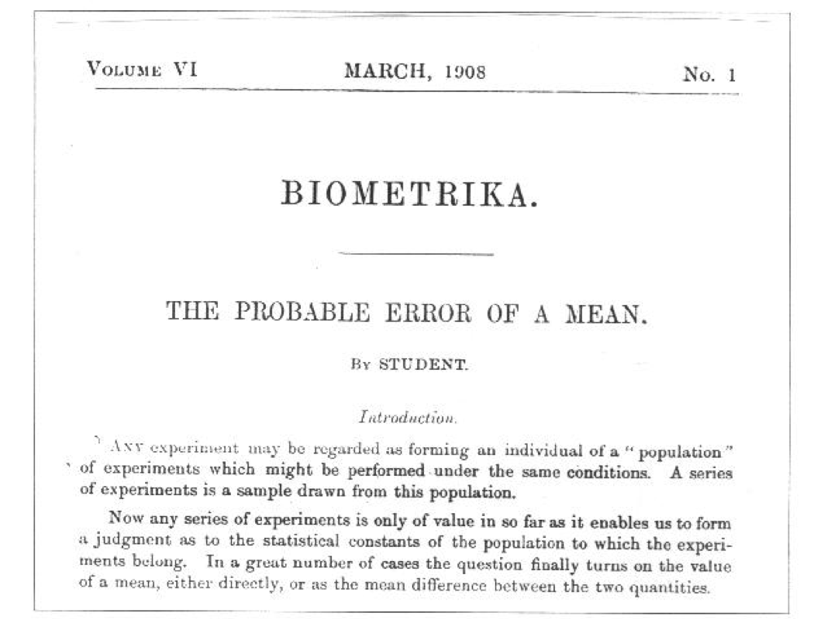

```{r setup, include=FALSE}
knitr::opts_chunk$set(echo = TRUE)
library(knitr)
library(magrittr)
```

## Biometrika 1908

```{r, out.width = "67%"}

```

## Structure of Data

"Student": William. S. Gosset(1876 ~ 1937)이 t-분포를 유도하기 위하여 모의실험에 활용한 자료는 다음과 같다.

```{r, crimtab}
options(width = 80)
crimtab
str(crimtab)
```

자료구조에서 살필 수 있다시피 `crimtab`은  (왼손 가운데)손가락 길이와 키를 계급으로 나누고 손가락 길이와 키의 조합을 이름으로 갖는 `table`이다. 

각 cell의 값은 길이와 키의 조합이 나타나는 빈도이다. 

여기서 키를 인치 단위로 환원하면 어떤 모양이 드러나는지 살펴보자. 

cm 단위로 되어 있는 키의 계급을 인치 단위로 변환하면 숨어있던 자료구조가 드러난다.
(1인치 = 2.54cm)

이러한 `table`구조의 행과 열에 이름을 붙이려면, `list`를 사용한다.`dimnames`설정 과정에서 `list(finger = ..., height = ...)` 같은 방법으로 이름을 부여할 경우와 그렇지 않을 때 차이가 무엇인지 알아 두자.

```{r, viewing the real data structure}
crimtab_2 <- crimtab
colnames(crimtab_2) <- as.numeric(colnames(crimtab_2))/ 2.54
dimnames(crimtab_2) <- list(finger = rownames(crimtab_2), 
                            height = colnames(crimtab_2))
crimtab_2
str(crimtab_2)
```

<!--
<P style = "page-break-after:always">
-->

## Data Frame 변환

글자 속성을 갖는 손가락 길이와 키의 조합에 따른 빈도를 또 다른 변수로 갖는 `data frame`으로 변환하고 이를 다시 `long format` 으로 전환하는 과정은 다음과 같음.

* 1차적으로 각 손가락 길이와 키의 조합을 갖는 인원수로 구성된 `data frame`으로 변환하고, case 단위의 `long format data frame`으로 2단계 변환. 
    + 단순히 `data.frame()`으로 변환할 경우 `Factor`로 설정되어`numeric`으로 변환하더라도 의미없는 숫자를 얻게 됨. 
    + `as.data.frame()`의 결과물로 두 개의 character vector 와 counts를 나타내는 새로운 변수 `Freq`가 나오게 됨. 손가락 길이와 키를 나타내는 character를 numeric으로 전환하고 다음 작업 진행.`Factor`는 본질적으로 음이 아닌 정수이기 때문임.

* `sapply`를 이용하여 두 변수의 속성을 한번에 글자(character)에서 숫자(numeric)으로 변환함.

```{r, data frame}
#> R 4.0.0 이후 버전부터는 `stringsAsFactors = FALSE`가 디폴트이어서 굳이 드러내어 설정하지 않아도 됨.
crimtab_df <- as.data.frame(crimtab_2, 
                            stringsAsFactors = FALSE)
str(crimtab_df)
crimtab_df[1:2] <- sapply(crimtab_df[1:2], 
                          FUN = as.numeric)
# crimtab_df[1:2] %<>%
#   sapply(FUN = as.numeric)
str(crimtab_df)
```

손가락 길이와 키의 조합이 나타나는 빈도만큼 그 조합을 반복하는 long format으로 변환하기 위하여 `sapply` 활용. `apply`를 사용하는 방법도 주석처리하여 보여 줌.

```{r, long format}
# crimtab_long <- apply(crimtab_df[ , 1:2], MARGIN = 2, function(x) rep(x, crimtab_df[ , 3]))
# crimtab_long <- apply(crimtab_df[, c("finger", "height")], MARGIN = 2, function(x) rep(x, crimtab_df[ , "Freq"]))
# crimtab_long <- apply(crimtab_df[c("finger", "height")], MARGIN = 2, function(x) rep(x, crimtab_df[ , "Freq"]))
# crimtab_long <- apply(crimtab_df[1:2], MARGIN = 2, function(x) rep(x, crimtab_df[ , "Freq"]))
crimtab_long <- sapply(crimtab_df[c("finger", "height")], 
                       function(x) rep(x, crimtab_df$Freq))
# crimtab_long <- mapply(function(x) rep(x, crimtab_df$Freq), crimtab_df[c("finger", "height")])
str(crimtab_long)
```

long format 으로 변환하는 다른 방법 1

```{r, alternative implementation 1}
# finger_long <- rep(crimtab_df$finger, crimtab_df$Freq)
# height_long <- rep(crimtab_df$height, crimtab_df$Freq)
# crimtab_long_df <- data.frame(finger = finger_long, height = height_long)
# str(crimtab_long_df)
```

long format 으로 변환하는 다른 방법 2

```{r, alternative implementation 2}
# index_crimtab <- rep(1:nrow(crimtab_df), crimtab_df[, "Freq"])
# index_crimtab[1:10]
# crimtab_df_long <- crimtab_df[index_crimtab, c("finger", "height")]
# str(crimtab_df_long)
```

matrix 를 data frame으로 변환

```{r, matrix to dataframe}
crimtab_long_df <- data.frame(crimtab_long)
str(crimtab_long_df)
```

### Save for future works

```{r, save}
save.image("./crimtab.RData")
```