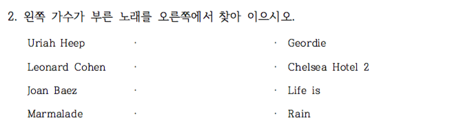
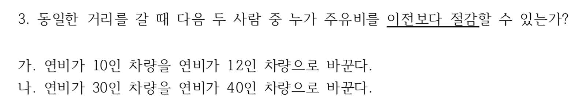
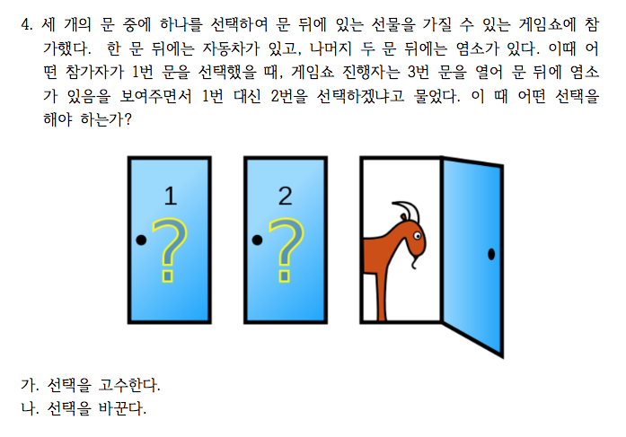

```{r setup, include=FALSE}
knitr::opts_chunk$set(echo = TRUE)
library(readxl)
library(pander)
library(knitr)
library(magrittr)
library(tidyverse)
library(stringr)
panderOptions('table.split.table', Inf)
panderOptions('table.alignment.rownames', 'left')
panderOptions('table.alignment.default', 'right')
options(width = 180)
```

```{r, data, echo = FALSE, results = 'hide', message = FALSE}
# load("./red_and_black_220305_data.RData")
quiz <- 
  "../data/quiz220523.xlsx" %>% 
  read_excel(range = "B1:K821",
             col_types = "text")
quiz %>% 
  str
names(quiz) <- 
  c("id", "Q1", paste("Q2", 1:4, sep = "_"), "Q3", "group", "Q4_R", "Q4_B")
quiz[paste("Q2", 1:4, sep = "_")] %<>% 
  sapply(FUN = . %>% {substr(., 1, 1)})
quiz$Q2 <- 
  apply(quiz[paste("Q2", 1:4, sep = "_")], 
        MARGIN = 1, paste, collapse = "")
quiz$group %<>% 
  factor(levels = c("Red", "Black"))
quiz$Q4 <- 
  ifelse(is.na(quiz$Q4_R), quiz$Q4_B, quiz$Q4_R)
# quiz$Q4 <- ifelse(is.na(quiz$Q4_R), quiz$Q4_B, quiz$Q4_R)
# quiz$Q4 %<>% 
#   strsplit(split = "[.]") %>% sapply(`[`, 1)
quiz[c("Q3", "Q4")] %<>%
  sapply(FUN = . %>% 
           {strsplit(., split = "[.]") %>% 
               sapply(`[`, 1)})
#> birth_month_date <- strsplit(quiz$Q1, ",")
birth_month_date <- quiz %>%
  select("Q1") %>%
  .[[1]]
#> `[[`(1) 바로 윗 식을 고쳐 쓴 방법
#> .[, "Q1"] 두 줄을 한 줄로 
#> 월, 일을 날짜 순으로 정리하기 위하여 글자를 떼어내고 숫자로 변화. 1 => 01 등.
quiz$month <- quiz$Q1 %>% 
  strsplit(split = "/") %>% 
  sapply(function(.).[1]) 
# quiz$month %<>%
#   nchar %>% 
#   `==`(1) %>% 
#   ifelse(paste0(0, quiz$month), quiz$month)
quiz$date <- quiz$Q1 %>% 
  strsplit(split = "/") %>% 
  sapply(function(.).[2]) 
# quiz$date %<>%
#   nchar %>% 
#   `==`(1) %>% 
#   ifelse(paste0(0, quiz$date), quiz$date)

# quiz$month <- sapply(strsplit(birth_month_date, split = ","), function(x) x[1])
# quiz$month <- ifelse(nchar(quiz$month) == 1, paste0(0, quiz$month), quiz$month)
# quiz$date <- sapply(strsplit(birth_month_date, split = ","), function(x) x[2])
# quiz$date <- ifelse(nchar(quiz$date) == 1, paste0(0, quiz$date), quiz$date)
quiz$Q1_2 <- paste0(quiz$month, "월", quiz$date, "일")
quiz$Q1_2[quiz$Q1_2 == "NA월NA일"] <- NA
# quiz$Q1_2 <- str_c(quiz$month, "월", quiz$date, "일")
#> 생일을 날짜 순서대로 정리한 복제본 생성
quiz_2 <- quiz %>%
  `[`(order(.$month, .$date), )
# quiz_2 <- quiz %>%
#   `[`(.$month %>% order(quiz$date), )
# quiz_2 <- quiz[order(quiz$month, quiz$date), ]
quiz_2[, c("id", "Q1_2")]
#> NA 아닌 값만 추출
birthdate <- quiz_2$Q1_2 %>%
  `[`(is.na(.) %>% `!`)
N1 <- length(birthdate)
# birthdate <- quiz_2$Q1_2[!is.na(quiz_2$Q1_2)]
#> Places where duplicated birthdates appears
dup_b <- birthdate %>%
  duplicated
# dup_b <- duplicated(birthdate)
#> Duplicated birthdates which appears at least twice (3번 이상 중복되는 값이 나올 수 있음)
b_dup <- birthdate %>%
  `[`(duplicated(.))
# b_dup <- birthdate[duplicated(birthdate)]
# b_dup <- birthdate[dup_b]
#> List of duplicated birthdates
b_dup_b <- birthdate %>%
  `[`(. %in% (birthdate %>%
  `[`(duplicated(.)) %>% unique))
# b_dup_b <- birthdate[birthdate %in% unique(birthdate[duplicated(birthdate)])]
# b_dup_b <- birthdate[birthdate %in% unique(b_dup_b)]
#> Where the duplicates appear in Q1_2
index_dup_b <- quiz_2$Q1_2 %>%
  `%in%`(b_dup_b %>% unique) %>%
  which
# index_dup_b <- which(quiz$Q1_2 %in% unique(b_dup_b)
#> List Duplicated birthdates with id and group
quiz_2 %>%
  `[`(index_dup_b, c("id", "Q1_2", "group"))
# quiz_2[idex_dup_b, c("id", "Q1_2", group)]
#> To remove 0 counts cells, use `droplevels`. 
quiz_2$Q1_2 %>%
  `[`(index_dup_b) %>%
  table %>%
  as.matrix(ncol = 1, byrow = TRUE) %>%
#  t %>%
#  cbind("계" = rowSums(.)) %>%
  rbind("계" = colSums(.)) %>%
  data.frame(Birthe_Dates = rownames(.), 
             Counts = ., 
             row.names = NULL)
# %>%
#  t
# %>%
#   kable(row.names = NA)
# table(quiz_2$Q1_2[index_dup_b])
# tbl_b <- t(as.matrix(table(quiz_2$Q1_2[index.dup.b])))
# cbind(tbl_b, "계" = rowSums(tbl_b))
# kable(t(as.matrix(table(droplevels(quiz_2$Q1_2[index.dup.b])))))

#> Matching Data
#> 데이터 오류 점검
quiz$Q2 %>% 
  table
quiz$Q2[quiz$Q2 %>% `%in%`(c("RCFL", "RDGL")) %>% which] <- "RCGL"
# quiz$Q2[which(quiz$Q2 %in% c("RCFL", "RDGL"))] <- "RCGL"
#> 정답 분해
ans <- "RCGL" %>% strsplit(split = "")
# ans <- strsplit("RCGL", split = "")
#> 답안 분해
matching_score <- quiz$Q2 %>% 
  strsplit(split = "") %>%
  sapply(. %>% { `==`(., unlist(ans)) %>% ifelse(1, 0)}) %>%
#   sapply(. %>% {ifelse( . == unlist(ans), 1, 0)}) %>%
#   sapply(function(x) ifelse(x == unlist(ans), 1, 0)) %>%
  apply(MARGIN = 2, sum)
N2 <- matching_score %>%
  is.na %>%
  `!` %>%
  sum
# matching <- strsplit(quiz$Q2, "")
# matching_count <- mapply(function(x) ifelse(x == unlist(ans), 1, 0), matching)
# matching_score <- apply(matching_count, 2, sum)
quiz$Q2_2 <- matching_score
#> Q3
quiz$Q3 %<>% factor(levels = c("가", "나"), 
                        labels = c("연비 10 => 12", "연비 30 => 40"))
#> Q4
quiz$Q4 %<>% 
  factor(levels = c("가", "나"))
levels(quiz$Q4[quiz$group == "Black"]) <- c("나", "가")
quiz$Q4 %<>%
  `levels<-` (c("고수한다", "바꾼다"))
pander(quiz[c("Q3", "Q4", "group")])
```

<!--
## Red, Black을 잘못 표시한 사람들

랜덤화출석부에 있는 Red, Black 과 실제 구글예습퀴즈에 올린 Red, Black 이 다른 사람들이 있어서 파악해 보았습니다. 랜덤화 효과는 여기서도 작동하고 있는 걸 알 수 있습니다. Red를 Black 이라고 한 사람의 수효(8명)과 Black을 Red 라고 한 사람의 수효(7명)이 비슷합니다 group 을 잘못 기억하고 있는 사람들의 수효조차 Red, Black 에 비슷하게 나뉘었습니다. 굳이 학번까지 올린 이유는 그 다음 구글예습퀴즈부터라도 제대로 올려주길 바라서입니다.

```{r, wrong group, echo = FALSE, eval = FALSE}
class_roll$group2 <- quiz$group[match(class_roll$id, quiz$id)]
wrong_group <- which(class_roll$group != class_roll$group2)
class_roll[wrong_group, c("id", "name", "group", "group2")] %>%
  `colnames<-`(c("학번", "이름", "랜덤화출석부", "구글예습퀴즈")) %>%
  pander
wrong_tbl <- table(class_roll$group, class_roll$group2)
wrong_tbl %>%
  pander
```
-->

```{r, randomization, echo = FALSE, results = 'hide'}
summary(quiz)
```

# 퀴즈 응답

## Birthday Problem

<!--
### 생일이 같은 사람

```{r, echo = FALSE}
quiz_2 %>%
  `[`(index_dup_b, c("id", "Q1_2", "group")) %>%
  `colnames<-`(c("학번", "생일", "그룹")) %>%
  pander
#  kable(col.names = c("학번", "생일", "그룹"), 
#        row.names = FALSE, align = "c", )
```
-->

### 어느 날에 몇 명씩 생일이 같은가?

```{r, echo = FALSE}
quiz_2$Q1_2 %>%
  `[`(index_dup_b) %>%
  table %>%
  as.matrix %>%
#  t %>%
  rbind("계" = colSums(.)) %>%
  pander
#   kable(row.names = NA, align = 'lc')
```

### 생일이 같은 날은 모두 며칠인가?

```{r, echo = FALSE}
quiz_2$Q1_2 %>%
  `[`(index_dup_b) %>%
  table %>%
  as.matrix %>%
  t %>%
  ncol
```

### 생일이 같은 사람은 몇 명 정도 기대되는가?

```{r, echo = FALSE}
E_N <- . %>% {. * (1 - (364 / 365) ^ ( . - 1))}
# E_N <- function(N){N * (1 - (364 / 365) ^ (N - 1))}
V_N <- . %>% {E_N(.) + . * ( . - 1) * (1 - (363 / 365)) ^ ( . - 2)}
# V_N <- function(N){N * (1 - (364 / 365) ^ (N - 1)) + N * (N - 1) * (1 - (363 / 365)) ^ (N - 2)}
```

$N$을 전체 인원이라 할 때, 기대 인원은 $N\times\{1- (\frac{364}{365})^{N-1}\}$, 
분산은 $N\times\{1- (\frac{364}{365})^{N-1}\} + N\times(N-1)\times\{1-(\frac{363}{365})^{N-2}\}$로 계산됩니다.

무응답이거나 결석한 학생을 제외한 응답 인원 `r N1`명에 대하여 기대인원을 계산하면 `r N1 %>% E_N %>% round(1)`명,
표준오차는 `r N1 %>% V_N %>% sqrt %>% round(1)`명으로 계산되어 관찰된 값이 그 범위에 잘 들어감을 알 수 있습니다.

#### 기대되는 인원

```{r, echo = FALSE}
N1 %>% 
  E_N %>%
  round(digits = 1)
```

#### 표준오차

```{r, echo = FALSE}
N1 %>%
  V_N %>%
  sqrt %>%
  round(digits = 1)
```

### 태어난 달의 분포는?

```{r, month of the birthdates, echo = FALSE}
quiz$month_f <- quiz$month %>%
  factor(levels = c(paste0("0", 1:9), 10:12), labels = paste0(1:12, "월"))
quiz$month_f %>%
  table(quiz$group, .) %>%
  cbind("계" = rowSums(.)) %>%
  rbind("계" = colSums(.)) %>%
  kable(align = "r")
```

#### 랜덤화 효과 

```{r, echo = FALSE}
quiz$month %>%
  table(quiz$group, .) %>%
  chisq.test(simulate.p.value = TRUE) %>%
  pander
```

#### 월별로 고르게 출생하였는가?

```{r, echo = FALSE}
quiz$month %>%
  table %>%
  chisq.test(simulate.p.value = FALSE) %>%
  pander
```

## Matching Problem

```{r, echo = FALSE, out.width = "75%"}

```

### 정답갯수의 분포

```{r, matching, echo = FALSE}
tbl_matching <- quiz$Q2_2 %>%
  factor(levels = c(0, 1, 2, 4),
         labels = paste0(c(0, 1, 2, 4), "개")) %>%
  table(quiz$group, .) %>%
  cbind("계" = rowSums(.)) %>%
  rbind("계" = colSums(.)) 
tbl_matching %>%
  kable
```

### Observed vs Expected

랜덤하게 골랐다면, 각각의 확률은 9/24, 8/24, 6/24, 1/24임. 응답인원 `r N2`명을 각 확률에 곱해보면 이론적으로 기대되는 인원이 계산됩니다. 확률분포로부터 기대하는 값과 관찰된 값이 벗어나는 것을 관찰할 수 있습니다. 인터넷 검색금지를 일부만 지킨 것 같습니다. 지지난 학기와 비교해 보십시요.
한 가지, 기대값과 표준편차가 다 1이라고 해서 1개 맞추는 사람들이 가장 많은 게 아닙니다.

```{r, echo = FALSE}
options(digits = 3)
prob <- c(9, 8, 6, 1) / 24
Expected <- N2 * prob
names(Expected) <- paste0(c("0", "1", "2", "4"), "개")
O_E_tbl <- Expected %>%
  as.matrix %>%
  t %>%
  cbind("계" = rowSums(.)) %>%
  rbind(tbl_matching[3, ], .) 
Diff <- O_E_tbl[1, ] - O_E_tbl[2, ] %>% 
  round(1)
O_E_tbl <- rbind(O_E_tbl, Diff)
rownames(O_E_tbl) <-c("Observed", "Expected", "Difference")
O_E_tbl %>%
  format(digits = 2, nsmall = 1) %>%
  kable(align = "c")
```

### 카이제곱 테스트

```{r, echo = FALSE}
quiz$Q2_2 %>%
  factor(levels = c(0, 1, 2, 4)) %>%
  table %>%
  chisq.test(p = c(9, 8, 6, 1)/24, simulate.p.value = FALSE) %>%
  pander
```

## 직관과 어긋나는 용어

### 연비

```{r, echo = FALSE, out.width = "75%"}

```

1,200 킬로미터룰 주행한다고 해 봅시다. '가'는 120리터에서 100리터로 20리터를 절감하고, '나'는 40리터에서 30리터 10리터를 절감하게 됩니다. 따라서 '가'운전자가 이전보다 더 절감합니다. 연비라는 용어가 주는 직관과는 잘 맞지 않다는 것을 여러분의 응답에서 잘 알 수 있습니다. 연비 높은 차량으로 바꾸는 것이 더 절감할 것이라는 응답이 무려 60%에 가깝습니다. 악마는 디테일에 있습니다. 

### 집계

```{r, Framing Effect, echo = FALSE}
tbl_q3_a <- quiz$Q3 %>%
  table(quiz$group, ., useNA = "ifany") %>%
  cbind("계" = rowSums(.)) %>%
  rbind("계" = colSums(.))
tbl_q3_a %>% 
  kable
tbl_q3_a %>%
  `[`(-3, 3) %>% 
  chisq.test(simulate.p.value = TRUE, B = 20000) %>%
  pander
```

### % 비교.  

```{r, Framing effects in percentage, echo = FALSE}
tbl_q3_a %>%
  `[`(3, -3, drop = FALSE) %>%
  prop.table %>%
  cbind("계" = rowSums(.)) %>%
  `*`(100) %>%
  format(digits = 2, nsmall = 1) %>%
  kable(align = "c", row.names = FALSE)
```

# Monty Hall 문제

## 문항 배열 효과?

### Red

```{r, echo = FALSE, out.width = "75%"}

```

### Black

```{r, echo = FALSE, out.width = "75%"}
include_graphics("../pics/Quiz171106_04_black.png")
```

염소가 들어있는 문을 보여줌으로써 다른 문에 자동차가 들어 있을 확률은 2/3로 늘어나므로 바꾸는 것이 적절한 판단임. Red와 Black의 차이는 "바꾼다"와 "고수한다"의 순서를 바꾼 것으로 "바꾼다"를 앞에 놓은 Black 집단에서 바꾼다는 응답이 다소 높게 나왔으나 통계적으로 유의한 수준은 아님.

### 집계

```{r, Monty Hall, echo = FALSE}
tbl_q4_a <- quiz$Q4 %>%
  table(quiz$group, ., useNA = "ifany") %>%
  cbind("계" = rowSums(.)) %>%
  rbind("계" = colSums(.))
tbl_q4_a %>% 
  pander
tbl_q4_a %>%
  `[`(-3, -3) %>%
  chisq.test(simulate.p.value = FALSE) %>%
  pander
```

### % 비교.  

```{r, Monty Hall in percentage, echo = FALSE}
tbl_q4_a %>% 
  `[`(-3, -3) %>%
  prop.table(margin = 1) %>%
  `*`(100) %>%
  cbind("계" = rowSums(.)) %>%
  format(digits = 2, nsmall = 1) %>%
  pander
```

### 합산(%)

```{r, percentage in sum, echo = FALSE}
tbl_q4_a %>% 
  `[`(3, -3, drop = FALSE) %>%
  prop.table(margin = 1) %>%
  `*`(100) %>%
  cbind("계" = rowSums(.)) %>%
  format(digits = 2, nsmall = 1) %>%
  pander
```

```{r, save, echo = FALSE}
saveRDS(quiz, file = "./quiz220523.RDS")
save.image("../R/quiz220523.RData")
```