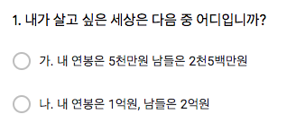
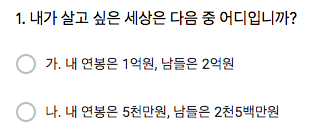
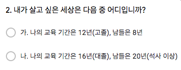
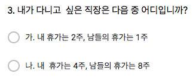
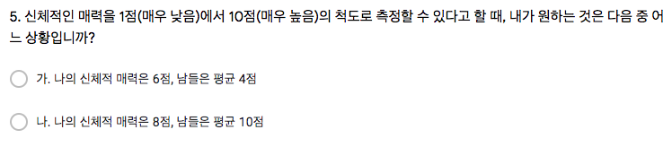

```{r setup, include=FALSE}
knitr::opts_chunk$set(echo = TRUE)
# install.packages("pander", repos = "https://cran.rstudio.com")
# install.packages("xlsx", repos = "https://cran.rstudio.com")
library(xlsx)
library(pander)
library(knitr)
library(magrittr)
panderOptions('table.split.table', Inf)
panderOptions('table.alignment.rownames', 'left')
panderOptions('table.alignment.default', 'right')
options(width=180)
```

```{r, data, echo = FALSE, results = 'hide'}
# load("./red_and_black_190830_data.RData")
world <- read.xlsx("../data/which_world_r_prog1902.xlsx", 
                      sheetIndex = 1, 
                      startRow = 1, 
                      endRow = 66, 
                      colIndex = c(2:15), 
                      header = TRUE,
                      colClasses = c(rep("character", 14)), 
                      encoding = "UTF-8",
                      stringsAsFactors = FALSE)
str(world)
names(world) <- c("dept", "id", "name", "group", "Q1_R", "Q2_R", "Q3_R", "Q4_R", "Q5_R", 
                     "Q1_B", "Q2_B", "Q3_B", "Q4_B", "Q5_B")
world$dept %<>% 
  factor
world$group %<>% 
  factor(levels = c("Red", "Black"))
world[5:14] %<>% 
  sapply(FUN = {. %>% strsplit(split = "[.]") %>% sapply(`[`, 1)})
#> factor로 만들 것을 처음부터 고려한다면 cbind에서 stringsAsFactors = TRUE, 즉 default로 놔 두면 된다.
world %<>% cbind(mapply(function(x, y){ifelse(is.na(x), y, x)}, world[5:9], world[10:14], 
                              USE.NAMES = FALSE), stringsAsFactors = FALSE) 
names(world)[15:19] <- paste0("Q", 1:5)
#> 다음 코드들에서 sapply를 사용하면 character 행렬이 나오게 되므로 반드시 lapply를 사용해야 한다.
world[paste0("Q", 1:5)] %<>% 
  lapply(factor) 
#> 확인
world[c("group", paste0("Q", 1:5))]
#> Black 의 level에서 "가", "나"를 바꾸기 위한 조건 설정
Black <- world$group == "Black"
#> Black 
world[Black, paste0("Q", 1:5)] %<>%
  lapply(`levels<-`, c("나", "가"))
world[c("group", paste0("Q", 1:5))]  
world[paste0("Q", 1:5)] %<>%
  lapply(`levels<-`, c("내가 남보다", "남이 나보다"))
world[c("group", paste0("Q", 1:5))]
```

```{r, echo = FALSE, eval = FALSE}
world$Q1 <- ifelse(is.na(world$Q1_R), world$Q1_B, world$Q1_R)
world$Q2 <- ifelse(is.na(world$Q2_R), world$Q2_B, world$Q2_R)
world$Q3 <- ifelse(is.na(world$Q3_R), world$Q3_B, world$Q3_R)
world$Q4 <- ifelse(is.na(world$Q4_R), world$Q4_B, world$Q4_R)
world$Q5 <- ifelse(is.na(world$Q5_R), world$Q5_B, world$Q5_R)
world$Q1 %<>% 
  factor(levels = c("가", "나"))
levels(world$Q1[world$group == "Black"]) <- c("나", "가")
world$Q1 %<>%
  `levels<-` (c("내가 남보다", "남이 나보다"))
# levels(world$Q4) <- c("내가 남보다", "남이 나보다")
world$Q1
world$Q2 %<>% 
  factor(levels = c("가", "나"))
levels(world$Q2[world$group == "Black"]) <- c("나", "가")
world$Q2 %<>%
  `levels<-` (c("내가 남보다", "남이 나보다"))
# levels(world$Q4) <- c("내가 남보다", "남이 나보다")
world$Q2
world$Q3 %<>% 
  factor(levels = c("가", "나"))
levels(world$Q3[world$group == "Black"]) <- c("나", "가")
world$Q3 %<>%
  `levels<-` (c("내가 남보다", "남이 나보다"))
# levels(world$Q4) <- c("내가 남보다", "남이 나보다")
world$Q3
world$Q4 %<>% 
  factor(levels = c("가", "나"))
levels(world$Q4[world$group == "Black"]) <- c("나", "가")
world$Q4 %<>%
  `levels<-` (c("내가 남보다", "남이 나보다"))
# levels(world$Q4) <- c("내가 남보다", "남이 나보다")
world$Q4
world$Q5 %<>% 
  factor(levels = c("가", "나"))
levels(world$Q5[world$group == "Black"]) <- c("나", "가")
world$Q5 %<>%
  `levels<-` (c("내가 남보다", "남이 나보다"))
# levels(world$Q4) <- c("내가 남보다", "남이 나보다")
world$Q5
```

```{r, randomization, echo = FALSE, results = 'hide'}
pander(summary(world))
```

## 내가 살고 싶은 세상

### 내가 남보다, 혹은 남이 나보다 

#### Red 

```{r, echo = FALSE, out.width = "50%"}

```

#### Black

```{r, echo = FALSE, out.width = "50%"}

```

소득의 절대값이 아니라 상대 비교가 중요하다는 Solnick and Hemenway(1998)의 연구결과와 일치. 랜덤화하였지만 응답에는 차이가 없음.

#### 집계

```{r, social comparison, echo = FALSE}
tbl_q1_a <- world$Q1 %>%
  table(world$group, ., useNA = "ifany") %>%
  cbind("계" = rowSums(.)) %>%
  rbind("계" = colSums(.))
rownames(tbl_q1_a)[1:2] <- c("Red('내가 남보다' 먼저)", "Black('남이 나보다' 먼저)")
tbl_q1_a %>% 
  kable
```

#### % 비교.  

```{r, social comparison in percentage, echo = FALSE}
tbl_q1_a %>% 
  `[`(-3, -3) %>%
  prop.table(margin = 1) %>%
  `*`(100) %>%
  cbind("계" = rowSums(.)) %>%
  format(digits = 2, nsmall = 1) %>%
  kable
```

#### 합산(%)

```{r, percentage in sum, echo = FALSE}
tbl_q1_a %>% 
  `[`(3, -3) %>%
  prop.table %>%
  `*`(100) %>%
  c("계" = sum(.)) %>%
#  cbind("계" = rowSums(.)) %>%
  format(digits = 2, nsmall = 1) %>%
  t %>%
  kable
```

### 학력

```{r, echo = FALSE, out.width = "50%"}

```

#### 집계

```{r, echo = FALSE}
tbl_q2_a <- world$Q2 %>%
  table(world$group, ., useNA = "ifany") %>%
  cbind("계" = rowSums(.)) %>%
  rbind("계" = colSums(.))
rownames(tbl_q2_a)[1:2] <- c("Red('내가 남보다' 먼저)", "Black('남이 나보다' 먼저)")
tbl_q2_a %>% 
  kable
```

#### % 비교.  

```{r, echo = FALSE}
tbl_q2_a %>% 
  `[`(-3, -(3:5)) %>%
  prop.table(margin = 1) %>%
  `*`(100) %>%
  cbind("계" = rowSums(.)) %>%
  format(digits = 2, nsmall = 1) %>%
  kable
```

#### 합산(%)

```{r, echo = FALSE}
tbl_q2_a %>% 
  `[`(3, -(3:5), drop = FALSE) %>%
  prop.table(margin = 1) %>%
  `*`(100) %>%
  cbind("계" = rowSums(.)) %>%
  format(digits = 2, nsmall = 1) %>%
  kable
```

### 휴가 기간 


```{r, echo = FALSE, out.width = "50%"}

```

#### 집계

```{r, echo = FALSE}
tbl_q3_a <- world$Q3 %>%
  table(world$group, ., useNA = "ifany") %>%
  cbind("계" = rowSums(.)) %>%
  rbind("계" = colSums(.))
rownames(tbl_q3_a)[1:2] <- c("Red('내가 남보다' 먼저)", "Black('남이 나보다' 먼저)")
tbl_q3_a %>% 
  kable
```

#### % 비교.  

```{r, echo = FALSE}
tbl_q3_a %>% 
  `[`(-3, -(3:5)) %>%
  prop.table(margin = 1) %>%
  `*`(100) %>%
  cbind("계" = rowSums(.)) %>%
  format(digits = 2, nsmall = 1) %>%
  kable
```

#### 합산(%)

```{r, echo = FALSE}
tbl_q3_a %>% 
  `[`(3, -(3:5), drop = FALSE) %>%
  prop.table(margin = 1) %>%
  `*`(100) %>%
  cbind("계" = rowSums(.)) %>%
  format(digits = 2, nsmall = 1) %>%
  kable
```

### 지능

```{r, echo = FALSE, out.width = "75%"}

```

#### 집계

```{r, echo = FALSE}
tbl_q4_a <- world$Q4 %>%
  table(world$group, ., useNA = "ifany") %>%
  cbind("계" = rowSums(.)) %>%
  rbind("계" = colSums(.))
rownames(tbl_q4_a)[1:2] <- c("Red('내가 남보다' 먼저)", "Black('남이 나보다' 먼저)")
tbl_q4_a %>% 
  kable
```

#### % 비교.  

```{r, echo = FALSE}
tbl_q4_a %>% 
  `[`(-3, -(3:5)) %>%
  prop.table(margin = 1) %>%
  `*`(100) %>%
  cbind("계" = rowSums(.)) %>%
  format(digits = 2, nsmall = 1) %>%
  kable
```

#### 합산(%)

```{r, echo = FALSE}
tbl_q4_a %>% 
  `[`(3, -(3:5), drop = FALSE) %>%
  prop.table(margin = 1) %>%
  `*`(100) %>%
  cbind("계" = rowSums(.)) %>%
  format(digits = 2, nsmall = 1) %>%
  kable
```

### 신체적 매력

```{r, echo = FALSE, out.width = "100%"}

```

#### 집계

```{r, echo = FALSE}
tbl_q5_a <- world$Q5 %>%
  table(world$group, ., useNA = "ifany") %>%
  cbind("계" = rowSums(.)) %>%
  rbind("계" = colSums(.))
rownames(tbl_q5_a)[1:2] <- c("Red('내가 남보다' 먼저)", "Black('남이 나보다' 먼저)")
tbl_q5_a %>% 
  kable
```

#### % 비교.  

```{r, echo = FALSE}
tbl_q5_a %>% 
  `[`(-3, -(3:5)) %>%
  prop.table(margin = 1) %>%
  `*`(100) %>%
  cbind("계" = rowSums(.)) %>%
  format(digits = 2, nsmall = 1) %>%
  kable
```

#### 합산(%)

```{r, echo = FALSE}
tbl_q5_a %>% 
  `[`(3, -(3:5), drop = FALSE) %>%
  prop.table(margin = 1) %>%
  `*`(100) %>%
  cbind("계" = rowSums(.)) %>%
  format(digits = 2, nsmall = 1) %>%
  kable
```

```{r, save, echo = FALSE}
#save.image("../R/world.RData"")
```